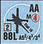
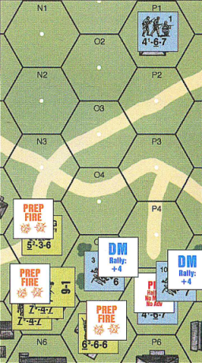
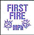
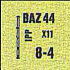
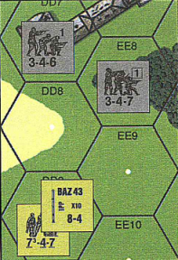
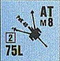

% Правила Advanced Squad Leader Starter Kit #3

# Введение {-}

Добро пожаловать в третий выпуск серии Advanced Squad Leader Starter Kit.
ASLSK#3 "Tanks" познакомит вас с материалом, необходимым для добавления техники
в ASLSK. Advanced Squad Leader (ASL) - игровая система, которая способна
подробно симулировать любые наземные действия на уровне рот и на любом театре
военных действий Второй мировой войны. Фишки представляют собой отделения,
полуотделения, лидеров, расчеты, орудия и технику всех основных и второстепенных
участников Второй мировой войны. Поля сражений представлены геоморфными картами,
на которых будут передвигаться фишки. Стартовый набор предлагает новичку простой
способ ознакомиться с основами системы ASL, используя сценарии начального
уровня, игровые карты, фишки и правила. Во многих терминах, приведенных в
правилах, используются аббревиатуры. Пока вы с ними знакомитесь, вам будет
полезен раздел правил [Определения].

Фишки отделений представляют собой 9-15 бойцов, в зависимости от национальности
и типа. Фишки лидеров представляют собой боевых командиров, исторически
участвовавших в битве, а также помогают отобразить боевую самостоятельность
личного состава под их командованием. Каждое из отделений и каждый лидер имеют
соответствующий уровень боевого духа, указанный на фишке; чем выше дух, тем
более они стойки в бою и тем быстрее они восстанавливают боеспособность. Фишки
оружия поддержки, орудий и техники представляют отдельные единицы вооружения
сверх обычного стрелкового, уже включенного в значения огневой мощи отделений и
полуотделений. Огневые группы, атакуя вражеские подразделения, суммируют огневую
мощь отдельных подразделений и единиц вооружения. После суммирования огневой
мощи производится бросок двух шестигранных кубиков, и результат броска
(модифицированный различными факторами) ищется в строках таблицы огневой мощи
пехоты (IFT). Результат атаки определяется по столбцу применимой огневой мощи.
Орудия должны для начала обеспечить попадание, чтобы можно было рассчитывать
эффект атаки. Результаты атак могут варьироваться от не возымевших эффекта,
проверки боевого духа и возможной его потери и до полного уничтожения одного или
нескольких вражеских подразделений. Подразделения также используют свою огневую
мощь в ближнем бою, который, как правило, ведется "до последнего".

Каждый из сценариев ASLSK симулирует историческое сражение, предоставляя для
достижения определенных условий победы как атакующему, так и обороняющемуся
боевой порядок, состоящий из определенных подразделений и вооружения.
Геоморфные карты могут размещаться различными способами, представляя
разнообразные поля сражений на Европейском ТВД.

ASLSK#3 "Tanks" - это полноценная игра, знакомящая игрока с правилами ASL для
техники и включающая в себя отделения, полуотделения, лидеров, оружие поддержки,
орудийные расчеты, оперируемые расчетами орудия и технику, а также упрощенные
правила и карты. Вы можете использовать этот материал для расширения своих
возможностей в ASLSK или постепенно вовлечься в фантастически подробный мир
тактического варгейма ASL по полным правилам. В любом случае, материал,
представленный здесь (правила, карты и фишки), полностью совместим как с
предыдущими стартовыми наборами (ASLSK), так и с ASL. Вам не понадобится
какой-либо другой материал, чтобы играть в эту игру, она полностью
самостоятельна; однако вы можете найти дополнительные материалы для ASL и много
других замечательных игр на сайте <http://www.multimanpublishing.com>.
Дополнительные сценарии ASLSK доступны в журнале MMP "OPERATIONS".

Этот буклет правил имеет приоритет как над буклетом правил ASLSK#1, так и
ASLSK#2. Обратите внимание, что ASLSK#3 "Tanks", содержит набор фишек, которого
обычно достаточно для восьми прилагающихся сценариев. Однако, ASL - это игра с
широкими возможностями, и исключительные обстоятельства в ней могут привести к
нехватке некоторых фишек.

# Игровые компоненты

## Карта

ASLSK#3 содержит три геоморфные карты (t, u и v). Они представляют поле боя и
могут быть объединены длинными или короткими сторонами друг к другу, образуя
различные игровые конфигурации. На карту наложена сетка шестиугольников
(гексов), по ней измеряется расстояние. Каждый гекс содержит определенный тип
местности. Разные типы местности оказывают различное влияние на движение и бой.
Каждый гекс также содержит собственную координату в сетке, указывающую
местоположение на карте (напр., гекс K2). Поставив перед координатой индекс
карты (напр., tK2), получим уникальное обозначение для любого гекса в данной
игровой системе. Каждый гекс содержит белую точку, отмечающую его центр. Она
используется при определении линии видимости (LOS). Половинки гексов вдоль края
игрового поля являются эквивалентами целых гексов, хотя координата и белая точка
центра могут отсутствовать.

### Тип местности

По эстетическим соображениям условное изображение местности может слегка
выходить за пределы гекса в прилегающий гекс с другим типом местности, но в
большинстве гексов доминирует один конкретный тип местности, и эти гексы
управляются правилами для этого конкретного типа местности. Обычно доминирующий
тип местности включает точку в центре, но иногда гексы, не являющиеся открытой
местностью, имеют точку в центре на открытой местности. Через одну местность
труднее двигаться, чем через другую; стоимость движения выражается в факторах
движения (MF) для пехоты и в очках движения (MP) для техники. Местность может
также блокировать линию видимости (LOS) или создавать на ней помехи, а также
может обеспечивать некоторое укрытие, влияя на огневые атаки своим
модификатором эффектов местности (TEM).

#### Открытая местность

Это любой гекс, в котором нет дополнительных изображений местности, и обычно,
однообразно заполненный светло-зеленым цветом, (напр., tC2). Открытая местность
не представляет препятствия или помехи для LOS, а единственный TEM открытой
местности для двигающихся подразделений - это модификатор броска двух кубиков
(DRM) -1 за первый огонь по двигающимся на открытой местности (FFMO). Вход в
гекс с открытой местностью стоит пехоте 1 MF. Въезд в гекс с открытой местностью
стоит гусеничной технике 1 MP, а бронеавтомобилям - 3 MP. 

#### Здание

Представляет искусственные сооружения различных размеров. Любой гекс, который
содержит прямоугольное изображение здания серого или коричневого цвета видом
сверху, - это здание, (напр., uH7). Если LOS между двумя подразделениями
пересекает изображение здания, то гекс здания является препятствием для обоих
подразделений, находящихся на одном уровне с ним. Изображение здания также
является препятствием между двумя подразделениями на разных уровнях. Вход в
здание стоит пехоте 2 MF. Миномет не может вести огонь из здания.
Бронеавтомобиль не может выставляться или въезжать в здание. Гусеничная
бронированная техника (AFV) с закрытыми люками (BU) (см.
[Люки открыты (CE) или закрыты (BU)]), может въезжать в здание за половину
своего полного количества MP, пройдя проверку на застревание (см.
[Застревание и давление на грунт]). TEM каменного (серого) здания равен +3, а
для деревянного (коричневого) здания - +2.

#### Дорога

Представляет либо мощеные, либо грунтовые покрытия. Дорога, представленная
коричневой полоской, (напр., uY2), - это грунтовая дорога, в то время как
представленная серой полоской, (напр., uL6), - это мощеное покрытие. Дорога
считается открытой местностью во всех отношениях. Кроме того, пехота, во время
всей своей MPh пересекающая стороны гексов только по дороге, получает один
добавочный MF (бонус за дорогу), если она не использовала защитные преимущества
гекса леса-дороги или сада-дороги, не являющихся открытой местностью, или не
затратила добавочную стоимость движения, войдя в дым (см. [Дым]). Пересечение
стороны гекса по дороге стоит как бронеавтомобилям, так и гусеничной технике 1/2
MP, если люки открыты (CE), или 1 MP, если люки закрыты (BU) (см.
[Люки открыты (CE) или закрыты (BU)]).

#### Лес

Представляет участок, заросший лесом с густым подлеском (напр., vC8. Если LOS
между двумя подразделениями пересекает изображение леса, то гекс леса является
препятствием для обоих подразделений, находящихся на одном же уровне с ним. Лес
также является препятствием между двумя подразделениями на разных уровнях. Вход
в лес стоит пехоте 2 MF. Леса стоят бронеавтомобилю всех его MP с проверкой на
застревание (см. [Застревание и давление на грунт]). Гусеничная бронированная
техника, чтобы въехать в гекс леса, может по выбору затратить либо половину,
либо все свое общее количество MP с проверкой на застревание (см.
[Застревание и давление на грунт]). Техника, тратящая все свои MP, чтобы въехать
в гекс леса, все же может затратить 1 MP для запуска и 1 MP для остановки.
Суровость DRM при проверке на застревание зависит от того, сколько MP затратила
техника, чтобы въехать в гекс леса. TEM леса равен +1. Минометный огонь по
пехоте или технике CE в лесу, наоборот, получает TEM -1 за разрывы в воздухе.

#### Лес-дорога

Подразделение, двигающееся в гексе леса-дороги (напр., tC5), не может получить
+1 TEM леса во время оборонительного первого огня (и подвержена FFMO и
перехвату), если LOS не пересекает зеленое условное изображение леса, и оно
вошло в гекс со скоростью движения по дороге. В противном случае, действует
обычный TEM леса; пехотное подразделение всегда может предпочесть движение по
лесу и получить преимущества соответствующего TEM. Изображение дороги не
блокирует LOS. Подразделение, двигающееся по дороге через гекс леса, двигается с
обычной скоростью движения по дороге, а не леса. Техника в гексе леса-дороги
всегда считается находящейся на дороге.

#### Сад

Представляет участок без подлеска, редко засаженный деревьями (напр., vAA2). Сад
- помеха на LOS одного уровня и поэтому прибавляет +1 DRM за каждый гекс сада
между целью и ведущим огонь. Вход в сад стоит пехоте 1 MF. Въезд в сад стоит
бронеавтомобилю 3 MP, а гусеничной технике - 1 MP. TEM сада отсутствует, но,
поскольку это - не открытая местность, FFMO и перехват не применяются. Сад - в
цвету с апреля по октябрь. Сад в цвету - препятствие для LOS, между
подразделениями на разных уровнях. Каждый гекс сада, который не находится в
цвету (с ноября по март), прибавляет +1 DRM за помеху LOS между подразделениями
на разных уровнях. Гекс сада считается заполняющей местностью (см.
[Линия видимости (LOS)]), поэтому гекс целиком, включая его стороны, влияет на
LOS, проведенную через гекс сада.

##### Пример сада

Сад - в цвету. Немецкое подразделение 4-6-7 находится на уровне 1, а британские
- на уровне земли. Сад в W3 является препятствием для LOS между 4-6-7 на уровне
1 и подразделениями 6-4-8 и 4-5-8 на уровне земли. Если бы сад был не в цвету,
он давал бы помеху +1. Немецкое 4-6-7 и британское 4-5-7 имеют LOS друг к другу
без помех, вне зависимости от времени года.

#### Сад-дорога

Гекс, содержащий условные изображения как сада, так и дороги (напр., vV4), - на
самом деле, дорога, обсаженная деревьями. Вход в такой гекс через сторону по
дороге ничем не отличается от движения по любой дороге. Помехи к таким гексам не
применяются, если часть LOS между целью и ведущим огонь, проходящая через гекс,
никогда не покидает пределов дороги, независимо от разницы в высоте. В подобных
случаях к пехоте, двигающейся по дороге, применяется -1 FFMO DRM. Во всем
остальном отношении, сад-дорога ничем не отличается от сада.

#### Зерновое поле

В период созревания зерновое поле представляет возделанное поле с разными
злаками на корню (напр., tP6). Зерновое поле - помеха для LOS между
подразделениями на одном уровне с ним и поэтому прибавляет +1 DRM за помеху за
каждый гекс зернового поля, в котором LOS между целью и ведущим огонь пересекает
изображение зернового поля. Зерновое поле созревает с июня по сентябрь
(включительно). Вне этого периода гексы зернового поля считаются открытой
местностью. Вход в гекс зернового поля в период созревания стоит пехоте 1,5 MF.
Въезд в гекс зернового поля стоит бронеавтомобилю 4 MP, а гусеничной технике - 1
MP. TEM зернового поля отсутствует, но, поскольку в период созревания это - не
открытая местность, FFMO и перехват не применяются.

#### Кустарник

Представляет участок, редко заросший лесом с густым подлеском (напр., uCC8).
Кустарник - помеха для LOS между подразделениями на одном уровне с ним, и
поэтому прибавляет +1 DRM за помеху за каждый гекс кустарника, в котором LOS
между целью и ведущим огонь пересекает изображение кустарника. TEM кустарника
отсутствует, но, поскольку это - не открытая местность, FFMO и перехват не
применяются. Вход в кустарник стоит пехоте 2 MF. Въезд в густой кустарник стоит
бронеавтомобилю 4 MP, а гусеничной технике - 2 MP.

#### Холм

Представляет возвышение на местности, поднимающееся на целый уровень над уровнем
земли, и любой тип местности на нем возвышается над этим новым уровнем, образуя
новые эквиваленты высоты. Все холмы являются препятствием для LOS подразделения,
не находящегося на холме. Массив холма изображается оттенком коричневого цвета
(напр., vK8); однако по эстетическим соображениям некоторые гексы могут
содержать как цвет массива холма, так и цвет уровня земли. Гексы, поразделения и
типы местности (включая заполняющую местность) всегда считаются находящимися на
уровне возвышения, включающем белую точку в центре гекса. Гекс холма, лишенный
других особенностей местности, также является гексом открытой местности. FFMO и
перехват не применяются, если двигающееся/бегущее подразделение пользуется
преимуществом высоты (см. ниже). Препятствие первого уровня (здание, лес или
сад) на холме первого уровня становится препятствием второго уровня.

Два подразделения в гексах холмов будут иметь друг на друга LOS, которой не
препятствует никакой тип местности, под холмом. Ни зерновое поле, ни кустарник
на уровне земли не будут являться помехой LOS между одним подразделением на
холме и другим подразделением под холмом.

В каждом гексе, где встречаются два различных полных уровня возвышения,
образуется кромка (напр., vAA8).

Кромки имеют важное значение как для определения стоимости движения, так и для
установления склона холма при определении возможных препятствий для LOS. Когда
пехота пересекает кромку, поднимаясь на более высокую местность, она должна
затратить двойную стоимость местности (COT) гекса, в который она входит. Техника
платит стоимость местности в гексе плюс дополнительные 4 MP при пересении
кромки, поднимаясь на более высокую местность, или дополнительные 2 MP при
пересечении кромки через сторону гекса с дорогой.

Подразделение, находящееся под любым огнем, кроме минометного, ведущегося с
более низкого уровня, получает +1 TEM за преимущество высоты при условии, что
оно не может получить какой-либо другой положительный TEM. В дополнение,
подразделение, получающее TEM за преимущество высоты, не подвержено перехвату
или FFMO при атаке, к которой применяется этот +1 TEM. В виде исключения,
подразделение не может получать TEM за преимущество высоты во время MPh или
RtPh, если при входе в целевой гекс оно пересекает кромку через ту же сторону
гекса, через которую проходит LOS ведущего огонь. 

##### Пример преимущества высоты и LOS на холме {-}

Немецкое подразделение 4-6-7 в Е9 имеет беспрепятственную LOS на американское
подразделение 6-6-6 в I7, несмотря на зерновое поле F8, однако при атаке
немецким 4-6-7 американского 6-6-6 последним будет получен +1 TEM за
преимущество в высоте. Для передвижения 5-3-6 из H7 в I7 потребуется 2 МF
(поздразделение поднимается на более высокую местность и затрачивает двойную
стоимость движения в открытой местности 2 * 1 MF). 5-3-6 не получит TEM +1 за
преимущество в высоте при атаке по нему подразделения 4-6-7, так как во время
MPh при входе в целевой гекс оно пересекает кромку через ту же сторону гекса,
через которую проходит LOS ведущего огонь. 4-6-7 не имеет LOS на 3-3-7 в wI6 (и
наоборот). Если бы 3-3-7 передвинулось с I6 в I7 (1 MF), то LOS бы появилась, и
3-3-7 получило бы +1 TEM за преимущество в высоте при атаке по нему
подразделения 4-6-7. Если бы 5-3-6 в H7 передвинулось, например, в G7 за 4 MF
(необстрелянному подразделению потребовалось бы объявить ускоренный марш и
потратить 2 * 2 MF), оно бы получило TEM здания вместо преимущества в высоте.

## Фишки

В игре используются пять типов фишек: информационные маркеры, маркеры личного
состава, оружие поддержки (SW), орудия и техника. Информационные маркеры
используются обеими сторонами и служат, главным образом, средствами для
напоминания. Они включают такие фишки, как Prep Fire (подготовительный огонь),
First Fire (первый огонь), Pin (залегание), DM (подавленность), Smoke (дым)
и CE (люки открыты). Информационные фишки будут описаны далее во время
рассмотрения последовательности игры. Фишки личного состава бывают двух основных
типов: с одним бойцом и с несколькими.

### Фишки с одним бойцом (SMC)

SMC (или лидеры) - элитные подразделения, на которых изображен одиночный силуэт,
и представляющих всего одного бойца. У лидеров имеется двузначный фактор силы,
состоящий из уровня боевого духа (внизу) и DRM лидерства (наверху). Последний
выражается отрицательным числом, нулем, или иногда +1. Не сломленный и не
залегший лидер может применять свой DRM лидерства, влияя на поведение другого
личного состава в том же местонахождении. Модификаторы лидерства не
суммируются. Лидер может пытаться предпринимать только одно действие за фазу,
но может применять свой модификатор лидерства (даже равный 0 или +1) несколько
раз за фазу при попытке собрать больше одного подразделения в RPh, при
руководстве атакой за счет ROF и/или оборонительного огня и при помощи
подразделениям проходить проверки боевого духа (MC).

### Фишки с несколькими бойцами (MMC)

MMC - это подразделения, на которых изображены силуэты более чем одного бойца. В
игре используются три типа MMC: отделение, полуотделение (HS) и пехотный расчет.
На фишке отделения изображены силуэты трех бойцов, на фишке HS - двух бойцов, а
на фишке расчета - двух бойцов в положении стрельбы с колена. Пехотные расчеты
всегда - элитные. Фишки отделений и HS определяются как E (элитные), 1 (первая
линия), 2 (вторая линия), G (необстрелянные) или C (призывники), что отмечено в
верхнем правом углу. Две фишки HS или расчетов равны по величине одному
отделению.

У MMC - трехзначный фактор силы, определяющий ее способности в игре. Огневая
мощь (FP) - это крайний левый фактор, представляющий базовую мощь огня, с
которой MMC может атаковать, до принятия в расчет каких-либо модификаций. Число
в середине (нормальная дальность) - это дистанция в гексах, на которой MMC может
атаковать своей полной FP. Третий фактор силы - это боевой дух, относительный
показатель способности поразделения оставаться под огнем, прежде чем стать
сломленным. У некоторых отделений имеется показатель дыма, стоящий в виде
показателя степени при FP, и указывающий на их способность к попытке применения
дымовых гранат.

### Сторона "сломлен"

Оборотная сторона каждой SMC и MMC используется, если подразденение сломлено.
Крупное число в правом нижнем углу - это его уровень боевого духа в сломленном
состоянии. Если уровень боевого духа взят в квадратную рамку, то подразделение
способно к самостоятельному сбору.

### Оружие поддержки (SW)

Эти фишки размером 1/2 дюйма представляют оружие, которым должны быть вооружены
MMC или SMC, чтобы его можно было применять (см. 
[Вооружение и оружие поддержки (SW)]). Оно включает пулеметы (MG), огнеметы
(FT), подрывные заряды (DC), легкие минометы и легкое противотанковое вооружение
(LATW). Этими SW вооружено подразделение, находящеяся в стопке фишек
непосредственно под ними. Кто-то должен быть вооружен SW, чтобы им можно было
пользоваться или перемещать его. У SW имеется требование относительно переноски
(очки переноски или PP), указанное на фишке. SW имеют как дальность, так и FP,
применяющиеся подобно аналогичным показателям MMC. Некоторые SW могут
отказать, в этом случае они переворачиваются на обратную сторону. Число починки
показано в левом верхнем углу. "6" в правом нижнем углу показывает, что SW
насовсем удаляется из игры при броске одного кубика (dr) на починку, равном 6.

#### Скорострельность (ROF)

Некоторые образцы вооружения имеют скорострельность (ROF), показанную числом в
квадратной рамке. Если число на цветном кубике в броске двух кубиков на огневую
атаку меньше ROF или равен ей, такое не залегшее SW, орудие, или основное
вооружение (MA) техники могут снова вести огонь в эту фазу (исключая AFPh), пока
число на цветном кубике не превысит ROF, или пока вооружение либо пехота,
вооруженная им, не маркируется фишкой Final Fire (последний огонь), например,
использует последующий первый огонь. Нормальная ROF, показанная на фишке, может
быть снижена в связи с определенными обстоятельствами, перечисленными на
информационной карточке для быстрой справки (QRDC). См. также обсуждение ATT в
разделе [Процесс попадания].

### Дым

Дым на фишках размером 1/2 дюйма ставится пехотой во время MPh (см.
[Фаза движения (MPh)]) и удаляется в конце этой MPh. Дым на фишках размером 5/8
дюйма держится дольше и ставится тяжелым вооружением в начале PFPh или DFPh при
попадании по цели типа "площадь" (ATT). Техника может также ставить дымовую
завесу в MPh (см. [Средства постановки дымовых завес, устанавливаемые на
технике]). Если постановка происходит в PFPh, поместите фишку плотного дыма +3
(в случае белого фосфора (WP) - +2); если - в MPh или DFPh, то - рассеянного
дыма +2 (+1, если WP). В начале следующей PFPh игрока, поставившего дым, удалите
все фишки рассеянного дыма и переверните все фишки плотного дыма на сторону
рассеянного дыма. Дым представляет помеху на LOS, заполняющую весь гекс; любой
огонь, который проходит через гекс с дымом или ведется по такому гексу,
подвергается DRM помехи за каждый гекс (+3 за плотный дым на фишках размером 5/8
дюйма; +2 за дым на фишках размером 1/2 дюйма, рассеянный дым или WP; +1 за
рассеянный WP, максимум - +3 за гекс); огонь, ведущийся из гекса с дымом,
получает дополнительный DRM +1. Любое движение во время MPh или RtPh в гекс с
дымом (но не из гекса с дымом) стоит дополнительно 1 MF или MP.

### Орудия

Любое артиллерийское вооружение, не относящееся к технике, изображенное на фишке
5/8 дюйма, называется орудием (см. [Артиллерийское вооружение]). Орудие должно
обслуживаться пехотным расчетом, которое ведет огонь без штрафа +2 за
неквалифицированное применение. Орудиями вооружаются, их передают, подбирают и
уничтожают так же, как и SW (см. [Вооружение и оружие поддержки (SW)]). Есть
пять типов орудий. Тип указан на фишках в сокращенной форме. Они таковы: MTR -
миномет, AT - противотанковое орудие, INF - пехотная гаубица, ART - артиллерия,
AA - зенитное орудие. Эти роли не следует понимать буквально. Противотанковое
орудие может вести огонь по пехоте и т.д. Лицевая сторона фишки орудия также
показывает его калибр (в мм), величину цели, которую представляет из себя само
орудие (см. [Орудия, как цель]), число перекатки вручную (см.
[Перемещение орудия]) и, если таковые имеются, ROF, эквивалент огневой мощи
пехоты (IFE; см. [Эквивалент огневой мощи пехоты (IFE)]) и возможность вращения
на 360 градусов (см. [Процесс попадания]). Некоторые орудия являются быстро
устанавливаемыми (QSU - на обороте фишки), и поэтому их можно перекатывать
вручную. Другие орудия не могут перемещаться в ходе сценария, потому что их для
этого надо брать на передок (Limbered - на обороте фишки). Только орудия,
представляющие из себя малую цель, и не являющиеся крупными
целями орудия AT и INF могут занимать гекс здания.

### Техника

Вся техника (см. [Техника]) представлена фишками размером 5/8 дюйма. Стартовый
набор содержит два типа бронированной техники (AFV). Бронеавтомобиль опознается
по характеристике "очки движения" (MP) на фоне белого круга. Гусеничная техника
(напр., танки, танкетки, штурмовые орудия и т.д.) - "очки движения" (MP) на фоне
белого овала. Лицевая сторона фишки техники также показывает тип ее основного
вооружения (MA), давление на грунт, величину цели, ROF (если есть), фактор
бронирования (AF), тип башни и установленные пулеметы.

## Карточки сценариев

Каждая игра начинается с карточки сценария, где приводятся необходимые для игры
информация и компоненты: карта (или карты), подразделения и вооружение
(количество каждого напечатано под иллюстрацией), где эти подразделения
расставляются или входят, продолжительность игры, победные условия, историческая
справка и специальные правила сценария (SSR). Обратите внимание на то, что,
когда конкретная карта указана в качестве зачетной для победных условий или
единственной, на которой могут расставляться подразделения, то неполные гексы
этой карты, составленные с гексами другой карты, не принимаются в расчет для
победных условий или расстановки.

## Кубики

Один шестигранный белый кубик и один шестигранный цветной кубик. Временами
требуется бросок двух кубиков (DR); временами - только одного (dr). Цветной
кубик также используется для определения ROF, обратного выброса пламени, места
попадания по технике и устранения застревания.

# Определения

A#
: показатель истощения бронебойных составных жестких подкалиберных боеприпасов
(APCR).

AAMG
: зенитный MG; экипаж обязан быть CE, прицельная дальность - 8 гексов.

AC
: бронеавтомобиль; опознается по показателю MP на фоне белого круга.

Aquired Target (пристрелянная цель)
: TH DRM -1 или -2, который может получить основное вооружение техники, орудие
или миномет, повторно стреляющие по той же цели. Для ITT и ATT используются
маленькие маркеры пристрелки (1/2 дюйма), а для ATT - большие (5/8 дюйма): (см.
[Пристрелка по цели], [Пристрелка по площади]).

AF
: фактор бронирования (см. [Факторы бронирования (AF)]).

AFPh
: фаза огня в движении (см. [Фаза огня в движении (AFPh)]).

AFV
: бронированная техника; любая техника, имеющая фактор бронирования.

Air Burst (подрыв в воздухе)
: минометный огонь против пехоты или техники CE, находящихся в лесу, получает
TEM -1 вместо +1 (см. [Типы местности]).

AP
: бронебойные боеприпасы (см. [Особые типы боеприпасов и числа истощения]);
могут применяться против VTT и ITT (хотя и с меньшей эффективностью) и не 
могут - против ATT.

APh
: фаза продвижения (см. [Фаза продвижения (APh)]).

Area Fire (огонь по площадям)
: FP атакующего (неартиллерийским вооружением) делится на 2 за каждый случай
применения огня по площадям (см. [Огневые атаки], [Результаты огневых атак],
[Оборонительный первый огонь], [Фаза огня в движении (AFPh)], [Пулеметы (MG)]).

Area Target Type (ATT, тип цели "площадь")
: один из трех общих типов целей артиллерийского вооружения. Всегда используется
минометами и при постановке артиллерийского дыма; не может использоваться LATW и
при стрельбе любыми типами боеприпасов, кроме HE, дымового и WP (см.
[Процесс попадания]).

Aspect (аспект)
: место попадания по технике; башня или корпус, а также лоб, бок или корма 
(см. [Процесс попадания], [Факторы бронирования (AF)]).

Assault Fire (штурмовой огонь)
: атака в AFPh, доступная для MMC с подчеркнутым фактором FP (см.
[Фаза огня в движении (AFPh)]).

Assault Move (штурмовое движение)
: тип движения пехоты (см. [Фаза движения (MPh)]).

ATR
: противотанковое ружье (см. [Противотанковые ружья (ATR)]).

ATTACKER (атакующий)
: игрок, чей ход происходит в данный момент.

B#
: показатель отказа вооружения или MA (возможна починка) (см.
[Вооружение и оружие поддержки (SW)], [Отказ артиллерийского вооружения]).

Backblast (обратный выброс)
: вторичный эффект стрельбы из BAZ, PSK и PF из здания (см. [Обратный выброс]).

BAZ
: базука; американское LATW (см. [Базука (BAZ) и панцершрек (PSK)]).

Blind Hex (слепой гекс)
: гекс, который не видно из-за препятствий на LOS.

BMG
: курсовой MG; прицельная дальность - 8 гексов.

Bog (застревание)
: временная остановка техники при провале проверки на застревание, вызванной
условиями окружающей среды или местности (см.
[Застревание и давление на грунт]).

Bounding Fire (связывающий огонь)
: огонь техники в AFPh после перемещения в новый гекс в предшествующую MPh (см.
[Связывающий огонь]).

Bounding First Fire (связывающий первый огонь)
: огонь техники во время собственной MPh до или после собственно перемещения
(см. [Связывающий огонь]).

BU
: статус техники с закрытыми люками (см. 
[Экипаж на виду (CE), люки закрыты (BU)]).

Casualty Reduction (потери)
: результат атаки, уничтожающий HS или расчет или приводящий к ранению SMC.
Отделение сокращается до HS (см. [Результаты огневых атак]).

CA
: сектор обстрела; направление орудия, определяется изображением ствола на фишке
(см. [Процесс попадания]).

CC
: ближний бой (см. [Фаза ближнего боя (CCPh)]).

CCPh
: фаза CC (см. [Фаза ближнего боя (CCPh)]).

CCT
: таблица CC

CCV
: значение в CC 

CE
: статус техники с открытыми люками (см. 
[Экипаж на виду (CE), люки закрыты (BU)]).

Center Hex Dot (белая точка в центре гекса)
: точка, от которой определяется LOS (см. [Карта]).

CH
: критическое попадание (см. [Критическое попадание (CH)]).

Close Combat Reaction Fire (огневое реагирование CC)
: также упоминается как CC Reaction Fire; разновидность оборонительного первого
огня, доступная пехоте, находящейся в одном гексе с вражеской AFV (см. 
[Огневое реагирование]).

CMG
: башенный пулемет, прицельная дальность - 12 гексов.

COT
: стоимость местности; стоимость входа в гекс с данным типом местности,
выражаемая в MF или MP. Фактическая стоимость входа в гекс может быть выше
(например, движение вверх через линию кромки холма).

Cowering (укрывание)
: штраф для MMC за бросок дубля во время атаки по IFT без руководства лидера
(см. [Огневые атаки]). Не относится к артиллерийскому вооружению, IFE и любому
огню техники.

Control (контроль)
: боеспособная MMC получает контроль над гексом или зданием, который она
занимает, при условиии отсутствия в этом гексе или здании вражеских
подразделений. Это часто необходимо для выполнения победных условий. Чтобы
получить контроль над зданием, необязательно занимать все его гексы. AFV может
получить временный контроль над гексом, который занимает, если в гексе нет
вражеских подразделений; но как только он покидает гекс, контроль немедленно
возвращается в предыдущее состояник.

CX
: измождение; статус подразделения после того, как оно объявило ускоренный марш
(см. [Фаза движения (MPh)]) или использовало все свои MF в APh (см.
[Фаза продвижения (APh)]).

D#
: показатель истощения бронебойных подкалиберных боеприпасов с отделяющимся
поддоном (APDS).

DC
: подрывной заряд (см. [Подрывной заряд (DC)]).

DEFENDER (обороняющийся)
: игрок, чей ход сейчас не происходит.

DFPh
: фаза оборонительного огня (см. [Фаза оборонительного огня (DFPh)]).

Defensive First Fire (оборонительный первый огонь)
: огонь по двигающимся подразделениям в MPh (см. [Оборонительный первый огонь]).

Direct Hit (прямое попадание)
: при попадании артиллерийского вооружения по орудию, если окончательный
результат DR по IFT (до возможного использования модификатора орудийного щита) -
KIA или K (см. [Орудия, как цель]).

DM
: отчаяние; DRM +4 к попыткам сбора (см. [Фаза сбора (RPh)],
[Результаты огневых атак], [Фаза бегства (RtPh)]).

dr
: бросок одного кубика (см. [Кубики]).

DR
: бросок двух кубиков (см. [Кубики]).

drm/DRM
: модификатор dr или DR; арифметическая поправка результатов броска; может быть
положительным или отрицательным.

Depletion Numbers (показатели истощения)
: напечатаны на обороте фишек артиллерийского вооружения или техники, отражают
запасы особых боеприпасов (см. [Особые типы боеприпасов и числа истощения]).

Double Time (ускоренный марш)
: подразделение пехоты может добавить 2 MF во время своей MPh, получив CX (см.
[Фаза движения (MPh)]). 

Emplaced Gun (окопанное орудие)
: орудие, размещенное не на мощеной дороге и не двигавшееся, получает TEM +2 за
орудийный окоп (см. [Орудийный окоп]).

FFMO
: первый огонь по двигающимся на открытой местности; DRM -1 против двигающейся
по открытой местности пехоте; не может быть использован, если есть помеха на LOS
(см. [Движение пехоты]).

FFNAM : первый огонь по двигающимся не штурмовым порядком; DRM -1 против
двигающейся пехоты, не использующей штурмовое движение (см. [Движение пехоты]).

FG
: огневая группа; два и более подразделений, MG и ATR, объединенных для
совместной огневой атаки (см. 
[Фаза подготовительного огня (PFPh) и огневые атаки]). Артиллерийское вооружение
не может объединяться. MG и IFE техники не могут объединяться с другими
подразделениями.

FP
: огневая мощь; сила атаки подразделения или FG (см.
[Фишки с несколькими бойцами (MMC)]).

FPF
: последний заградительный огонь (см. [Оборонительный первый огонь]).

FT
: огнемет (см [Огнеметы (FT)]).

Fully Tracked (гусеничная техника)
: опознается по показателю MP на фоне белого овала.

Good Order (боеспособен)
: подразделение пехоты, если оно не сломлено и не увязло в схватке. Техника,
если экипаж не оглушен (UK - включительно) и не контужен.

Ground Pressure (давление на грунт)
: DRM для проверок на застревание (см. [Застревание и давление на грунт]).

Gun (орудие)
: любое вооружение, на фишке 5/8 дюйма, не относящееся к технике (см. [Орудия],
[Артиллерийское вооружение]).

Gunshield (орудийный щит)
: защитное устройство (обычно дающее IFT DRM +2), иногда прменяемое расчетами
орудий AT и INF (см. [Орудийный щит]).

H
: обозначение на фишке для HEAT.

HEAT
: бронебойно-фугасные боеприпасы; используются для BAZ, PSK, PF и PIAT, а также
в качестве особых для некоторых орудий (см. 
[Особые типы боеприпасов и числа истощения]).

HE
: фугасные боеприпасы (см. [Особые типы боеприпасов и числа истощения]); тип
боеприпасов, используемые по умолчанию против ITT и ATT. Могут применяться
против VTT по собственной таблице TK.

Hazardous Movement (рискованное движение)
: тип движения, используемый подразделениями, вручную перекатывающими орудие
(см. [Перемещение орудия]).

Height Advantage (преимущество высоты)
: защитный TEM для подразделений на возвышении (см. [Типы местности]).

HIP
: скрытое начальное размещение орудий (см.
[Скрытое начальное размещение (HIP)]).

Hindrance (помеха)
: некоторые типы местности (сад, зерно, кустарник), а также не находящаяся в
движении техника (в том числе, подбитая) и дым не могут полностью блокировать
LOS. Они являются помехами на LOS, и каждая из них мешает ведению огня сквозь
нее (а также в нее и из нее, если это дым). Каждый гекс с помехой, через который
ведется огонь на одном уровне, прибавляет IFT или TH DRM +1.

Hit (попадание)
: артиллерийское вооружение должно сначала обеспечить попадание по цели через
процесс TH (см. [Процесс попадания]), прежде чем произвести эффект по IFT или
TK.

HS
: полуотделение.

Inexperienced (неопытный)
: фишка с необстрелянными бойцами (Green MMC) без боеспособного лидера в своей
стопке, и фишка с призывниками (Conscript MMC) подвергаются штрафам за
неопытность: 3 MF, показатели B# и X# снижены на 1, укрывание - на две колонки;
drm +1 на засаду (см. [Неопытные MMC]).

IFE
: эквивалент FP пехоты.

IFT
: таблица FP пехоты.

Immobilized (обездвижен)
: техника, которая в связи с последствиями боя (включая оглушение и контузию
экипажа), застревания или отказа механизмов не может переехать в другой гекс,
изменить VCA или запуститься.

Infantry (пехота)
: все SMC и MMC.

Infantry Target Type (ITT, тип цели "пехота")
: один из трех общих типов цели артиллерийского вооружения. Недоступен для
минометов и LATW. Допустимы все типы боеприпасов, кроме дымового и WP (см.
[Процесс попадания]).

Inherent Terrain (присущая местность)
: сад и дым распространяют свои характеристики на весь гекс, включая его стороны
и вершины. Заполняющая местность влияет на LOS, даже если она проходит только
через вершину гекса (см. [Линия видимости (LOS)]).

IPC
: присущая способность переноски (см. [Вооружение и оружие поддержки (SW)]).

Intensive Fire (интенсивный огонь)
: орудие или MA после потери ROF может произвести одну последнюю атаку
(см. [Процесс попадания]); TH DRM +2, показатель B# снижен на 2
([Отказ артиллерийского вооружения]).

Interdiction (перехват)
: вызывает NMC сломленного подразделения, бегущего (не отползающего) через
открытую местность на LOS и дистанции прицельной стрельбы вражеского, если
гипотетически применим FFMO (см. [Фаза бегства (RtPh)]).

Known Enemy Unit (известное вражеское подразделение)
: любое вражеское подразделение, на которое данное дружественное подразделение
имеет в настоящее время LOS.

LATW
: легкое противотанковое оружие; тип SW, используещее собственную таблицу TH.

LLMC
: дополнительная MC подразделения при уничтожении лидера с более высоким боевым
духом в своей стопке (см. [Результаты огневых атак]).

LLTC
: дополнительная ТС подразделения при получении статуса "сломлен" лидером с
более высоким боевым духом в своей стопке (см. [Результаты огневых атак]).

LOS
: линия видимости (см. [Линия видимости (LOS)]).

Low Crawl (отползание)
: бегство на один гекс по открытой местности в RtPh с целью избежать перехват
(см. [Фаза бегства (RtPh)]).

M#
: показатель перекатки вручную; DR на попытку переместить орудие (см.
[Перемещение орудия]).

MA
: основное вооружение техники (см. [Основное вооружение и типы башни]).
Считается артиллерийским вооружением, если не является MG или IFE, которые ведут
огонь по IFT.

Mandatory Fire Group (обязательная FG)
: подразделения пехота и MG, находящиеся в одном гексе и желающие вести огонь по
одной и той же цели (или двигающейся стопке в рамках единой затраты MF), обязаны
вести огонь в составе FG, а не по отдельности (см. [Огневые атаки]).
Артиллерийское вооружение не может объединяться. MG и IFE техники так же обязаны
объединятся для ведения огня по одной цели.

MC
: проверка боевого духа

Melee (схватка)
: обстоятельства, возникающие между подразделениями обоих оппонентов в одном
гексе после того, как они были атакованы в CC (см. [Фаза СС (CCPh)]).

MF
: фактор движения; мера способности движения подразделений пехоты (см.
[Фаза движения (MPh)]).

MG
: пулемет; тип SW, бывает легким (LMG), средним (MMG) или тяжелым (HMG) (см.
[Пулеметы (MG)]). Техника также может быть вооружена пулеметами.

Mired (увязший)
: более проблемная форма застревания (см. [Застревание и давление на грунт]).

MMC
: фишка с несколькими бойцами (см. [Фишки с несколькими бойцами (MMC)]);
отделение, полуотделение или расчет пехоты.

Mobile (подвижный)
: техника в боеспособном состоянии, не застрявшая, не неподвижная.

Mortars (минометы)
: тип артиллерийского вооружения; ведут непрямой огонь и по ATT. Легкие минометы
(60 мм и меньше) являются SW, и к ими можно вооружать любую пехоту, в то время
как все остальные минометы - это орудия, и для ведения огня без штрафа ими
должны вооружаться расчеты (см. [Легкие минометы], [Минометы]).

Motion Fire (огонь на ходу)
: огонь, ведущийся техникой в движении. MG и IFE FP техники в движении делится
на 2. В дополнение существуют определенные штрафы TH (см. [Огонь на ходу]).

Motion Status (статус "на ходу")
: техника, которая запустилась после остановки.

Motion Status Attempt (попытка прийти в движение)
: попытка техники во время MPh оппонента получить статус "на ходу" или изменить
VCA (см. [Попытка прийти в движение]).

Moving Target (движущаяся цель)
: техника (в том числе, подбитая), передвинувшаяся в новый гекс в этом ходу,
имеющая статус "на ходу" или начавшая свою MPh на ходу.

MP
: очко движения, мера способности движения для техники (см. [Движение техники]).

MPh
: фаза движения (см. [Фаза движения (MPh)]).

NMC
: нормальная MC; требует DR не выше текущего уровня боевого духа подразделения,
иначе оно сломлено. Могут применяться модификаторы лидерства (см.
[Результаты огневых атак]).

NT
: вооружение, не установленное на вращающейся платформе, включая все орудия,
кроме тех, что имеют лафеты, обеспечивающие вращение на 360 градусов (см.
[Процесс попадания]). Также включает MA техники, не имеющей башни.

Near Miss: (близкое попадание)
: любое попадание по орудию, которое не завершается результатом KIA или K до
использования DRM орудийного щита (см. [Орудия, как цель]).

Non-Qualified Use (неквалифицированное применение)
: применение орудия любым подразделением, кроме расчета (см. [Орудия]);
прибавляет TH DRM +2 и снижает показатель B# на 2 (см.
[Отказ артиллерийского вооружения]).

Non-Stopped (не остановленный)
: техника в MPh, не затратишая MP на остановку с того момента, как запустилатсь
(см. [Движение техники]).

OB
: боевой порядок; силы, составляющие одну из сторон, определяемые карточкой
сценария.

Ordnance (артиллерийское вооружение)
: орудие, SW (миномет или LATW) и MA; должно сначала обеспечить попадание через
процесс TH, чтобы атака могла нанести эффект по IFT против пехоты (см.
[Артиллерийское вооружение]), или по таблице TK против техники (см. 
[Процесс уничтожения]).

PAATC
: TC перед продвижением в гекс вражеского AFV для атаки (см.
[Фаза продвижения (APh)]).

PBF
: огонь в упор; огонь по цели в прилегающем гексе. FP удваивается (см. 
[Огневые атаки]).

PF
: Panzerfaust (см. [Panzerfaust (PF)]).

PFPh
: фаза подготовительного огня (см.
[Фаза подготовительного огня (PFPh) и огневые атаки]).

PIAT
: гранатомёт, пехотный, противотанковый (см. [PIAT]).

PSK
: Panzershreck, германское LATW (см. [Базука (BAZ) и Panzershreck (PSK)]).

Player Turn (ход игрока)
: восемь последовательных фаз, которые составляют половину одного хода игры, и в
течение которых атакующий может передвигать свои силы.

PP
: очки переноски отражают, насколько тяжело переносить вооружение, и с ними
соотносится IPC подразделения (см. [Вооружение и оружие поддержки (SW)]).

PTC
: TC на залегание (см. [Результаты огневых атак]).

QRDC
: информационная карточка для быстрой справки; карточка со всеми
таблицами, необходимыми для игры.

QSU
: бвстро устанавливаемое орудие. Такое орудие можно передвигать во время
игры посредством процесса перекатки вручную (см. [Перемещение орудия]).

Recall (отзыв)
: состояние бронированной техники, обязанной выйти за свой край карты как можно
быстрее (см. [Эффекты на AFV]). Может быть вызвано сильной контузией, второй
контузией или первой контузией (при одноместной башне) экипажа или полного
отказа MA.

Residual FP (остаточная FP)
: FP, остающаяся в гексе в результате оборонительного первого огня (см.
[Движение пехоты]).

RMG
: кормовой MG; прицельная дальность - 8 гексов.

ROF
: скорострельность; MG, миномет, орудие и MA могут быть способны атаковать
больше одного раза за ход. Показатель скорострельности взят в квадратную рамку
(см. [Скорострельность (ROF)]).

RPh
: фаза сбора (см. [Фаза сбора (RPh)]).

RtPh
: фаза бегства (см. [Фаза бегства (RtPh)]).

Self Rally (самостоятельный сбор)
: способность подразделения собраться самостоятельно боеспособного лидера, на
что указывает показатель боевого духа на сломленной стороне фишки, взятый в
квадратную рамку (см. [Фаза сбора (RPh)]).

Shock (оглушен)
: один из возможных результатов процедуры TK (см. [Эффекты на AFV]).

SMC
: фишка с одним бойцом (см. [Фишки с одним бойцом (SMC)]).

Smoke (дым)
: дымовые гранаты, применяемые отделениями пехоты (фишка дыма - 1/2 дюйма, см.
[Фаза движения (MPh)]); дымовые боеприпасы, применяемые артиллерийским
вооружением, или средства, распыляемые бронетехникой (фишка дыма - 5/8 дюйма,
см. [Особые типы боеприпасов и показатели истощения]); обеспечивают защитное
укрытие (см. [Дым]).

Smoke Exponent (показатель дыма)
: указано в виде степени рядом с FP подразделения, отражает способность
осуществлять попытки применения дымовых гранат (см. [Движение пехоты]).

Squad Equivalent (эквивалент отделения)
: два HS или два расчета равны по величине одному отделению (см.
[Фишки с несколькими бойцами (MMC)]). Расчет, вооруженный орудием, эквивалентен
одному отделению.

SSR
: специальное правило сценария (см. [Карточки сценариев]).

Stacking Limits (пределы группирования) : каждая сторона может иметь в гексе до
трех эквивалетнов MMC плюс до четырех лидеров (см. [Фаза движения (MPh)]).
Каждая сторона также может иметь в гексе до одной единицы техники.

Stun (контужен)
: состояние экипажа техники при провале MC или при окончательныом результате MG
TK DR, равного окончательному TK (см. [Эффекты на AFV]).

STUN (сильно контужен)
: состояние экипажа техники, при результате KIA или K, при второй контузии,
первой контузии (при одноместной башни), или результатом MC, равным 12 (см.
[Эффекты на AFV]); также приводит к отзыву.

Subsequent First Fire (SFF, последующий первый огонь)
: ведение огня снова при оборонительном первом огне, но по площадям (см.
[Оборонительный первый огонь]).

SW
: оружие поддержки (см. [Вооружение и оружие поддержки (SW)]).

TC:
: проверка на выполнение задачи.

TEM
: модификатор эффекта местности; IFT и TH DRM, вызванный местностью, в которой
находится атакуемое подразделение (см. 
[Фаза подготовительного огня (PFPh) и огневые атаки]).

Target Size (размер цели)
: размер орудия, указанная цветом его показателя M# (см. [Орудия, как цель]).
Величина техники, указанная цветом ее различных факторов бронирования.

TH (To Hit)
: на попадание; артиллерийское вооружение должно обеспечить попадание через процесс
TH, чтобы атака по IFT или TK имела эффект (см. [Процесс попадания]).

TK (To Kill)
: на уничтожение; при попадании по VTT, эффект на технику определяется по
таблице TK (см. [Процесс уничтожения]).

TPBF
: утроенный огонь в упор; огонь по цели в гексе ведущего огонь. FP утраивается
(см. [Утроенный огонь в упор (TPBF)]). 

Turret Covered Arс (TCA, сектор обстрела башни)
: определяется либо по носу техники, либо по направлению ствола фишки башни,
если они отличаются.

Vehicle (техника)
: моторизованное подразделение, расходующее MP; изображается на фишке 5/8 дюйма. 

Vehicle Covered Arc (VCA, сектор обстрела техники)
: определяется по носу техники.

Vehicle Target Type (VTT, тип цели "техника")
: один из трех общих типов целей артиллерийского вооружения. Недоступен для
минометов и большинства LATW. Допускаются все типы снарядов, кроме дымовых и WP
(см. [Процесс попадания]).

Weapon (вооружение)
: SW (см. [Оружие поддержки (SW)]), орудие (см. [Орудия]), MA (см.
[Основное вооружение и типы башни]) и MG (см. [Огонь из пулеметов м IFE,
установленных на технике]) бронированной техники.

WP
: фосфорные боеприпасы; тип дымовых боеприпасов, доступных только для
определенных национальностей и вооружения; обеспечивает слабое укрытие (см.
[Орудия]), а также вызывает NMC при попадании (см.
[Особые типы боеприпасов и показатели истощения]).

Wreck (подбитая техника)
: уничтоженная техника, фишка которой перевернута на оборотную сторону.

X#
: показатель полного отказа FT, DC, BAZ и PSK (починка невозможна) (см.
[Вооружение и оружие поддержки (SW)]).

# 3.0 Последовательность игры

Каждый ход игрока насчитывает восемь фаз, которые выполняются в следующем порядке: фаза сбора, фаза подготовительного огня, фаза движения, фаза оборонительного огня, фаза огня после движения, фаза бегства, фаза продвижения и фаза ближнего боя. Полный ход сыгран, когда оба игрока проделали всю последовательность в качестве АТАКУЮЩЕГО. 

## 3.1 Фаза сбора (RPh)

Во время RPh оба игрока пытаются собрать те сломленные подразделения, которые можно собирать, починить сломанное вооружение или передать вооружение другому подразделению в том же местоположении. За исключением лидеров, занятых сбором (себя и других подразделений), каждое подразделение может выполнить только одно действие за RPh. Эти действия должны быть выполнены по порядку: 
- а) АТАКУЮЩИЙ бросает на прибытие подкреплений, обусловленных SSR, и размещает рядом с игровым полем силы, которые должны вступить в игру в этот ход игрока. 
- б) Подразделения в боеспособном состоянии могут попытаться подобрать SW, которым никто не вооружен, в том же самом гексе, сделав dr, который будет меньше 6 (drm +1, если подразделение CX) (АТАКУЮЩИЙ первым). 
- в) Починка сломанного вооружения: подразделение в боеспособном состоянии, вооруженное вооружением, принадлежащим своей собственной национальности (т. е. цвета), может попытаться починить вооружение, сделав dr, который будет меньше числа починки на обороте фишки или равен ему (АТАКУЮЩИЙ первым). dr, равный 6, насовсем удаляет вооружение из игры. Техника в боеспособном состоянии может попытаться починить сломанный MG или сломанное MA; dr, равный 1, чинит вооружение, а dr, равный 6, насовсем удаляет его из игры. 
- г) Передача вооружения: можно свободно реорганизовать группировки фишек, чтобы перевооружить по-другому всем вооружением подразделения в боеспособном состоянии в одном местоположении (АТАКУЮЩИЙ первым). 
- д) Самостоятельный сбор: обе стороны (АТАКУЮЩИЙ первым) могут попытаться собрать подразделения, способные на самостоятельный сбор (подразделения с показателем боевого духа на сломленной стороне фишки, взятым в квадратную рамку, напр., лидеры и расчеты). Только АТАКУЮЩИЙ может сделать попытку самостоятельного сбора одного дополнительного MMC, не имеющей показателя боевого духа на сломленной стороне фишки, взятого в квадратную рамку. Лидер, делающий попытку самостоятельного сбора, не может применять свой модификатор лидерства, и любое подразделение, делающее попытку самостоятельного сбора, также подвергается DRM +1. 
- е) Сбор подразделений: обе стороны (АТАКУЮЩИЙ первым) могут попытаться собрать сломленные подразделения, сгруппированные с лидером в боеспособном состоянии. Чтобы собраться, подразделение должно сделать DR, который будет меньше, чем число боевого духа на сломленной стороне, или равен ему. Есть DRM +4, если подразделение находится в состоянии отчаяния (DM), DRM -1, если подразделение находится в лесах или зданиях, и DRM, равный модификатору лидерства, который делает попытку сбора подразделения. Если единственный лидер, имеющийся налицо в группировке сломленных подразделений, сам сломлен, то он может делать попытки сбора других подразделений только в том случае, если он сначала сам осуществит самостоятельный сбор. За провал попытки сбора не существует штрафа, если только подразделение не сделает бросок, равный 12 без учета модификаторов, в каковом случае оно понесет Потери. Ни одно подразделение не может делать попытку сбора больше одного раза за фазу; однако лидер в боеспособном состоянии может пытаться собрать все подразделения, с которыми он сгруппирован. 
- ж) Потрясение техники: бросьте на восстановление AFV от потрясения (Shock)/неподтвержденного уничтожения (UK). Удалите или переверните маркер либо уничтожьте технику в соответствии с результатом. 
- з) Снятие маркеров: все маркеры DM снимаются в конце RPh, если только подразделение под маркером DM не находится в гексе, прилегающем к известному вражескому подразделению. Сломленное подразделение может предпочесть сохранить свой маркер DM, если только оно не находится в лесах или здании. 

##### ПРИМЕР ФАЗЫ СБОРА СОВЕТСКИХ ПОДРАЗДЕЛЕНИЙ

Сломленное 5-2-7 в Q6 проводит попытку самостоятельного сбора. Оно должно добавить к DR +1 за попытку самостоятельного сбора, но вычесть 1 за нахождение в Здании. DR дал 7, сумма модификаторов = 0, итого 7. 5-2-7 успешно провело сбор и переворачивается на другую сторону.Затем, Лидер пытается провести сбор двух подразделений. Сломленное 5-2-7 должно добавить (+4) к DR из-за маркера DM. Также будут применяться DRM Лидерства (-1) и Здания (-1). Сломленное 4-4-7 не под DM и поэтому не добавляет (+4) к DR. У 5-2-7 DRM =(+4-1-1)=(+2), а у 4-4-7=(-1-1)=(-2). DR за 5-2-7 выпал 6. Итого: 6+2=8. Так как 8>7 (показатель боевого духа подразделения 5-2-7), то подразделение не смогло провести успешно сбор. DR за 4-4-7 выпал 9, Итого: 9-2=7. Так как модифицированный бросок кубиков равен или меньше показателю боевого духа подразделения, то 4-4-7 успешно проходит сбор и переворачивается на сторону с боеспособным состоянием.

## 3.2 Фаза подготовительного огня (PFPh) и огневые атаки

Огневые атаки — это основной процесс, посредством которого подразделение атакует вражеские подразделения. Ни одно подразделение не может вести огонь в полную силу больше одного раза за ход игрока, исключая вооружение, сохранившее ROF. Во всем остальном игрок может вести огонь всеми, некоторыми или никакими из своих подразделений в любую соответствующую огневую фазу. Огневые атаки обычно затрагивают все подразделения в целевом гексе за исключением времени MPh, когда атака оборонительным первым огнем затрагивает только подразделения, двигающиеся вместе. 

##### ПРИМЕР ФАЗЫ ПОДГОТОВИТЕЛЬНОГО ОГНЯ (ELR НЕМЦЕВ = 3)

Во время Фазы Подготовительного огня американского игрока, одно из подразделений 7-4-7 в N5 образует огневую группу с 6-6-6 в O6 для атаки немецких подразделений в P5. Итоговая FP=19. (6FP от 6-6-6 из O6 удваивается за огонь в упор и 7FP от 7-4-7 из N5), результат атаки проверяется по 16FP IFT. DRM будет +4 (+3 за Здание и +1 за Сад). DR выпал 6. Итого 6+4=10. По IFT по столбцу 16FP и строке со значением 10 определяется результат – это NMC. Каждое из подразделений в P5 проходит NMC. Первое 4-6-7 выбросило 9 (переворачивается на другую сторону с помещением маркера DM поверх него), второе 4-6-7 выбросило 7, что соответствует результату залегание, на него помещается маркер PIN, так как выпало значение равное показателю боевого духа при NMC. В завершении атаковавшие американские подразделения получают маркер PrepFire.Затем, оставшиеся американские 7-4-7 с 9-1 в N5 атакуют 4-6-7 в P1 с 2FP (7FP становится 3,5FP за превышение нормальной дальности, будет применяться столбец 2FP и DRM +2 (+3 за каменное здание и (-1) модификатор лидества). DR выпал 2. (Дубль, но укрывание не происходит, так как атака под руководством лидера. Итого 2+2=4. Результат по IFT для 2FP и 4 это 1МС. 4-6-7 сделало DR=5, итоговое число 6, таким образом 4-6-7 успешно проходит проверку. На проводивших атаку американские подразделения помещается маркер PrepFire. Затем, американский игрок решает атаковать подразделением 5-3-6 из N4 в O5. FP=10 и атака проводится по столбцу 8FP. DRM=0, Сад, обычно дает помеху +1 за каждый гекс с ним, но его TEM равен 0. DR=4 (Выпал дубль, поэтому происходит сдвиг по IFT на 2 столбца влево, так как 5-3-6 неопытное. Итоговый DR = 4. По IFT на пересечении 4FP и DR равном 4, получаем результат 1МС. 4-6-7 делает бросок на 12, с итоговым результатом 13, что приводит к Потерям. 4-6-7 выбросившее 2 "шестерки" подвергается Потерям и заменяется на 2-4-7. Это 2-4-7 заменяется на 2-3-7, так как итоговый результат 13 превышает показатель боевого духа больше чем на значение ELR. 2-3-7 переворачивается на сломленную сторону и получает маркер DM. Американское подразделение 5-3-6 получает маркер PrepFire.На рисунке приведено итоговое положение после всех атак.

### 3.2.1 Линия видимости (LOS)

Подразделение может вести огонь по вражескому подразделению только в том случае, если имеет линию видимости (LOS) на последнего. Подразделения на одном уровне высоты могут прослеживать LOS друг на друга, исключая препятствия на LOS. Это можно определить, туго натянув швейную нитку между центром гекса, из которого ведется огонь, и центром гекса, в котором находится цель, но это неприменимо для подразделений, находящихся за пределами игрового поля. Если нить не пересекает изображения препятствия на LOS (здания, лесов или холмов) таким образом, что изображение препятствия видно по обе стороны от нитки, то между двумя гексами существует LOS. Подобным же образом, если нитка не пересекает изображение помехи на LOS (напр., зерна) или гекс с заполняющей помехой (напр., гекс сада или с дымом), то помеха для LOS отсутствует. Местность в гексе, из которого ведется огонь, или гексе, в котором находится цель, не блокирует LOS до точки в центре (хотя дым в гексе, из которого ведется огонь, или гексе, в котором находится цель, является помехой для LOS). Атаки могут прослеживаться через подразделения в промежуточных гексах, не влияя на них. Ни один игрок не может проводить проверку LOS до того, как объявить атаку. Если проверка LOS выявит, что препятствие на LOS блокирует огонь, результат огневой атаки не определяется, но подразделения, объявившие атаку, считаются ведущими огонь во всех отношениях, включая возможную поломку вооружения. Подразделение может прослеживать LOS на возвышение более низкого уровня (и наоборот) только в том случае, если подразделение, находящееся выше, прослеживает LOS через линию гребня, когда LOS покидает гекс, в котором находится подразделение, и эта LOS нигде не пересекает другую линию гребня. Подразделение, находящееся на возвышении более высокого уровня, не может видеть ничего за препятствиями на LOS, хотя может видеть в гексы с препятствиями. Подразделение, находящееся на возвышении более высокого уровня, может видеть без помехи поверх помех (зерно/густой кустарник), находящихся на более низком уровне. 

##### ПРИМЕР С ЛИНИЕЙ ВИДИМОСТИ

У подразделения 4-6-7 есть видимость на подразделение 4-4-7а в F3, так как линия видимости, проведенная из центра I2 в центр F3 не пересекает изображение леса (она проходит по дороге), у 4-6-7 есть видимость на 4-4-7b в J5 с помехой в +1 из-за местности Сада и нет видимости на 4-4-7с из-за местности Здания в J3.

### 3.2.2 Огневые атаки

Огневая атака подразделения или огневой группы использует силу огневой мощи (FP) подразделения или подразделений. Сила FP, напечатанная на фишках, может быть модифицирована при определенных условиях. FP атакующего пехотного подразделения/ATR/MG (включая MG/IFE, относящиеся к технике), удваивается за огонь в упор (PBF), который происходит, когда пехотное подразделение ведет огонь по прилегающему гексу, и утраивается против подразделений в том же самом гексе за утроенный огонь в упор (TPBF). MMC/MG/FT могут атаковать за пределы нормальной дальности в виде огня по площадям на расстояние, вдвое большее это дальности включительно, но делают это в половину от FP. Остатки уполовиненной FP не отбрасываются, но сохраняются и подвергаются дальнейшим модификациям или прибавляются к итоговым FP других подразделений, участвующих в этой же атаке. Модификации FP совокупны; FP атакующего может быть как удвоена, так и уполовинена, и может быть уполовинена еще несколько раз. Подразделение не может распределять свою FP между разными целями, но отделение может предпочесть вести огонь своей FP по одной цели, а из вооружения, которым оно вооружено, — по другой цели. Когда при определении результата атаки MMC, не направляемой лидером, DR по IFT без учета модификаторов выпадает в виде дублей, атакующие укрываются, и результат атаки определяется по следующей меньшей колонке по IFT, а укрывающееся подразделение маркируется Prep Fire или Final Fire в зависимости от ситуации. Если в такой атаке участвует неопытное MMC, то атака сдвигается на две колонки влево, а не на одну. Любой сдвиг ниже самой меньшей колонки означает, что атака безрезультатна. Укрывание не влияет на атаки, производимые тяжелым вооружением, техникой, в CC, DC или остаточной FP. Два или несколько подразделений могут объединиться вместе, чтобы произвести объединенную огневую атаку, и получают название огневой группы (FG). FG может состоять из подразделений, находящихся более чем в одном гексе, только в том случае, если каждое участвующее подразделение занимает один гекс с подразделением из той же самой FG или гекс, прилегающий к такому подразделению. Одиночный лидер не может являться связующим звеном в FG. Тяжелое вооружение и FT не могут объединяться в FG. MG/IFE, относящиеся к технике, могут составлять FG только сами с собой. Все члены FG должны быть способны прослеживать LOS ([3.2.1 Линия видимости (LOS)]) на цель. FG, состоящая из нескольких гексов, которая обнаруживает, что какая-нибудь составляющая FG не имеет LOS на цель, утрачивает участие этого подразделения. Подразделения в FG, у которых LOS прослеживается, по-прежнему должны атаковать цель, но в качестве меньшей по составу FG (если соблюдается условие прилегания) или в виде отдельных атак (на выбор ведущего огонь). Если пехота, находящаяся в одном гексе, собирается атаковать одно и то же подразделение, пехота должна делать это в составе обязательной FG; она не может производить отдельные атаки, если только не применяет FT или тяжелое вооружение. Лидер может использовать свой DRM лидерства, чтобы модифицировать DR по IFT любого одного атакующего подразделения пехоты (за исключением FT) или FG за ход игрока при условии, что все подразделения FG находятся в одном гексе. DRM лидерства может применяться к FG, состоящей из нескольких гексов, только в том случае, если в каждом гексе находится лидер, направляющий эту атаку; DRM лидерства в этом случае будет взят от лидера с наихудшим показателем. Лидер, направляющий огонь, сам считается атакующим. 

#### 3.2.2.1 Утроенный огонь в упор (TPBF)

Огневая мощь MG/ATR/IFE и MMC утраивается для огневых атак против целей, находящихся в гексе ведущего огонь в тех редких случаях, когда это возможно (вражеская техника въезжает в ваш гекс или пехота продвигается в гекс с вражеской техникой, которая находится или становится на ходу или не является остановившейся). AFV с BU находится в безопасности от TPBF, но AFV с CE — нет, хотя DRM +2 за CE применяется нормально. Подразделение не может вести огонь за пределы своего гекса, если в нем находится вражеское подразделение. 
### 3.2.3 Результаты огневых атак

Результаты огневых атак определяются на пересечении объединенной суммарной FP атакующего подразделения или подразделений с DR в таблице огневой мощи пехоты (IFT). Атакующий использует крайнюю правую колонку IFT, значение в которой не превышает суммарной скорректированной FP атаки (таким образом результат суммарной атаки, равной 9, определяется по колонке 8); факторы FP сверх значения колонки сгорают. DR модифицируется прибавлением или вычитанием всех соответствующих DRM, таких, как DRM лидерства, модификатор влияния местности (TEM) или помеха на LOS между гексом, где находится ведущий огонь, и гексом, где находится цель (но не в этих гексах). Результаты применяются против пехоты следующим образом: 

- **#KIA:** число целей (выбранных случайным образом), равное указанному числу (#), уничтожено; все оставшиеся цели автоматически становятся сломленными и оказываются в DM или несут потери (см. ниже), если уже сломлены. Если экипаж AFV с CE подвергается результату KIA, то AFV и экипаж ОШЕЛОМЛЕНЫ ([7.10 Что происходит с AFV]). 
- **K/#:** одно подразделение несет потери, а все другие подразделения, являющиеся целями (включая только что образовавшееся HS) должны пройти проверку боевого духа (MC), прибавив указанное число (#) к DR на MC. Какая из нескольких целей понесет потери, определяется случайным образом. Потери уничтожают HS или расчет, превращают MMC в HS и ранят SMC. Раненое SMC должно немедленно сделать dr на серьезность ранения; 1-4 означает легкое ранение (поставьте маркер Wound), а 5-6 уничтожает SMC. Раненое SMC имеет только три MF, IPC, равную нулю, и не может совершать ускоренный марш. Если боец ранен снова, то он должен прибавить единственный drm +1 к dr на серьезность ранения — единственный штраф за то, что он ранен еще раз. Его уровень боевого духа и модификатор лидерства уменьшаются на один, напр., раненый лидер с показателями 8-0 имеет уровень боевого духа, равный 7, и модификатор лидерства +1. Если экипаж AFV с CE подвергается результату K, то AFV и экипаж ОШЕЛОМЛЕНЫ ([7.10 Что происходит с AFV]). 
- **NMC:** каждое подразделение, являющееся целью, должно попытаться пройти нормальную проверку боевого духа (NMC), сделав DR, который должен быть меньше или равен уровню боевого духа подразделения. Лидер с самыми лучшими характеристиками в гексе должен пройти проверку первым. Подразделения, которые проваливают проверку, становятся сломленными и переворачиваются на оборотную сторону, а на них ставится маркер DM; снимите маркеры Pin и CX. Подразделение, которое при MC делает бросок, равный 12 без учета каких-либо модификаторов, несет потери в дополнение к сломленному состоянию. Уже сломленное подразделение, которое проваливает MC, несет потери; уже сломленное подразделение, которое при MC делает бросок, равный 12 без учета каких-либо модификаторов, уничтожается. Подразделение, не являющееся сломленным, которое проваливает MC на разницу, превышающую его ELR (см. 5.1), может быть заменено на подразделение худшего качества. Сломленные подразделения используют для всех MC и попыток сбора уровень боевого духа, напечатанный на сломленной стороне, пока они не соберутся и не будут перевернуты на боеспособную сторону. Сломленные подразделения могут только бежать и делать попытки сбора. Лидер в боеспособном состоянии, не являющийся залегшим, будет применять свой DRM лидерства к другим подразделениям (включая лидеров с худшим боевым духом) в местоположении цели, но не к себе, если он пройдет собственную MC без вреда для себя. Кроме того, если лидер уничтожен, то все подразделения в боеспособном состоянии с более худшим текущим уровнем боевого духа, сгруппированные с ним и не находящиеся в CC, должны пройти NMC после того, как определятся результаты исходной атаки, прибавляя к DR отрицательный DRM лидерства, а не вычитая из него. Это называется проверка боевого духа вследствие потери лидера (LLMC). Если лидер становится сломленным, то все подразделения в боеспособном состоянии с более худшим текущим уровнем боевого духа, сгруппированные с ним и не находящиеся в CC, должны пройти PTC после того, как определятся результаты исходной атаки, прибавляя к DR отрицательный DRM лидерства, а не вычитая из него. Это называется рабочая проверка вследствие потери лидера (LLTC). Если подразделение проходит требуемую MC ровно с самым наибольшим числом, с каким оно могло пройти MC (после всех модификаций), то это подразделение залегло, и на него ставится маркер Pin. Это подразделение не может двигаться дальше в этот ход игрока и ведет огонь в половину от своей нормальной FP. Если экипаж AFV с CE проваливает свою MC, то этот экипаж ошеломлен ([7.10 Что происходит с AFV]) и маркируется Stun. Если экипаж AFV с CE делает бросок при MC, равный 12, то AFV ОШЕЛОМЛЕНА ([7.10 Что происходит с AFV]) и маркируется STUN. 
- **#MC**: число перед MC — это положительный DRM, который должен применяться к DR на MC. 
- **PTC:** рабочая проверка на залегание; каждое подразделение, являющееся целью и не являющееся сломленным или залегшей, должно сделать бросок, который должен быть меньше или равен его текущему уровню боевого духа, или залечь. Может применяться DRM лидерства, если лидер, который входит в группу, являющуюся целью, пройдет сначала собственную PTC. На подразделения, которые проваливают PTC, ставится маркер Pin; во время этого хода они не могут двигаться, их FP ополовинивается, ROF теряется, а залегший лидер не может применять свой DRM лидерства. Подразделения не могут залегать больше одного раза за ход игрока. Результат залегания против экипажа AFV с CE вынуждает экипаж закрыть люки (BU) на остаток этого хода игрока. Техника сама по себе никогда не может залечь и поэтому может двигаться всегда. Сломленное подразделение, не находящееся в DM, которое оказывается в гексе, прилегающем к замеченному вражескому подразделению, или атакованное с достаточной FP (принимая в расчет возможность укрывания), чтобы потенциально вызвать NMC, ставится под DM. 

### 3.2.4 Процесс попадания

Тяжелое вооружение (орудия, SW, минометы и LATW; [6.0 Артиллерийское вооружение]) и MA техники, которое не является MG, должны сначала добиться попадания либо по типу цели "пехота" (ITT), "по площадям" (ATT), "техника" (VTT), либо (если это относится к делу) по своим собственным таблицам на попадание, используя процедуру попадания (см. относительно MG в [4.1 Пулеметы (MG)]). Если достигнуто попадание по пехоте или технике, бросьте для определения результата по IFT или по таблицам на уничтожение (TK), если цель — техника. Не все находящиеся в гексе могут пострадать в результате выстрела. По некоторым подразделениям нельзя попасть, потому что они не двигаются во время оборонительного первого огня, потому что соответствующий DRM не применяется равно ко всем целям или потому что использовался несоответственный тип цели. 

#### Тип цели "пехота"

Выстрелы, которые производятся по типу цели "пехота", обычно используют фугасные снаряды (HE), но могут также использовать HEAT или AP. В гексе, где находится цель, попадание оказывает воздействие на все вражеские цели, исключая AFV с BU, но включая подразделения с открытыми люками ([7.7 Люки открыты (CE)/закрыты (BU)]). TEM применяется к DR на попадание, но не к DR по IFT. 

#### Тип цели "по площадям"

Тип цели "по площадям" всегда используется минометами и тяжелым вооружением, когда оно пытается поставить дым; в других обстоятельствах его можно выбрать при стрельбе HE, но не снарядами HEAT или AP. Огонь по типу цели "по площадям" всем остальным кроме минометов поглощает всю ROF орудия на данный ход, поэтому не-минометы не могут снова вести огонь после того, как используют тип цели "по площадям". TEM не применяется к DR на попадание, но будет применяться к DR по IFT. В гексе, где находится цель, попадание может потенциально оказать воздействие на все подразделения. Тип цели "по площадям" не может использоваться в гексе, где, собственно, находится ведущий огонь (дальность, равная 0), в качестве первого огня с ходу или техникой на ходу. 

#### Тип цели "техника"

Тип цели "техника" используется, когда ведут огонь по конкретной единице техники. Попадание по типу цели "техника" не может причинить вред какому-либо иному подразделению в гексе, где находится цель. 

Выстрелы, которые производятся по типу цели "пехота", обычно используют фугасные снаряды (HE), но могут также использовать HEAT или AP. В гексе, где находится цель, попадание оказывает воздействие на все вражеские цели, исключая AFV с BU, но включая подразделения с открытыми люками ([7.7 Люки открыты (CE)/закрыты (BU)]). TEM применяется к DR на попадание, но не к DR по IFT. 

#### Процедура попадания

Тяжелое вооружение может вести огонь во время фаз подготовительного огня, оборонительного первого огня, последнего огня или огня после движения, но этим тяжелым вооружением должно быть вооружено MMC, поставленная к нему, либо это тяжелое вооружение должно являться MA техники. MA может также вести огонь во время MPh вооруженной им единицы техники ([3.3.2.2 Огонь с ходу]). Игрок, ведущий огонь, должен объявить как цель, так и тип цели. Определите расстояние до цели и найдите число на попадание (TH) в таблицах на попадание, имеющихся в памятках игрока, найдя его на пересечении строки и колонки для соответствующего типа тяжелого вооружения, типа цели и расстояния. Это число — максимальное число, которое должно выпасть на двух кубиках, чтобы добиться "попадания". Каждая отдельная запись TH представлена в виде черного числа, красного числа или обоих. Огонь по типу цели "по площадям" всегда использует красные числа TH. Огонь по таблицам типов цели "пехота" и "техника" использует черные числа TH, если только огонь не ведет советское, итальянское, польское, словацкое или американское (до 1944 г.) MA/орудие или MA/орудие, которое подвергается штрафам за неквалифицированное, трофейное или неопытное применение. Если отдельная запись не содержит красного числа, используйте черное. Прибавьте к DR как DRM для определения попадания, основанные на состоянии ведущего огонь (такие, как статус CX, изменение сектора обстрела и неквалифицированное применение), так и DRM для определения попадания, основанные на положении цели (такие, как FFMO, FFNAM, пристрелка по цели, помехи и, если не используется тип цели "по площадям", TEM), которые находятся на карточке для справки в разделе, касающемся используемого типа цели. Если DR равен модифицированному числу TH или меньше его, то попадание по цели достигнуто. Если огонь ведется во время фазы оборонительного первого огня, то применяются принципы оборонительного первого огня и задеты могут быть только движущиеся цели. 
У некоторых орудий и MA есть ROF, на которую указывает число, взятое в квадратную рамку ([1.2.4.1 Скорострельность (ROF)]). Существуют, однако, обстоятельства, в которых эта ROF может быть снижена. Они таковы: использование эквивалента огневой мощи пехоты (IFE), трофейное/ неквалифицированное применение и смена сектора обстрела во время данной фазы орудием, не установленным на вращающейся платформе. Каждое из этих обстоятельств, относящееся к делу, совокупно снижает нормальную ROF на один для этого выстрела. У большинства орудий/MA не указывается предел дальности; однако, если появляются два числа, то первое — это минимальная дистанция, а второе — максимальная. 
Орудие/BMG/CMG имеет направление, которое определяется их сектором обстрела (CA). Сектор обстрела обозначается тем, что фишку орудия ставят так, чтобы изображение ствола орудия указывало прямо на одну из шести вершин гекса, в котором оно находится. Сектор обстрела состоит из двух гексов, объединенных общей стороной, продолжение которой рассекает вершину гекса, в котором находится орудие, всех гексов и общих сторон, продолжения которых рассекают их вершины, в двух диагональных рядах гексов, которые проходят через эти гексы, сходясь на гексе, где находится орудие, и всех гексов между этими двумя сходящимися рядами гексов. Орудие/BMG/CMG может вести огонь только в пределах своего CA, но может изменить свой CA перед тем, как вести огонь (и подвергнуться соответствующим штрафам на попадание (или по IFT, если используется IFE), основанным на состоянии ведущего огонь). Эти штрафы применяются только к первому выстрелу после изменения CA. DRM под №8 не применяется к другому выстрелу из этого вооружения, если только вооружение не изменяет свой CA снова. DRM под №8 никогда не применяется к первому огню с ходу. Орудие может также изменить свой CA, не открывая огня, в конце своей фазы огня (не MPh), но только в том случае, если оно может вести огонь без использования интенсивного или продолжительного огня, а пехота, приставленная к нему, не вела огонь посредством присущей ей огневой мощи; как орудие, так и приставленная к нему пехота затем не могут двигаться в этот ход игрока. Если на фишке орудия его изображение обведено белым кругом, то оно имеет лафет, обеспечивающий вращение на 360 градусов, и сниженные штрафы на попадание при изменении CA перед ведением огня. Все остальные орудия относятся к вооружению, не установленному на вращающейся платформе (NT). Каждая единица техники имеет сектор обстрела техники (VCA), определяемый передом техники, который должен всегда быть направлен на одну из 6 вершин гекса, в котором она находится, по мере того, как она тратит MP, чтобы переехать в другой гекс или сменить свой VCA. Башенная техника (с кругом или квадратом вокруг изображения) имеет сектор обстрела башни (TCA), который может отличаться от VCA; если он отличается, то его представляет маркер башни. Как VCA, так и TCA определяются и действуют таким же образом, как CA орудия. Вооружение, установленное спереди (напр., BMG), всегда ведет огонь через VCA, а вооружение, установленное в башне (напр., CMG), всегда ведет огонь через TCA за исключением кормового CMG, который ведет огонь через оборотный TCA. Гекс, где находится подразделение, включается в его CA/VCA/TCA во время вражеской MPh, если техника, которая въезжает в гекс, делает это через сторону гекса, включенную в CA соответствующего вооружения, либо если вооружение изменяет CA, чтобы в него была включена сторона гекса, когда техника въезжает. В других обстоятельствах гекс, где находится неподвижная техника, не считается включенным в VCA ее вооружения, установленного спереди. 

#### Интенсивный огонь

Орудие/MA (не SW), которое вело огонь и утратило ROF, может все еще вести огонь один раз в эту же фазу, используя интенсивный огонь. Маркируйте его Intensive Fire, чтобы показать, что оно не может вести огонь снова в этот ход игрока. Для интенсивного огня есть DRM TH +2, а B# орудия/MA уменьшается на два. DR TH без учета модификаторов, равный первоначальному B# орудия/MA, использующего интенсивный огонь, имеет результатом удаление орудия из игры насовсем и отзыв ([7.10 Что происходит с AFV]) техники. Орудие/MA, не имеющее указателя ROF на фишке, которое изменяет CA, маркируется Intensive Fire после этого выстрела и не может вести огонь снова в этот ход игрока. Орудие/MA не может вести интенсивный огонь, если является залегшим, потрясенным или ошеломленным. Интенсивный огонь не может использоваться в AFPh и может использоваться только против прилегающего (или того же самого) гекса во время DFPh. Если у вооружения на фишке значится No IF, то оно не может вести интенсивный огонь. 

#### Неквалифицированное применение

Орудие, из которого ведет огонь отделение или HS, должно прибавить DRM TH +2, снижает B# на 2 и удаляется из игры насовсем при DR TH (или по IFT, если используется IFE) без учета модификаторов, равном 12. 

#### Последствия

Если достигнуто попадание (т. е. окончательный DR меньше числа TH или равен ему) по пехоте, экипажу с CE или относительно типа цели "по площадям" попадание по технике, то делается новый DR по IFT, чтобы определить последствия. Используйте колонку FP, соответствующую величине калибра тяжелого вооружения, если применяется тип цели "пехота", или колонку, представляющую половину этой FP, если применяется тип цели "по площадям" (см. [6.2 Особые типы боеприпасов и числа истощения], если применяются AP, HEAT или WP). При использовании типа цели "пехота" TEM не модифицирует DR по IFT. Тип цели "по площадям" должен применять TEM к DR по IFT. Тяжелое вооружение не удваивает свою FP по IFT для PBF, не обладает огнем на дальнюю дистанцию и не ополовинивается, ведя огонь в AFPh. Если достигнуто попадание, когда ведется огонь по типу цели "техника" или при применении LATW против AFV, то нужно будет определить соответствующие направленность цели, место попадания и фактор бронирования (AF), а затем использовать соответствующие таблицы на уничтожение (TK), чтобы определить, была ли пробита броня AFV. Направленность цели определяется, как показано на сопроводительной диаграмме (стр. 12 оригинальных правил); если LOS проходит прямо по линии, определяющей направленность цели, которая проходит через вершину целевого гекса, рассекая его пополам, используйте направленность цели, наименее благоприятную для атакующего. Если огонь ведется из самого целевого гекса, то направленность цели определяется цветным кубиком DR TH: 1-2 корма; 3-4 сторона; 5-6 перед; 

FT попадает с кормы. Техника получает попадание в башню, если цветной dr исходного DR TH меньше, чем белый dr. Попадание в корпус происходит в том случае, если цветной dr исходного DR TH больше белого кубика или равен ему. Для техники с башней при попадании в последнюю определите направленность (перед, сторона, корма), основываясь на TCA, а направленность попадания в корпус определяется на основании VCA. Затем определите число TK (#TK) вооружения перед тем, как определять последствия попадания, используя таблицу TK для типа применяемого снаряда. Таблицы TK приводят число TK для каждого вооружения, основываясь на его калибре и длине ствола. Окончательное число TK получается путем вычитания соответствующего фактора бронирования (AF). Если DR был меньше окончательного числа TK, то техника, являющаяся целью, уничтожена. Переверните ее фишку на оборотную сторону (подбитой техники). Потенциально могут быть дополнительные результаты, если DR равен окончательному #TK или даже больше его ([7.10 Что происходит с AFV]). 

####№ ПРИМЕР ПРОЦЕДУРЫ "НА ПОПАДАНИЕ"

Во время PFPh немецкое 88мм зенитное орудие атакует 7-4-7 в xJ5 (в пределах своего сектора обстрела) использую тип цели "пехота". Расстояние до цели 4 гекса и зерно (для рассматриваемого случая) пусть создает помеху. Найдем в таблице на попадание (на пересечении строки и колонки для соответствующего типа тяжелого вооружения, типа цели и расстояния), черное число на попадание (TH) равное 8. Красное число на попадание для данного выстрела не применимо. Бросок кубиков будет иметь следующие модификаторы: за TEM Леса +1, Помеха за гекс с зерном в L3 +1, получим DRM к TH +2. Немецкий игрок выбрасывает 7 (на цветном кубике 1) и добавляет +2 DRM для получения окончательного результата 9. Это больше чем 8, поэтому атака безрезультатна. Поместите ½ дюймовый маркер пристрелки по цели -1 поверх 7-4-7 в xJ5. У немецкого орудия сохраняется ROF и немецкий игрок решает еще раз провести атаку. В дополнение к предыдущим модификаторам применяется -1 от пристрелки по цели, DRM становится +1. Выброшено 3 (Цветной кубик 1), добавим DRM +1 и получим 4, которое ≤ 8, это попадание. Затем немецкий игрок бросает по IFT для колонки 16FP, которая соответствует 88мм орудию, а также другим орудиям от 80 до 100мм. Никакой DRM не применяется. (TEM было использовано при процедуре попадания. Немецкий игрок выкинул 7, что соответствует 2МС. 7-4-7 пытается пройти проверку, но не проходит и становится сломленным. Маркер пристрелки по цели переворачивается на сторону с -2. У немецкого орудия сохраняется ROF и игрок решает вновь атаковать, на этот раз 6-6-6 в O4, но прежде должно изменить сектор обстрела (CA). Орудие изменяет сектор обстрела на 1 вершину гекса в M4/N3. Расстояние до цели 2 гекса, и число на попадание теперь 9. DRM +1 за помеху из-за зерна в N3 и +1 за смену сектора обстрела на 1 вершину гекса (для 360˚ орудий), получим общий DRM +2. DR 8 (Цветной кубик 5) , добавим к броску DRM +2 и получим 10, это промах. Орудие теряет ROF и на него помещается маркер Prep Fire. Маркер пристрелки цели -2 удаляется из xJ5, а маркер пристрелки цели -1 помещается на 6-6-6 в O4. Орудие использует Интенсивный огонь по 6-6-6. DRM за смену сектора обстрела уже не применим. DRM+2 за интенсивный огонь, -1 за пристрелку цели и за помеху от зерна +1, итого DRM +2. Немецкий игрок опять выкидывает 8 (цветной кубик 2), итого 8+2 = 10 и это снова промах. ROF был потерян ранее и на орудие помещается маркер Intensive Fire, более оно вести атаки в этот ход не может. Маркер пристрелки цели переворачивается на сторону с -2.Орудие могло изначально атаковать 7-4-7 по типу цели "по площадям", а не по "пехоте", даже если 7-4-7 находилось бы в каменном здании, несмотря на то что на расстоянии в 4 гекса, число на попадание по типу цели "по площадям" меньше чем по "пехоте". При выборе типа цели "по площадям" TEM не модифицирует число на попадание, но вместо этого он модифицирует бросок по IFT, после попадания, таким образом по 7-4-7 легче попасть как по типу цели "по площадям", но уже со сниженным эффектом.

##### ПРИМЕР ПРОЦЕДУРЫ НА "ПОПАДАНИЕ"

В секторе обстрела 75мм противотанкового орудия, расположенного в Е8, находится лишь одно вражеское подразделение 7-4-7. Во время фазы PFPh орудие атакует 7-4-7 по типу цели "пехота" (ITT) на расстоянии 2, что соответствует из таблицы черному TH 9. (красные числа TH на этом расстоянии не используются, даже если бы и была на это причина) Бросок кубиков будет модифицироваться как +3 TEM за каменное здание. Немецкий игрок выбрасывает 7 (цветной кубик 1) и добавляет +3 DRM, получая 10. Это больше чем 9, атака безрезультатна. В С7 помещается маркер пристрелки -1. Однако орудие сохраняет ROF и атакует снова. В дополнении к +3 TEM, используется -1 DRM за пристрелку, давая итоговый +2 DRM. Немецкий игрок выкинул 7 (цветной кубик 2) и добавляет +2 DRM к TH DR, получая 9, это попадание, ROF сохраняется. Затем немецкий игрок бросает по колонке 12FP IFT (для 70-80мм орудий). DRM не применяется к IFT DR (так как TEM применялся к TH DR). Выпало в итоге 7 с результатом 1МС. 7-4-7 не проходит проверку и становится сломленным. Маркер пристрелки переворачивается на сторону с -2. Орудие могло стрелять по 7-4-7 по типу цели "по площадям" с красным числом TH 7 (так как атака "по площадям"). TEM не модифицирует TH DR, что делает немного проще попытку на попадание по типу цели "по площадям", чем по "пехоте", но уже без шансов на возможный ROF. Результат атаки будет менее эффективным чем по типу цели "пехота", так как FP будет ополовинена и к IFT DR будет применяться +3 TEM. Возвращаясь к примеру, ROF сохраняется и орудие атакует по типу цели "пехота" 6-6-6 в B7 изменяя свой сектор обстрела на одну вершину гекса на D7/D8. Расстояние до цели 3 гекса, TH 8. TH DRM +3 за смену на одну вершину гекса и +1 TEM за местность леса, давая итоговый TH DRM +4. (Пристрелка гекса С7 здесь не применима). ROF орудия уменьшается на 1 за смену сектора обстрела. Немецкий игрок выкинул 4 (цветной кубик 2), добавляем +4 DRM, итого 8, это попадание. Затем проводится атака по колонке 12FP без DRM, выпало 7, это 1МС, и подразделение 6-6-6 проходит проверку успешно. Маркер пристрелки снимается из С7 и помещается в B7. Орудие потеряло свой ROF и отказывается от ведения интенсивного огня.81мм миномет в E9 атакует 7-4-7 в С7, изменяя сектор обстрела на 2 вершины гекса, (против часовой стрелки) на D8/E8. Минометы должны использовать тип цели "по площадям", и их ROF не уменьшается при смене сектора обстрела. На расстоянии 3 TH 7. TH DRM +3 за первую смену сектора обстрела и +1 за вторую, итого TH DRM +4. Немецкий игрок выбросил 4, получилось 8, это безрезультатная атака, 5/8 дюймовый маркер пристрелки помещается в B7. Сохранив ROF, 81 мм миномет атакует 7-4-7, на этот раз с -1 DRM. Выпало 8 (цветной кубик 3) и в итоге получаем 7, это попадание и ROF сохраняется. Атака по IFT ополовинивается и идет по 8FP c +3 DRM за TEM каменного здания. Немецкий игрок выбросил 7, модифицированная 10, это безрезультатно. 81мм миномет продолжает атаку, но уже по 6-6-6 в B7. TH 7 остается, но уже без DRM. Немецкий игрок выкидывает 6 (цветной кубик 4), это попадание, но ROF утерян и атака проходит по столбцу 8FP, с модификатором -1 DRM за взрыв в воздухе). Немецкий игрок выбросил 8, -1 DRM, итого 7 и 1MC, которую 6-6-6 успешно проходит. Потеряв ROF 81мм миномет отказывается от интенсивного огня.50мм миномет атакует 6-6-6 в B7. Будучи SW он не имеет сектора обстрела. На расстоянии 2 TH 7.(Примечание, американский 60мм миномет не может атаковать на расстоянии 2). TH DRM не применяется. Немецкий игрок выкидывает 6, это попадание (цветной кубик 4, ROF потерян). В B7 помещается маркер пристрелки -1. Миномет атакует по 2FP (половина от 6 FP) с -1 DRM за взрыв в воздухе. Выпало 2, итого 1 с DRM. Итог: 1KIA, 6-6-6 уничтожено. Так как 50 мм миномет это SW, он не способен вести интенсивный огонь. 

##### ПОПАДАНИЕ И УНИЧТОЖЕНИЕ ПО ТИПУ ЦЕЛИ "ТЕХНИКА"

1. 	Выберите тип боеприпаса и тип цели "техника".
	.	Выберите цель и подсчитайте расстояние до нее.
	.	Найдите по таблице TH в блоке тип цели "техника" на пересечении столбца расстояния до цели и строки с тяжелым вооружением ведущим огонь.
	.	Бросьте кубики и примените необходимые TH DRM.
	.	Если попадание успешно, определите его место: корпус/башня и перед/сторона/корма.
	.	Определите TK на пересечении типа боеприпаса, орудия и расстояния.
	.	Определите окончательный ТК вычтя из него соответствующий AF. Бросьте кубики и сравните результат с ТК. Проверьте результат по AFV Destruction Chart в зависимости от типа боеприпаса.

### 3.2.5 Фаза подготовительного огня (PFPh)

АТАКУЮЩИЙ проводит огневые атаки в PFPh. После определения результата каждой атаки во время PFPh ведущее огонь подразделение (и вооружение) маркируется Prep Fire. Техника на ходу не может вести огонь в фазе подготовительного огня; она должна ждать до фазы движения. 

## 3.3 Фаза движения (MPh)

Во время фазы движения (MPh) АТАКУЮЩИЙ может двигать все, любые или никакие из своих подразделений при условии, что они не вели огонь во время PFPh и не являются сломленными, ввязавшимися в схватку или неподвижными. Подразделения могут двигаться в любом направлении или сочетании направлений вплоть до предела их характеристики факторов движения (MF) для пехоты или очков движения (MP) для техники. Во время движения подразделения двигаются из гекса в гекс и не могут перескакивать через гексы. Подразделения могут двигаться через дружественные подразделения и группироваться с ними, но не могут двигаться в гекс таким образом, чтобы нарушать пределы группирования в какое-либо время в течение движения. Подразделения, не являющиеся техникой, не могут входить в гекс с вражескими подразделениями во время MPh. Подразделения входят из-за пределов игрового поля — либо в начале сценария, либо в качестве подкреплений — согласно указаниям карточки сценария, включающим ход и место входа. Подразделения расставляются за пределами игрового поля вдоль указанного края (или краев) карты в начале их RPh в ход игрока, назначенный для входа. Они не могут выполнять никакие действия, пока находятся за пределами игрового поля, за исключением движения во время MPh с нормальной стоимостью движения для открытой местности. Они должны войти во время MPh или APh их хода, назначенного для входа, или быть уничтоженными. Дороги в целях получения бонуса к движению по ним считаются выходящими за пределы игрового поля. Подразделение не может добровольно покинуть карту, если только оно не находится в боеспособном состоянии и не покидает карту, выполняя победные условия, при этом оно покидает карту так, как если бы гекс за пределами игрового поля был открытой местностью. Любое подразделение, которое вынуждено покинуть карту в других обстоятельствах, уничтожается.

### 3.3.1 Движение пехоты

У SMC есть 6 MF (или 3 MF, если боец ранен), а у MMC — 4 MF (или 3 MF, если бойцы неопытные). Можно получить бонус в 1 MF, если подразделение двигается по дороге на протяжении MPh. Любое MMC, которое начинает и заканчивает свою MPh сгруппированной с лидером, получает бонус в 2 MF во время MPh при условии, что оно двигалось с лидером в составе объединенной группировки. MF нельзя ни передавать от подразделения к подразделению, ни накапливать от хода к ходу. Подразделения расходуют MF, основываясь на местности, в которую входят, вычитая это количество из своего остающегося итога, пока не достигнут нуля либо не решат остановиться. Когда игрок двигает подразделение, он объявляет затраченные подразделением MF за вход в каждый гекс или за действия, выполняемые в этом гексе. Если подразделение собирается закончить свою MPh в определенном гексе, то игрок должен объявить об этом перед тем, как двигать другое подразделение. Игроку не разрешается вернуть подразделение в гекс, которое оно занимало ранее, и начать двигать его снова, если только оно не сделает это в рамках своего движения. Как только подразделение походило, остановилось, а другое подразделение начало двигаться, первое подразделение не может двигаться снова в эту MPh. В гексе в отдельно взятый момент для каждой стороны могут находиться до трех MMC-эквивалентов отделения и 4 SMC. Расчет или HS, приставленные к орудию, равны полному отделению в целях группирования. Подразделения обычно двигаются по одному за раз, если только MMC не использует бонус в MF, получаемый за движение с лидером. Подразделения могут предпочесть двигаться в составе группировки и могут разгруппироваться во время MPh, чтобы двигаться по отдельности, но все подразделения в этой двигавшейся группировке должны закончить свои MPh до того, как может двигаться подразделение не из этой группировки. Подразделение, которое двигается только на один гекс во время MPh, может использовать осторожное движение (Assault Movement), если игрок объявляет, что он использует осторожное движение, и движение не отнимает все MF подразделения. Осторожное движение снижает уязвимость подразделения под оборонительным первым огнем, избегая DRM -1 за первый огонь по использующим движение, не являющееся осторожным (FFNAM). Пехота, способная к движению и не являющаяся сломленной, залегшей, раненой, использующей осторожное движение, фишка которой также еще не истощена (CX), может совершить ускоренный марш, если игрок объявляет об этом в начале MPh этого подразделения и маркирует его CX. Ускоренный марш повышает MF подразделения на 2. Подразделения с CX должны прибавлять единицу к DR любой атаки (IFT, TH, CC) (максимум +1), которую они ведут или направляют, и к dr на подбор вооружения, засаду и проверку применения дымовых гранат. У подразделения с CX IPC уменьшено на один, и любое подразделение, которое проводит атаку в CC против подразделения с CX, снижает свой DR в CC на один. Маркер CX удаляется в начале следующей MPh подразделения и не влияет на подразделение во время той MPh за исключением того, что не дает ему совершить ускоренный марш во время той MPh. Подразделение, имеющее показатель степени дыма ([1.2.2 Фишки с несколькими бойцами (MMC)]), может попробовать применить дымовые гранаты с полудюймовой фишкой во время MPh, объявив об этом, затратив один MF, чтобы поставить дым в собственный гекс или два MF, чтобы поставить дым в прилегающий гекс, и сделав dr, который будет меньше ее величины показателя степени дыма или равен той. Подразделение с CX должно прибавить drm +1. Ни одно подразделение не может пытаться применять дымовые гранаты больше одного раза за MPh. Если dr на применение дымовых гранат равен 6, подразделение должно немедленно завершить свою MPh в своем текущем местоположении. См. относительно воздействия дыма [1.2.5 Дым]; однако не забывайте, что движение во время MPh/RtPh в дым (но не из дыма) стоит один дополнительный MF. Полудюймовая фишка дымовой гранаты удаляется в конце MPh. Подбор вооружения допускается во время MPh, если на это затрачен один MF и сделан dr, который будет меньше 6 (drm +1, если CX). Подбирающее подразделение должно находиться в том же гексе, что и бесхозное вооружение. 

### 3.3.2 Движение техники

Подвижная техника должна затратить полностью все свои очки движения (MP), заложенные в характеристике, во время своей MPh в соответствии со стоимостью местности (COT), в которую она въезжает, хотя она может объявить, что тратит дополнительные MP, чтобы въехать в гекс. MP не могут передаваться от подразделения к подразделению или накапливаться от хода к ходу. Техника может въехать в один или больше гексов, занятых врагом. Считается, что техника, которая заканчивает свою MPh с остающимися MP, затратила все оставшиеся MP в последнем гексе. Как только техника переехала в новый гекс, она считается движущейся целью для оборонительного огня в этот ход. AFV с CE, въезжающая в гекс через сторону с дорогой, может сделать это со скоростью движения по дороге, равной ½ MP за гекс. Можно изменить VCA за 1 MP за смену на вершину гекса или, если техника находится в лесах или здании, с риском застревания в 2 MP за смену на вершину гекса. Техника должна двигаться в рамках своего VCA, чтобы въехать в новый гекс. Чтобы передвинуться в гекс, который не находится в рамках VCA техники, она должна сначала изменить свой VCA в гексе, который она занимает. VCA можно также изменить без затрат MP в результате ведения огня за пределы CA во время любой огневой фазы (кроме своей собственной MPh) или в конце любой огневой фазы, в которую техника может вести огонь из башенного/курсового вооружения. Сектор обстрела башни (TCA) можно свободно изменять с каждым MP, затраченным во время MPh, дополнительной стоимости за изменение TCA нет. Сделайте это, поместив маркер башни на технику (стороной BU либо CE) и повернув маркер башни так, чтобы тот смотрел в желаемом направлении. Если TCA и VCA направлены одинаково, то маркер башни не нужен (разве что когда техника с CE). Об изменении TCA следует объявлять по мере затрат MP, и изменение можно производить с затратами MP на запуск, остановку или задержку. Нужно затратить по крайней мере два MP, чтобы изменить TCA в лесах или здании. Техника, которая намерена двигаться в MPh и не начала этот ход под маркером Motion (на ходу), должна затратить перед въездом в новый гекс или для изменения VCA одно MP, чтобы завестись. Считается, что это MP на запуск тратится в гексе, занимаемом техникой в текущий момент, и, таким образом, подразделение подвержено оборонительному первому огню в этом гексе, хотя и не в качестве движущейся цели. Техника должна затратить одно дополнительное MP в гексе, занимаемом ею в текущий момент, чтобы остановить движение, если только она не заканчивает свою MPh под маркером Motion. Если она остановится, то она может начать двигаться снова в ту же самую MPh, если у нее достаточно MP, но должна снова затратить MP на запуск, чтобы это сделать. Даже если техника остановилась, она является движущейся целью, если въехала в новый гекс во время этого хода игрока либо начала или закончила свою MPh на ходу. Техника должна затратить одно дополнительное MP за каждую единицу подбитой техники или другой техники в гексе, в который она намерена въехать, вне зависимости от того, является ли техника, которая уже находится в гексе, своей или вражеской, но у каждой стороны в каждом гексе в конце MPh может находиться только одна единица техники, не являющейся подбитой; этот штраф к движению удваивается до 2 MP за единицу подбитой техники или просто техники, если в гекс въезжают через сторону с дорогой со скоростью движения по дороге, и этот штраф удваивается в лесах. Если две свои AFV занимают один и тот же гекс в конце MPh, владелец должен перевернуть одну из них на подбитую сторону. Затрата MP без движения называется задержкой и может использоваться только в том случае, если техника остановлена. Технике не запрещается затратить больше MP для въезда в гекс, чем требуется минимально, и она может объявить в тот момент, когда въезжает в новый гекс, о затрате MP сверх необходимого. Подвижная техника, которая целиком использовала свою характеристику MP, напечатанную на фишке, без затраты MP на запуск или задержку в конце этой MPh, находится на ходу, и на нее ставится маркер Motion. Техника может закончить MPh на ходу без использования всех своих MP только в том случае, если у нее недостаточно оставшихся MP, чтобы въехать в следующий гекс, в который она намеревалась въехать. Техника, которая начинает свой ход игрока на ходу, не может вести подготовительный огонь и должна тратить MP, хотя бы только на запуск и задержку. Вся техника, которая начинает игру за пределами игрового поля, начинает на ходу. Ни одна единица техники не может быть выставлена при расстановке в состоянии на ходу. Техника может въехать в гекс, занятый вражеским подразделением, однако она не может добровольно остановиться или закончить свою MPh на ходу в гексе с вражеской AFV, если только она не способна в самый момент въезда и с направления въезда уничтожить или потрясти AFV на DR TK или по IFT, равный 5 без учета модификаторов, применяя тип снарядов, запас которых у атакующей техники неограничен. Любая техника на ходу подпадает под DRM TH, основанные на состоянии цели на ходу, когда по ней ведут огонь в любую огневую фазу, включая атаки с помощью DC, или когда участвует в CC. Техника на ходу никогда не является помехой на LOS/TEM. Техника с красными цифрами MP страдает от поломок механизмов. Каждый раз, когда техника с красной цифрой MP тратит MP на запуск или совершает успешную попытку статуса хода, ее владелец должен сделать DR. Если выпало 12 (или 11 для некоторых образцов советской техники; см. соответствующие примечания), то AFV пострадала от поломки механизмов и сделалась неподвижной ([7.10 Что происходит с AFV]). Въезжая в леса при затрате всех своих MP, техника может сначала затратить 1 MP (если необходимо) на запуск и может затратить 1 MP, чтобы остановиться. Техника, которая въезжает в гекс лесов или здания, должна пройти проверку на застревание ([7.6 Застревание и давление на грунт]). Подвижная техника всегда может передвинуться на один гекс (без изменения VCA), затратив на это все свои MP (не включая 1 MP на запуск) и затем оставшись на ходу (если не застрянет).

#### 3.3.2.1 Попытка статуса хода

Попытка статуса хода может быть сделана любой обороняющейся подвижной техникой во время MPh вражеского наземного подразделения. AFV должна сделать dr, который будет меньше или равен числу MF/MP, затраченных вражеским подразделением во время нахождения на LOS AFV, которая делает попытку статуса хода. Вражеское подразделение не должно было находиться в начале этого хода игрока на LOS AFV, делающей попытку. AFV может делать попытку статуса хода только один раз за вражескую MPh и не может делать попытку вообще, если маркирована First/Final/Intensive Fire. За провал попытки штрафа не предусмотрено, но в случае успеха поставьте на AFV маркер Motion, и AFV может свободно изменять свои VCA/TCA за исключением того, что ей сначала придется пройти проверку на застревание ([7.6 Застревание и давление на грунт]), если это понадобится из-за ограничений местности. Поломка механизмов по-прежнему может произойти, и, если техника встанет, попытка статуса хода провалена. Техника, уже находящаяся на ходу, может также попытаться изменить VCA/TCA. 

#### 3.3.2.2 Огонь с ходу

Техника может двигаться и вести огонь в MPh, включая огонь по подразделениям, находящимся в том же гексе, что и AFV. Это называется огнем с ходу. Поставьте маркер Bounding First Fire на технику, ведущую огонь. Существуют различные DRM TH, основанные на состоянии ведущего огонь, рассчитываемые относительно количества MP, которые техника затратила, имея LOS на цель. DRM за изменение сектора обстрела (§8) никогда не применяется к подразделению, ведущему первый огонь на ходу. Техника может затратить MP на задержку, будучи остановившейся, чтобы с целью уменьшения DRM нарастить количество MP, затраченных, имея LOS на цель, но должна объявить об этих MP на задержку по отдельности и подвергнуться оборонительному огню, вызванному этими MP на задержку. Техника может двигаться снова в MPh после ведения огня при условии, что у нее достаточно MP. Техника, у которой не утрачена ROF, может вести огонь снова в качестве первого огня на ходу после того, как затратит еще одно MP, но все остальное вооружение должно вести огонь из того же гекса, откуда был сделан первый выстрел MA. FP у MG/IFE ополовинивается в MPh и сокращается вчетверо, если техника не является остановившейся. Установленные на технике FT не ополовиниваются за огонь в MPh, но ополовиниваются, если техника не является остановившейся. Единственный случай, когда техника может вести огонь как в MPh, так и в AFPh, бывает тогда, когда техника будет вести огонь только из своего MA в MPh и сохранит ROF; такая техника может вести огонь еще раз в AFPh ([3.5 Фаза огня после движения (AFPh)]). 

### 3.3.3 Оборонительный первый огонь

Оборонительный огонь может происходить во время вражеской MPh и DFPh. Та его часть, которая происходит во время вражеской MPh, называется оборонительным первым огнем и может применяться только против двигающегося подразделения (подразделений). Атака оборонительным первым огнем затрагивает только двигающееся подразделение (подразделения) независимо от других подразделений, которые занимают тот же самый гекс в момент атаки. В любое время, когда подразделение или группировка тратит MF или MP на LOS у подразделения обороняющегося в боеспособном состоянии, ОБОРОНЯЮЩИЙСЯ имеет право временно приостановить движение, пока он ведет огонь по этому местоположению столько раз, сколько ему возможно. ОБОРОНЯЮЩИЙСЯ должен поставить маркер First Fire на любое подразделение или вооружение, которые вели огонь и утратили ROF. Результат оборонительного первого огня должен определиться до того, как двигающееся подразделение или группировка покинет гекс, намеченный целью, или затратит другие MF/MP. ОБОРОНЯЮЩИЙСЯ не может потребовать, чтобы двигающееся подразделение или группировка вернулись в предшествующее положение, чтобы подвергнуться атаке, однако АТАКУЮЩИЙ перед тем, как ходить дальше, должен предоставить ОБОРОНЯЮЩЕМУСЯ достаточно широкую возможность, чтобы объявить огонь, и должен объявить о завершении движения данного подразделения до того, как двигать другое подразделение. Как только другое подразделение начинает движение или объявлено об окончании MPh, подразделения, двигавшиеся до этого, больше не подвергаются атакам оборонительным первым огнем. Любое действие, которое требует у подразделения затрат MF или MP в гексе, делает подразделение целью оборонительного первого огня даже несмотря на то, что подразделение, возможно, не входило в этот гекс во время MPh. Примеры подобных затрат включают попытки применения дымовых гранат, подбор вооружения, затраты MP на запуск или остановку, изменения VCA и установку DC. Результаты атак оборонительным первым огнем определяются таким же образом, что и у других огневых атак. Атаки оборонительным первым огнем могут также получить преимущество DRM -1 от первого огня по использующим движение, не являющееся осторожным (FFNAM), против двигающейся пехоты, не использующей осторожное движение, и DRM -1 от первого огня по двигающимся на открытой местности (FFMO), если пехотное подразделение двигается по открытой местности. Обратите внимание на то, что DRM FFMO неприменим к подразделению, у которого имеется помеха на LOS между целью и ведущим огонь, даже если двигающееся подразделение находится на открытой местности. Пехотное подразделение ОБОРОНЯЮЩЕГОСЯ, уже маркированное First Fire, может снова вести оборонительный первый огонь своей собственной FP и/или MG во время этой MPh при условии, что цель не находится ни на расстоянии большем, чем до ближайшего вражеского подразделения на LOS, ни за пределами нормальной дальности ведущего огонь. У подразделения, применяющего таким образом последующий первый огонь, FP ополовинивается. Если во время последующего первого огня применяется MG, то B# снижается на 2, и пулемет удаляется насовсем на DR по IFT, равный без учета модификаторов исходному B#. После того, как результат атаки определен, переверните маркер First Fire на оборотную сторону Final Fire для подразделения и всего его вооружения (вели ли все они огонь или нет). Орудие/MA ОБОРОНЯЮЩЕГОСЯ, уже маркированное First Fire, может снова вести оборонительный первый огонь в виде интенсивного огня ([3.2.4 Процесс попадания]) независимо от наличия более близкого вражеского подразделения. Переверните маркер First Fire на оборотную сторону Final Fire для подразделения, поставленного к орудию, и всего его вооружения. См. 6.8, если применяется IFE. Поставьте в данном случае на подразделение маркер Intensive Fire. 

#### Последний заградительный огонь (FPF)

Это возможность, доступная пехотному подразделению ОБОРОНЯЮЩЕГОСЯ, уже маркированного Final Fire, которое намерено вести огонь по подразделению, двигающемуся в прилегающий гекс во время MPh. FPF трактуется как последующий первый огонь (FP также удваивается из-за действия PBF) с дополнительным штрафом: DR по IFT, взятый без учета модификаторов (и модифицируемый только подходящим DRM лидерства), применяется в качестве NMC к подразделениям, использующим FPF (включая направляющего лидера). Нет ограничения на число атак FPF, проводимых подразделением, при условии, что то не становятся сломленными, кроме числа двигающихся подразделений и MF/MP, которые те тратят, чтобы передвинуться в гекс, прилегающий к ведущему огонь. Подразделение, использующее FPF, должно использовать всю свою FP и работающий MG (или IFE) и может образовать FG с подразделениями, не использующими FPF, но только те подразделения, которые используют FPF, затрагиваются его неблагоприятными последствиями. По подразделению, которое уцелело в результате атаки оборонительным первым огнем, можно снова вести огонь в том же самом местоположении во время его MPh до того, как оно затратит дополнительные MF/MP, но это могут делать только другие атакующие или это может произойти в том случае, если оно затратило по крайней мере 2 MF/MP в этом гексе. Одно и то же подразделение или вооружение никогда не может вести оборонительный первый огонь, или последующий первый огонь, или последний заградительный огонь по двигающемуся подразделению в одном и том же местоположении большее число раз, чем число MF/MP, затраченных в этом местоположении во время MPh. По подразделению, сломленному или залегшему под оборонительным первым огнем, можно снова вести огонь в его текущем местоположении посредством других атак оборонительным первым огнем, но оно атакуется в сломленном или залегшем состоянии. Двигающееся подразделение, подвергающееся FFNAM или FFMO, которое становится сломленным, по-прежнему подвергается этим DRM в данном местоположении при последующих атаках, пока не закончится его MPh. Подразделение, которое залегло, не подвергается в дальнейшем FFNAM или FFMO, будучи залегшим; однако, если последующий первый огонь или другой оборонительный первый огонь по залегшему подразделению сломит его, то оно теряет статус залегшего и снова подвергается DRM FFNAM или FFMO (если до этого могло подвергаться) при дальнейших атаках оборонительным первым огнем против него во время этой MPh (не забывая о том, что его MPh закончится, как только будет двигаться другое подразделение). Подразделение, использующее осторожное движение, которое становится сломленным, больше не использует осторожное движение и подвергается DRM -1 FFNAM на остаток своей MPh. 

### 3.3.4 Реагирующий огонь

Любое пехотное подразделение в боеспособном состоянии, не являющееся залегшим, может атаковать в своем гексе двигающуюся технику в виде реагирующего огня ближним боем, используя обычные процедуры DFF/SFF/FPF; маркируйте его и его вооружение как ведших огонь. MMC должно сначало пройти рабочую проверку перед продвижением/атакой бронированной техники (PAATC [3.7 Фаза продвижения (APh)]). Провал PAATC вынуждает подразделение залечь и предотвращает реагирующий огонь, но требуется только одна PAATC за подразделение и за AFV. Используйте обычное правило CC против AFV ([3.8 Фаза ближнего боя (CCPh)]) за исключением того, что техника не может атаковать в ответ посредством CC. CCV пехотного подразделения уменьшается на 1, если оно уже вело огонь (включая огонь из SW). 

### 3.3.5 Остаточный огонь

Когда подразделение атаковано оборонительным первым огнем, последующим первым огнем или FPF, местоположение, в котором определяется результат атаки, маркируется остаточной FP, равной половине (до максимума, равного 12; округляйте остатки с понижением) колонки FP IFT, использовавшейся для этой атаки (включая попадание тяжелого вооружения), хотя вооружение, которое отказало или сохранило ROF, не оставляет остаточной FP. Попытка на уничтожение оставляет остаточную FP таким же образом за исключением случаев применения AP (если только не ведет огонь MG), ATR, APCR или APDS либо если выпал "неразорвавшийся снаряд". Впоследствии любое подразделение, которое входит (или тратит MF/MP, включая AFV с CE) в это местоположение в ту же самую MPh, атакуется FP, представленной маркером, посредством нового DR по IFT. TEM/дым в местоположении, являющемся целью, а также FFNAM или FFMO применяются как DRM. Подразделение, тратящее MF/MP, чтобы покинуть местоположение, не подвергается атаке остаточным огнем в местоположении, которое оно покидает. После того, как была определена величина остаточной FP, оставленной какой-либо атакой, она уменьшается на один столбец IFT за каждый положительный DRM по IFT или таблице на попадание, вызванный исключительно условиями за пределами гекса, являющегося целью (включая DRM TH). Это может включать положительные модификаторы лидерства, статус CX и помехи на LOS. Преимущество высоты и отрицательные DRM лидерства никогда не влияют на остаточную FP. Взрывы в воздухе увеличивают величину остаточной FP на одну колонку. Остаточная FP никогда не может образовывать FG, она всегда должна атаковать одна. Остаточная FP всегда является первой атакой оборонительным первым огнем, допустимой против двигающегося подразделения в его текущем местоположении во время MPh, и ее результат определяется перед тем, как ОБОРОНЯЮЩИЙСЯ должен объявлять атаку. В местоположение можно поставить не более одного маркера остаточной FP, но больший по величине маркер остаточной FP, полученный впоследствии от большей по силе атаке по IFT, соответствующей требованиям, заменяет меньший по величине маркер остаточной FP; таким образом, маркеры остаточной FP от разных атак, соответствующих требованиям, не складываются. 
Подразделение обычно может быть атаковано остаточной FP только один раз за местоположение; MF/MP, затраченные одновременно (напр., два MF, чтобы войти в здание), не вызывают несколько атак остаточной FP. Подразделение может быть атаковано остаточной FP в том же самом местоположении снова, если оно затратит дополнительные MF/MP в этом местоположении и при совершении этого подразделение подвергнется более отрицательному или менее положительному DRM. Удалите все маркеры остаточной FP в конце MPh. 

##### ПРИМЕР ФАЗЫ ДВИЖЕНИЯ (MPH) (РИС.1.)

В MPh советского игрока, 4-4-7 в I5 тратит 2MF чтобы перейти в J5; так как это движение на 1 гекс, которое не затрачивает все доступные MF в полном объеме, то 4-4-7 может использовать осторожное движение. 4-4-7 в H3 тратит 2 MF чтобы зайти в I3 и еще 2MF для перехода в J2. Так как PP LMG =1, то они не превышают IPC подразделения (=3). 5-2-7 в F3 объявляет ускоренный марш и тратит 1 MF для входа в G3, 1MF для входа в H2, 1 MF для входа в I3 и еще 2MF для входа в J3. (Итого 6 MF). Лидер 9-1 и 4-4-7 в F4 двигаются вместе и тратят на вход в G4 2MF, в H4 - 2MF, в I4 - 2MF, итого 6 MF за движение с лидером. 8-1 и 4-4-7 в E3 объявляют ускоренный марш и тратят по 2 MF для входа в каждый из гексов:E4, E5, F5, G5,итого 8 MF, заканчивая CХ.

##### ПРИМЕР ФАЗ ДВИЖЕНИЯ (MPH) И ОБОРОНИТЕЛЬНОГО ПЕРВОГО ОГНЯ (DFPH) (РИС.2.)

4-4-7 c MMG в I4 тратит 2FM для входа в J3; так как PP MMG =5, то MF подразделения уменьшаются на 2, такое подразделение не может осторожно двигаться в J3, так как потратит полностью свою MF. 4-4-7 может объявить ускоренный марш, что увеличит его MF на 2, но уменьшит его IPC на 1, оставив 1MF для перехода из J3 в K3. Предположим, что так советский игрок и походил. Немецкий игрок 4-6-7 с MMG в K5 атакует без пулемета 4-6-7 с MMG в J3 по колонке 4FP +2 DRM (+3 за каменное здание, -1 FFNAM), укрывания нет (так как дубль не выпал) и помещает остаточный огонь с силой 2FP в гекс J3. Маркер First Fire помещается на 4-6-7 (но только на него, а не пулемет). Затем советское подразделение 4-4-7 продолжает движение в K3, немецкий игрок из K5 атакует его c MMG с 4FP с -2DRM (-1FFMO, -1FFNAM). Предположим, что MMG не сломался, не дал укрывания и не имеет ROF (не выброшено 12, дубли и цветной кубик больше 2), на MMG помещается маркер First Fire (Используйте ранее помещенный на 4-6-7 маркер, теперь вся стопка фишек в K5 под маркером First Fire), а в гекс K3 помещается остаточный огонь с 2FP. Затем советское 5-2-7 перемещается из G5 в K4, затрачивая 4MF.(Бонус за движение по дороге не применяется, так как движение было не полностью по ней). 5-2-7 входит в H5 и I5. В I5 немецкий игрок объявляет последующий первый огонь подразделением с маркером First Fire 4-6-7 вместе c MMG (число поломки уменьшается на 2) и (так как советское подразделение в пределах нормальной дальности и нет ближе известного вражеского подразделения).Будет/не будет использоваться в этой атаке MMG, на него поместят маркер Final Fire, поэтому немецкий игрок решает его включить в атаку. 9FP от 4-6-7 и MMG ополовинивается и их атака проходит по 4FP с -2 DRM (-1FFMO, -1 FFNAM). Атака вызывает остаточный огонь с 2FP (укрывание или поломка вызовут остаточный огонь с 1FP, а укрывание и поломка остаточный огонь с 0FP). Допустим 5-2-7 становится сломленой и поместим остаточный огонь c 2FP в гекс I5, маркер First Fire в гексе K5 переворачивается на Final Fire. Советский игрок потом двигается подразделением 4-4-7 из гекса F6, в G6, H5, I5 где он подвергается остаточному огню с 2FP -2DRM (-1 FFMO, -1 FFNAM) к примеру безрезультатно. Немецкий игрок хотел бы еще атаковать это подразделение, но подразделения в К5 с маркером Final Fire могут стрелять лишь в прилегающий гекс. 4-4-7 продолжает движение в I6, затратив 4MF и тратит еще 1MF за движение по дороге, чтобы войти в I7. Советские 9-2 и 4-4-7 с MMG из F5 двигаются в G6, H5, I6 и J5 за 5 MF. 1 IPC от лидера добавляется к 3 IPC MMC, давая в итоге 4 IPC, которые вычитаются из 5 PP MMG. Полученная разница вычитается из 6MF полученных от движения с лидером. При входе в J5 немецкий игрок объявляет последний заградительный огонь. FP огневой группы (MMC должно атаковать вместе с 4-6-7) ополовинивается за последующий первый огонь) и удваивается за стрельбу в упор. Атака разрешается по колонке 8FP +2DRM (+3 каменное здание, -1FFNAM). Выпало 7, 4-6-7 успешно проходит FPF NMC с максимально возможным значением, поэтому получает маркер Pin, а советские должны пройти PTC (9 по колонке 8FP). В гекс помещается остаточный огонь с 4FP. И наконец, советские 4-2-6 из H6 двигаются в I6, J6 и в K6, где немецкий игрок объявляет последний заградительный огонь. FP огневой группы ополовинивается за последующий первый огонь, затем повторно ополовинивается за маркер Pin и удваивается за стрельбу в упор. Атака разрешается по колонке 4FP -1 DRM (-1 FFNAM). Удача подводит немецкого игрока, выброшено 10 (не-дубль), следовательно 4-6-7 проваливает FPF NMC на 3 (и заменяется на подразделение второй линии 4-4-7, так как ELR немецкий 2 и меньше) и переворачивается на сломленную сторону с помещением маркера DM. В дополнение у MMG поломка, поэтому он переворачивается на обратную сторону. Огневая атака завершена, но 9 по 4 FP не дает результата. В гекс помещается остаточный огонь с 1FP (MMG сломался, он не дает свой остаточный огонь).Рисунок 2 показывает состояние подразделений после вышеизложенного, за исключение последнего заградительного огня против 4-2-6 в гексе K6.

#### ОБОРОНИТЕЛЬНЫЙ ОГОНЬ

Оборонительный первый огонь
- Происходит во время Mph противника;
- Затрагивает только двигающегося противника;
- Может вызывать остаточный огонь;
- Помещает маркер First Fire

Последующий первый огонь
- Происходит во время Mph противника;
- Затрагивает только двигающегося противника в пределах нормальной дальности стрельбы;
- Может вызывать остаточный огонь;
- Возможен для тех у кого уже есть маркер First Fire и не имеющих целей ближе рассматриваемой.
- Переверните маркер на сторону Final Fire.

Последний заградительный огонь
- Происходит во время Mph противника;
- Затрагивает только прилегающего двигающегося противника;
- Может вызывать остаточный огонь;
- Возможен для тех у кого уже есть маркер First Fire и рассматривается как NMC за возможность огня.

Последний огонь
- Происходит во время DFPh;
- FFNAM и FFMO не применяются;
- Затрагивает все подразделения противника в целевом гексе;
- Возможен для тех у кого уже есть маркер First Fire если огонь ведется в прилегающий гекс.
- Поместите/переверните маркер Final Fire

## 3.4 Фаза оборонительного огня (DFPh)

Та часть оборонительного огня, которая происходит строго во время DFPh, называется последним огнем. Во время последнего огня могут вести огонь любые подразделения, вооружение и техника ОБРОНЯЮЩЕГОСЯ, которые не маркированы First или Final Fire либо Intensive Fire (включая MG/вооружение/MA техники, сохранившие ROF в MPh). Любые подразделения ОБОРОНЯЮЩЕГОСЯ и MG, не относящиеся к технике (или орудие с IFE), которые маркированы First Fire, также могут вести огонь снова, но только по подразделениям в том же или прилегающем гексе, и они должны затем перевернуть маркер First Fire на сторону Final Fire. У подразделения, маркированного First Fire, ополовинивается его FP и FP его вооружения (и удваивается из-за действия PBF). Орудие/MA, маркированные First Fire, могут вести интенсивный огонь ([3.2.4 Процесс попадания]) по подразделениям в прилегающем (или том же самом) гексе. Подразделение, уже маркированное Final Fire, не может вести огонь во время последнего огня. Атаки последним огнем затрагивают все вражеские подразделения в местоположении, являющемся целью, а не только те, которые двигались, но FFNAM и FFMO не применяются. Направление атак лидером, использовавшееся во время оборонительного первого огня, может применяться снова при последующем первом огне, FPF или последнем огне, но только для одного подразделения, ведущего огонь, или FG, и это подразделение или FG не может включать ведущих огонь, отличных от тех, которых лидер направлял во время первого огня. Если во время этого хода игрока формируется новая FG, то лидер не может направлять ее огонь (даже во время FPF). Удалите все маркеры First и Final Fire в конце DFPh. 

## 3.5 Фаза огня после движения (AFPh)

Подразделения и вооружение АТАКУЮЩЕГО, которые не вели огонь в PFPh, могут вести огонь в половину от FP; тяжелое вооружение взамен прибавляет DRM TH +2. Отделение с подчеркнутым фактором FP может использовать огонь в движении. Способность ведения огня в движении дает возможность любому отделению, использующему свою собственную FP во время AFPh, прибавить единицу FP к своей атаке после всех модификаций собственной FP отделения; остаток округляется с повышением. Бонус огня в движении неприменим к любому огню за пределами нормальной дальности подразделения. Средние пулеметы (MMG), тяжелые пулеметы (HMG), минометы и орудия не могут вести огонь в AFPh, если они двигались в MPh. Вооружение не может вести огонь больше одного раза за AFPh. Техника, которая двигалась, использует для ведения огня в AFPh огонь на ходу. Если техника вела огонь в MPh в виде первого огня на ходу, но не утратила ROF и не вела огонь из какого-либо иного вооружения, то она может вести огонь из этого вооружения с неоднократной ROF еще один раз в AFPh, используя соответствующий DRM TH или половину FP MG/IFE, если вооружение с неоднократной ROF является IFE или MG. Если техника ведет огонь во время MPh из какого-либо иного вооружения, кроме MA, то она не может затем вести огонь в AFPh. Удалите все маркеры Prep Fire и Bounding Fire в конце AFPh. 

## 3.6 Фаза бегства (RtPh)

Во время RtPh сломленное подразделение, не участвующее в схватке, не может закончить RtPh в одном местоположении с замеченным вражеским поразделением, не являющимся сломленным, или в местоположении, прилегающем к такому вражескому подразделению, и не может оставаться в исходном местоположении на открытой местности, находясь на нормальной дальности и LOS у замеченного вражеского подразделения, которое было бы способно на перехват, если сломленное подразделение бежало бы через этот гекс (см. ниже). Подобное подразделение помещается под маркер DM. Сломленные подразделения под DM, не находящиеся в схватке, должны убежать (АТАКУЮЩИЙ первым — по одному подразделению за раз) во время этой RtPh или быть уничтоженными за невозможностью убежать. Все сломленные подразделения за исключением раненого SMC имеют 6 MF для использования в RtPh; это количество никогда не может быть увеличено. Сломленное подразделение может бежать в гекс открытой местности, находящийся на LOS и нормальной дальности у замеченного вражеского подразделения, без перехвата (см. ниже) только в том случае, если движется ползком, но оно по-прежнему не может в конце RtPh находиться в гексе, прилегающем к замеченному вражескому подразделению, или оно будет уничтожено за невозможностью убежать. Движение ползком — это бегство на один гекс, которое отнимает целиком характеристику MF бегущего подразделения. Бегущее подразделение, использующее движение ползком, не подвергается перехвату. Все остальные условия, касающиеся бегства, относятся к движению ползком без изменений. Бегущее подразделение должно двигаться к ближайшему (в MF) гексу здания или лесов в пределах 6 MF. При этом бегущее подразделение не может ни бежать по направлению к вражескому подразделению (даже если то сломлено), находясь на LOS у этого врага, таким образом, чтобы расстояние в гексах между бегущим подразделением и замеченным вражеским подразделением сокращалось, ни двигаться по направлению к такому подразделению, покинув его LOS во время этой RtPh; ни передвигаться в другой гекс, прилегающий к вражескому подразделению, если находится в гексе, прилегающем к тому же вражескому подразделению, если только при этом бегущее подразделение не покидает местоположение этого вражеского подразделения. В других обстоятельствах бегущее подразделение может двигаться по направлению к вражескому подразделению. Достигнув ближайшего легального гекса лесов или здания, не прилегающего к вражескому подразделению, бегущее подразделение должно остановиться и закончить свою RtPh в этом гексе здания или лесов, если только подразделение не может незамедлительно войти в другой гекс здания или лесов. Бегущее подразделение всегда может убежать из здания, в котором начинало свою RtPh. Бегущее подразделение должно игнорировать гекс здания или лесов, в который оно не может войти из-за пределов группирования, и может также игнорировать гекс здания или лесов, который не находится дальше от замеченного вражеского подразделения, чем исходный гекс бегущего подразделения. Если во время этой RtPh нельзя достичь никаких зданий или лесов, бегущее подразделение может бежать в любой гекс, соответствующий вышеизложенным требованиям. Сломленное подразделение может бежать, если находится под DM. Лидер, не являющийся залегшим, который уже сгруппирован со сломленным подразделением до того, как то бежит, может предпочесть бежать вместе со сломленным подразделением, даже несмотря на то, что он не является со сломленным. Если лидер так и делает, то он уничтожается, если сломленное подразделение, с которым он сгруппирован, проваливает MC на перехват. Он должен оставаться с подразделением на протяжении RtPh, но не считается сломленным и может задействовать свой DRM лидерства при NMC подразделения на перехват. Перехват происходит всякий раз, когда бегущее подразделение входит в гекс открытой местности, не используя движение ползком, будучи на нормальной дальности и LOS у вражеского подразделения, не являющегося сломленным или залегшим, которое способно вести огонь по этому гексу с FP, равной по крайней мере единице, или попасть по гексу посредством процесса TH с расстояния, не превышающего 17 гексов. Подразделение, участвующее в схватке, не может перехватывать, как и подразделение/вооружение, у которого в силу каких-либо причин уполовинена FP или существует положительный DRM (напр., подразделение под CX, одиночный лидер с MG, MA техники с BU, техника на ходу или орудие/ MA, которое должно изменить свой CA). Если перехват происходит, то бегущее подразделение подвергается NMC и всему, что с ней обычно связано. Бегущее подразделение, которое проваливает свою NMC на перехват, несет потери, хотя, если в результате останется HS, то оно может продолжить бегство далее. Перехват не затрагивает другие подразделения в гексе, и подразделения способны на перехват даже в том случае, если они использовали все остальные возможности ведения огня в этот ход игрока. Подразделение, подвергшееся перехвату, которое в результате NMC залегает, не может бежать дальше в эту RtPh и, если оно по-прежнему находится в гексе, прилегающем к замеченному вражескому подразделению, то уничтожается за невозможностью бежать. Сломленное подразделение не может подвергаться перехвату больше одного раза за гекс открытой местности, в который оно вошло, независимо от числа вражеских подразделений, которые способны перехватывать. Гекс открытой местности по отношению к перехвату — это любой гекс открытой местности, к которому перехватывающий может применить во время гипотетической возможности оборонительного первого огня DRM FFMO -1 (тем самым исключая подразделения, получающие пользу от TEM за орудийный окоп). DRM FFMO отменяется, если существует помеха между бегущим подразделением и перехватывающим. Обратите внимание на то, что во время RtPh первый огонь на самом деле не ведется.

#### ПРИМЕР ФАЗЫ БЕГСТВА

Наступила Фаза Бегства и каждое из сломленных подразделений под маркером DM способно к бегству. Подразделение в zM9 может выбрать между тем чтобы остаться в занимаемой гексе или бегством в гекс N9 с местностью Леса, а затем уже возможно в O10 или N10); Оно не способно бежать в L8 или M8 так как становится ближе к известному вражескому подразделению; Оно может проигнорировать гекс c лесом N9 (расстояние от которого до O6 не больше, чем у M9), и бежать в гекс N10 или **L(~~О?~~)10.** Подразделение из N7 должно бежать; оно не может оставаться на открытой местности в пределах нормальной дальности стрельбы от возможных подразделений противника, способных к перехвату в O6, M6 и L7, в начале фазы RtPh оно автоматически ставится под DM. Оно может бежать в гекс O8 или может игнорировать O8 (которое дальше от O6, в отличии от N7) в пользу N9 (или М9) используя соответственно либо движение ползком (в N8) либо подвергаясь перехвату (в N9). Подразделение в N6 должно бежать в N7. Оно может безопасно двигаться ползком или подвергнуться перехвату в N7 и продолжить движение в О8. Если бы 4-6-7 было не в M6, а в M5, подразделение в N6 должно было бежать в M7, но не могло бы там оставаться, а продолжило бы свой путь в O8, через объявление перехвата. Подразделение в N5 уничтожается, так как не может бежать. (Это справедливо и для случая когда подразделение 4-6-7 из M6, находилось бы в M5*

#### ФАЗА БЕГСТВА

- Бегущее подразделение может использовать до 6 MF (раненый лидер только 3 MF);
- Подразделение должно бежать если прилегает к несломленному вражескому подразделению;
- Подразделение должно бежать из гекса, если гипотетическое подразделение бегущее через этот гекс подвергается перехвату;
- Подразделение может бежать если под маркером DM;
- Когда бежит, должно двигаться к ближайшему зданию или лесу, который в свою очередь не сокращает расстояние до известного вражеского подразделения. Бегущее подразделение может игнорировать гекс здания, если он является частью здания в котором оно находится;
- Перехват объявляется для бегущего подразделения в открытой местности не использующей движение ползком, на нормальной дистанции стрельбы и LOS без помех;
- Движение ползком это бегство на 1 гекс, которое защищает от перехвата;
- Подразделения которые должны бежать, но не могут - уничтожаются;
- Если гекс леса/здания не может быть достигнут за одну RtPh (т.к. затрачивается больше 6MF), подразделение может бежать в любую местность удовлетворяющую все указанные требования;
- Бегущая ММС должна нести SW максимально близкую к 3pp настолько, насколько это возможно,но без превывешения 3PP (для SMC – 1PP). Вооружение превысившее допустимое PP бросается перед бегством подразделения (его несущего).

## 3.7 Фаза продвижения (APh)

АТАКУЮЩИЙ может передать SW от одного подразделения в боеспособном состоянии другому и передвинуть в прилегающий гекс любые из своих пехотных подразделений, не являющихся залегшими, но находящихся в боеспособном состоянии (даже если вражеские подразделения занимают гекс, в который передвигаются). Подразделение, продвигающееся в гекс, который отнимает все его MF, должно стать CX. Например, советское отделение, переносящее MMG весом в пять PP, имеет всего два MF и вследствие этого должно стать CX, чтобы передвинуться в гекс, требующий два MF, чтобы войти во время MPh (густой кустарник, холмы, леса или здание), если только отделение не сопровождает лидер, который прибавляет ему два MF и единицу к IPC, сообщив таким образом отделению пять MF. Подразделение под CX не может продвигаться в гекс, который стоил бы всех его MF, чтобы войти. Например, у немецкого отделения, вооруженного HMG весом в четыре PP, останется только два MF за вычетом двух PP сверх нормы (IPC отделения уменьшена на два из-за того, что оно под CX), и оно не сможет продвинуться в гекс здания, если только его не сопровождает лидер. Чтобы MMC могло продвинуться в гекс с вражеской AFV, оно должно сначала пройти рабочую проверку перед продвижением/атакой бронированной техники (PAATC). Оно должно сделать бросок, который был бы равен его боевому духу или был бы меньше его, чтобы продвинуться в этот гекс. Провал PAATC приводит к тому, что подразделение залегает. От лидеров не требуется проходить PAATC, и они могут модифицировать PAATC подразделений, с которыми они сгруппированы, даже если сами они не входят в гекс. Вся неопытная пехота, итальянцы, малые союзники и малые фашисты, не являющиеся элитными, должны прибавить +1 к DR. подразделение, которое проходит PAATC, должно немедленно войти в гекс; оно не может ждать результатов PAATC других подразделений, прежде чем решить войти в гекс, однако PAATC не обязательно объявлять заранее. AFV может изменить свое состояние, чтобы открыть люки (CE), или может закрыть люки (BU). Поставьте маркер CC на подразделения, которые продвинулись в гекс, занятый врагом. 

## 3.8 Фаза ближнего боя (CCPh)

Ближний бой — это тип атаки, которая происходит во время CCPh между противоборствующими подразделениями в одном и том же гексе. Модификаций за TEM к DR атаки на CC нет, и не принимаются в расчет ни вооружение, ни PBF. В отличие от огневых атак CC носит одновременный характер, так что атакуют обе стороны, другая сторона даже в том случае, если одна сторона или обе уничтожены, если только кто-то не попал в засаду или у обеих сторон в гексе есть техника. АТАКУЮЩИЙ указывает порядок, в котором будут определяться результаты CC, проходящих в нескольких гексах; результат CC в каждом гексе должен полностью определиться на этот ход до того, как определять результат CC в другом гексе. Каждая сторона должна объявить все свои атаки в данном гексе перед определением результатов какой-либо из них (АТАКУЮЩИЙ объявляет свои первым). Затем все свои атаки объявляет ОБОРОНЯЮЩИЙСЯ, после чего АТАКУЮЩИЙ определяет результаты всех своих атак, объявленных заранее. Затем ОБОРОНЯЮЩИЙСЯ определяет результаты всех своих атак — даже если обороняющиеся подразделения были уничтожены или понесли потери. Подразделения могут атаковать любое подразделение или сочетание подразделений в одном и том же гексе до тех пор, пока ни одно подразделение не атакует или не атаковано больше одного раза за CCPh. Необязательно ни атаковать все подразделения в гексе, ни атаковать всеми подразделениями в гексе. Могут атаковать только подразделения, не являющиеся сломленными, но даже сломленные подразделения обороняются, хотя и подвергаются при атаках в CC против них DRM -2. FP атакующих подразделений сопоставляется с FP тех вражеских подразделений, которые подвергаются атаке, чтобы получить соотношение сил FP атакующих к обороняющимся. Когда соотношение сил было определено, делается DR за каждую атаку. Если окончательный DR меньше числа в таблице ближнего боя (CCT) в колонке, соответствующей соотношению сил, атакованные подразделения уничтожены. Окончательный DR, равный числу уничтожения в CCT, заканчивается потерями у одного из атакованных подразделений(определенной случайным образом). Окончательный DR больше числа уничтожения безрезультатен. SMC в CC обладает силой атаки и обороны, равной единице. SMC может атаковать в одиночку, но если так, то и обороняться он должен также один. Любое число SMC может объединяться с MMC или другими SMC, чтобы провести атаку в CC, суммируя вместе свою FP. SMC обороняется в CC как часть группы, с которой он атакует, прибавляя свою FP, равную единице, к FP подразделения, с которым он сгруппирован так, что находится наверху (игроки могут перераспределить лидеров в группировках перед началом CCPh). Лидер может направлять в CC MMC, с которой он атакует или обороняется (и любое другое подразделение, которое присоединяется к этому MMC для объединенной атаки в CC), применив свой DRM лидерства для модифицирования DR в CC в дополнение к прибавлению своей FP к силе атаки. Лидер не может использовать свой DRM лидерства, чтобы модифицировать атаку, которую он проводит в одиночку. Когда пехота продвигается в CC в гекс лесов или здания (если только не присоединяется к схватке), может случиться засада. В этом случае перед тем, как объявлять атаки в CC, каждый игрок делает один dr. Если любой из игроков сделал бросок по крайней мере на три меньше, чем другой, то он устроил противнику засаду. Сторона, устроившая засаду в CC, получает DRM -1 к своим атакам в CC и +1 к атакам в CC против нее до тех пор, пока CC не станет схваткой в конце CCPh. dr на засаду подвержены drm даже в том случае, если только часть сил игрока в CC может их получить; drm включают +1 за CX, +1 за залегание, +1 за неопытность и drm лидерства (если только лидер не один); см. также QRDC. Сторона, устроившая засаду, первой определяет результаты всех своих атак в эту CCPh; только уцелевшие вражеские подразделения могут атаковать ответно после попадания в засаду. Все атаки в CC в гексе с техникой должны быть объявлены последовательно даже в том случае, если техника не атакует или не атакована. Игрок, у которого нет техники, проводит одну атаку первым, а затем может провести одну атаку игрок с техникой. Впоследствии стороны чередуются до тех пор, пока все подразделения не атаковали по одному разу, не были уничтожены (что означает для них отсутствие возможности атаковать, если они еще не атаковали к моменту своего уничтожения) или не спасовали. Когда в местоположении CC находится техника обеих сторон, АТАКУЮЩИЙ ходит первым, а за ним ОБОРОНЯЮЩИЙСЯ. Если в гексе с техникой кто-то попал в засаду, то сторона, подстроившая засаду, проводит все свои атаки первой. Пехота атакует технику в CC, используя свою величину ближнего боя (CCV). CCV отделения равна 5, расчета = 4, полуотделения = 3, а SMC = 2. Если SMC объединяется с другим подразделением, то прибавьте взамен 1 к CCV подразделения. CCV, подверженная любому виду огня по площадям (такова, напр., CCV залегшего подразделения), снижается на 1 за каждую подобную причину. Если DR в CC меньше CCV, то техника уничтожена. Если DR в CC равен CCV, то техника становится неподвижной. Хотя можно провести несколько атак, но для одной атаки в CC могут объединяться не больше двух подразделений и одно из этих подразделений должно быть SMC. В одном местонахождении нельзя атаковать одновременно технику и личный состав. При броске, равном 2 без учета модификаторов, всегда есть возможность успеха, даже если DRM в CC или низкая CCV делают успех невозможным. Если число уничтожения техники после сложения всех DRM к CCV меньше 2 и атакующий бросает 2, то атакующий бросает третий кубик. На 1-2 техника уничтожена, а на 3 становится неподвижной. 4-6 безрезультатно. Всякий раз, когда подразделение атакует в CC технику, не являющуюся ни потрясенной, ни ошеломленной, и делает бросок, равный 12 без учета модификаторов, атакующее подразделение несет потери. Определите случайным образом, какое подразделение затронуто, если SMC и MMC атакуют вместе. Техника может атаковать пехоту в CC с помощью своего AAMG (если техника с CE), своего CMG (если только этот CMG не может стрелять только через VCA), RMG, оружия ближней защиты и/или IFE основного вооружения, установленного в башне, калибр которого меньше или равен 15 мм. Техника может объединить FP CMG, RMG или AAMG в одну объединенную атаку или использовать их по отдельности в разных атаках в CC. Вся FP подобного рода используется для образования соотношения сил относительно CCV обороняющегося и никогда не может быть увеличена какими-либо условиями, хотя может быть уполовинена за огонь на ходу и сведена на нет результатом Shock или Stun. Обратите внимание на то, что, хотя BMG не может использоваться в CC, он отменяет DRM за технику, обороняющуюся без MG. Начиная с июля 1944 г., определенные образцы немецкой техники стали оснащаться системой оружия ближней обороны (Nahverteidigungswaffe). Ее можно использовать для того, чтобы провести атаку HE по IFT, если AFV с BU, но только во время CCPh после того, как AFV была атакована в этой CCPh (если только AFV не устроила засаду). Если она ведет огонь, то атакует все пехотные подразделения (включая свои) в гексе с FP 16 по IFT. Она не может объединяться с какой-либо иной атакой, и не требуется бросок TH, однако, если бросок по IFT без учета модификаторов больше числа использования (не прибавляйте +1 за BU), атака безрезультатна. К этой атаке не применяются TEM/дым или иные помехи на LOS. Если пехота с обеих сторон (любая из которых не является сломленной) остается в одном и том же местоположении после того, как были определены результаты всех первоначальных атак в CC, то она считается участвующей в схватке и не может делать что-то еще помимо того, что вести CC (напр., покидать это местоположение, вести огневую атаку, перехватывать бегство подразделениям и т. д.). Маркируйте подобную группировку Melee. Новые подразделения могут продвигаться в гекс схватки, но должны участвовать в CC. Подразделения, не участвующие в схватке, могут во время огневой фазы атаковать подразделения, участвующие в схватке, но должны быть атакованы все свои и вражеские подразделения, участвующие в схватке в этом гексе. Снимите маркер Melee, как только не осталось подразделений, не являющихся сломленными. Техника никогда не задерживается в схватке и, если подвижна, то может выехать из гекса схватки во время своей следующей MPh. Неподвижная техника или такая, которая предпочитает оставаться в гексе схватки, может вести огонь из своего вооружения только по вражеским подразделениям в этом гексе. Однако техника удерживает в схватке все вражеские пехотные подразделения в этом гексе столько, сколько эта техника остается в этом местоположении, если только она не в движении. Удалите все маркеры Pin в конце CCPh. Переверните маркеры Stun на оборотную сторону. AFV не может атаковать друг друга в CCPh. 

##### ПРИМЕР ФАЗЫ БЛИЖНЕГО БОЯ

Все продвижения (обозначены желтыми стрелками) завершены. Ближние Бои разрешаются в порядке выбранном атакующим (немцами).Когда 4-6-7 из G6 продвигается в ближний бой с советским подразделеним в F5 может случиться засада, так как бой происходит в местности здания. drm засады для 4-2-6 "+1" (призывники), в то время как drm немцев "0". Советский игрок выбросил "3", немецкий "2". Немцы атакуют с соотношением 1:1, как и советское подразделение. DRM для обеих атак "0". DR немцев "5", что соответствует потерям, однако не влияет на соотношение сил. DR советского подразделения "9" - без результата. Советское 4-2-6 заменяется на 2-2-6, а в гекс помещается фишка Melee.Немецкие силы 8-1, 9-1 и 4-6-7 из H5 продвигаются в G5 к советскому 4-4-7. Может произойти засада с drm "-1" у немцев (модификатор лидерства), и "0" у советского подразделения. dr немцев "6"; у советского подразделения dr "3" таким образом засада не происходит.4-6-7 добавляет 4 фактора FP, а каждый из лидеров по 1FP,что даст соотношение 6:4 или 3:2. Советский игрок должен атаковать как 1:2; потому что лидеры атакуют вместе с подразделениями, а не по-отдельности. У немцев DRM "-1" за лидера, у советского игрока DRM "0". Немецкий DR "6" модифицируется до "5", что означает уничтожение советского подразделения. DR советского игрока 3 и все немецкие подразделения также уничтожены. Гекс пуст, никакие информационные маркеры в него не помещаются.Три немецких подразделения 4-4-7 продвигаются в гекс здания H4, в котором находятся 2 советских подразделения 4-5-8. У обоих сторон drm засады "0", засады нет, так как советский игрок выбросил "5", а немецкий –"3". Немецкий игрок первым объявляет атакующих. Каждое из его подразделений может проатаковать единожды, и каждое из советских подразделений может быть атаковано единожды. Варианты немецкого игрока: одна большая атака 12:8 (3:2); 2 подразделениями одно советское подразделение (2:1) и 1 подразделением второе советское подразделение (1:1); или всеми 3 подразделениями на 1 советское подразделение, а второе советское подразделение не атаковать вообще (3:1). Немецкий игрок объявляет 2 атаки; первая 2:1, вторая 1:1. Теперь советский игрок объявляет атаки. Варианты: одна большая атака 8:12 (1:2); 4-5-8 против (4-4-7)x2 (1:2) и 4-5-8 против 4-4-7 (1:1); (4-5-8)x2 против (4-4-7)х2 (1:1 каждая), а третье 4-4-7 вообще не атаковать; каждое 4-5-8 атакует одно 4-4-7 ( две атаки 1:1), а третье 4-4-7 не атаковать; (4-5-8)х2 атакуют 4-4-7 (2:1), а два других 4-4-7 не атакуются. Советский игрок объявляет две атаки: 4-5-8 атакует (4-4-7)х2 (1:2) и 4-5-8 против 4-4-7. DRM всех атак "0". Немецкий игрок выбросил "6" при атаке по соотношению 2:1, уничтожив подразделение, а вот бросок "9" по 1:1 – без результата. Советский игрок выбросил "4" в атаке по соотношению 1:2 (потери) и 7 в атаке по соотношению 1:1 (без результата). Случайным образом определяется подразделение 4-4-7, которое понесет потери. После атак гекс содержит 2 немецких подразделения 4-4-7, полуотделение 2-3-7 и одно советское подразделение 4-5-8 с маркером Melee на них. В J3 немецкое подразделение 4-6-7 в схватке с предыдущего хода с русскими подразделениями 4-4-7 и 5-2-7, а раненый лидер 9-2 из K4 продвигается в нее в качестве подкрепления. Засады не будет так как схватка идет с прошлого хода. Немцы объявляют атаку по соотношению 1:1 против 5-2-7. 4-4-7 не атакуется. Советский игрок атакует 3:2 против немецкого подразделения и лидера. DRM немецкой атаки "-1" (из-за ранения лидера модификатор лидерства снижен), а у советского игрока "0". Немецкий игрок, как и советский выбросил DR "7". Оба броска – без результата, схватка продолжается. Немецкое подразделение 4-6-7 продвигается в гекс здания I4, в котором находится советское подразделение 4-4-7. Возможна засада. drm засады обоих сторон "0". dr немецкого игрока "4", а советского "1", как следствие успешная засада советских сил. Затем следует ближний бой. Советский игрок объявляет и проводит свои атаки. Немецкий игрок объявляет и проводит атаки с выжившими силами. Советский игрок атакует по соотношению 1:1 с DRM "-1" за засаду. DR "6" с результатом потери, немецкое подразделение 4-6-7 заменяется на 2-4-7. Немецкий игрок объявляет атаку по соотношению 1:2 с DRM "+1" (попали в засаду). DR "5" - без результата. Гекс помечается маркером Melee. Схватка продолжится и в следующем ходу, но DRM ближнего боя, обусловленные засадой, применяться уже не будут. Немецкое подразделение 5-4-8 под СХ продвигается в гекс E6, в котором находится советское подразделение 4-4-7. Для засады нет возможности. Немецкий игрок атакует по соотношению 1:1 с "+1" DRM, советское подразделение атакует по соотношению 1:2 с "-1" DRM. DRM обусловлены тем, что немецкое подразделение 5-4-8 под CХ. Немецкий DR "9", а у советского игрока DR "2", что приводит к возможности повышения в звании на поле боя. Советский игрок совершает dr по таблице появления лидера с "+1" drm (за русских). Выпавший dr "1" модифицируется до "2", создавая русского лидера 8-0. Соотношение сил в ближнем бою должны быть рассчитаны заново. Немецкая атака останется с соотношением 1:1 (5:5), результат – без эффекта. Атака советского игрока изменяется на соотношение 1:1, хотя при результате DR "2", что для соотношения 1:2, что для 1:1 результат один – немецкое подразделение 5-4-8 будет уничтожено.

## 3.9 Дорожка записи хода

Предыдущий ОБОРОНЯЮЩИЙСЯ теперь становится АТАКУЮЩИМ и переворачивает маркер хода и, если он уже был АТАКУЮЩИМ в этот ход игры, передвигает маркер хода на одну ячейку по дорожке записи хода. Когда маркер хода помещается в ячейку END, сценарий окончен. Если ячейка хода перечеркнута по диагонали и наполовину заполнена красным, то это означает, что в этот последний ход игры будет только ход игрока той стороны, которая ходила первой. Национальные символы в ячейке хода напоминают о том, что в этот ход надо проверить подкрепления. 

# 4.0 Вооружение и оружие поддержки (SW)

Подразделение может быть вооружено любым числом единиц вооружения (SW/орудий). Вооружение не может двигаться само по себе; SW должно переносить подразделение ценой, определенной в PP (см. [1.2.4 Оружие поддержки (SW)]); орудие QSU нужно перекатывать вручную ([6.5 Перемещение орудия]). Подразделение, не являющееся сломленным, может подобрать и бросить вооружение в любом пункте своего движения при условии, что у него достаточно MF для этого, хотя никакое вооружение нельзя передвигать больше одного раза за MPh. Подразделение, не являющееся сломленным, может бросить вооружение, которым оно вооружено, без каких-либо затрат MF во время своей MPh или APh. Если подразделение бросает SW/орудие, которым оно вооружено, в начале допустимой для этого фазы перед тем, как затратить MF, то считается, что этим вооружением в начале этой фазы никто не был вооружен (и поэтому никакое подразделение его не передвигало). Подразделения должны бросить орудия и SW сверх своей IPC перед тем, как они могут бежать. Если подразделение бросает вооружение, которым оно вооружено, или уничтожено, то его вооружение остается без хозяина в том же самом местоположении и должно быть подобрано, чтобы им кто-то мог вооружиться. Пехота в боеспособном состоянии может вооружиться в своем гексе вооружением, которым никто не вооружен, в начале своей Rph в качестве своего единственного действия во время этой Rph при условии, что она сделает dr на подбор меньше 6 (drm +1, если CX). Вооружение нельзя передавать во время той же фазы, в которую оно было подобрано. Двигающаяся пехота может также сделать попытку подбора ценой 1 MF. Способность переноски оценивается за переносимую единицу относительно способности переноски (IPC), присущего MMC или SMC. Вооружение можно бросить в любое время в течение MPh. Ни одну единицу вооружения нельзя переносить больше одного раза за MPh. MMC имеет IPC, равную трем PP, а SMC имеет IPC, равную одному PP. Пехотное подразделение теряет один MF за каждое PP, переносимое сверх ее IPC, а SMC никогда не может переносить больше двух PP. SMC в боеспособном состоянии может прибавлять свою IPC к IPC одного MMC в боеспособном, чтобы повысить последнюю на один, если они начинают MPh вместе и двигаются в составе группировки. Вооружение может быть добровольно уничтожено вооруженным им подразделением во время PFPh или DFPh, но подобное действие считается применением вооружения. Вооружение может быть также уничтожено, когда окончательный DR по IFT дает для вооруженному им подразделению результат KIA (относительно попаданий тяжелым вооружением см. [6.7 Орудия, как цель]). Сделайте последующий dr по той же самой колонке, что и атака по IFT, за каждую единицу вооружения, которым вооружено подразделение. Если окончательный dr дает KIA, то эта единица вооружения уничтожена, если K, то эта единица вооружения сломалась. У трофейного вооружения ROF снижена на один, а B# или X# снижены на два, у вооружения, применяемого неопытного MMC, B# или X# снижены на один (оба эффекта суммируются с другими штрафами). Отделение может вести огонь из одной единицы вооружения без всяких потерь для своей FP или из двух любых единиц вооружения, отказавшись от своей собственной FP на текущую и оставшиеся огневые фазы (исключая SFF/FPF) в этот ход игрока (CCPh не считается огневой фазой). SMC может применять одно SW, но теряет DRM лидерства, который лидер мог бы иначе задействовать во время этой огневой фазы. SW/орудия не могут выставляться бесхозными при расстановке. 

## 4.1 Пулеметы (MG)

У каждого MG есть фактор силы в виде двух чисел, разделенных дефисом; число слева — это его FP, а число справа — это его нормальная дальность, измеряемая в гексах. Одиночный SMC может вести огонь из одного MG в качестве огня по площадям, в то время как две SMC, сгруппированные вместе, могут вести огонь из любого одного MG в полную FP. Если MMC собирается вести огонь своей собственной FP и из MG по одной цели (и в том же гексе, и по тому же подразделению) во время одной и той же фазы, то они должны образовать FG; они не могут атаковать по отдельности, если только MG не сохранит ROF (или MMC не атакует последующим первым огнем без применения MG). Огонь из MG SW ограничен максимумом в 16 гексов, если только не направляется лидером. Подобные атаки на дальность больше 16 гексов ополовиниваются как огонь по площадям по пехоте, не являющейся сломленой (в дополнение к эффектам огня на дальнее расстояние). MG без указанного на фишке B# имеет присущее B#, равное 12. Если DR по IFT без учета модификаторов в любой из атак с применением MG больше или равен его B#, то один MG сломался, и его фишка переворачивается на оборотную сторону после проведения его атаки. Определите случайным образом, какой MG сломался, если применяется несколько MG в FG. B# MG, маркированного First Fire, при последующем первом огне или последнем огне ниже на два, и один MG удаляется, если DR по IFT без учета модификаторов равен первоначальному B#. MG, не относящийся к технике (или MG, являющийся MA техники) может атаковать AFV как тяжелое вооружение ([3.2.4 Процесс попадания]), используя таблицу AP TK после того, как попасть по VTT. Подобная атака должна проводиться в пределах нормальной дальности MG, без какой-либо разновидности уменьшения FP наполовину. 

## 4.2 Огнеметы (FT)

FT — это SW с нормальной дальностью в один гекс и фактором FP, равным 24. Залегшее подразделение не может вести огонь из FT. FT может атаковать на дальней дистанции (два гекса) в половину от FP. FT никогда не усиливается за PBF. FP FT не ополовинивается во время AFPh, но укрывание влияет на нее. Результаты атак FT определяются по IFT, но не получают никаких DRM за лидера или TEM. Могут применяться DRM за помехи (включая дым) и DRM +1 за CX. Подразделение не может применять 2 FT, но полное отделение может провести отдельную атаку своим собственным FT. FT не может ни объединяться с какой-либо иной атакой, ни образовывать FG. Подразделение, вооруженное FT, должно вычитать единицу (за каждый FT, которым вооружено) из DR на определение результата по IFT любой атаки против него. Если DR на определение результата любой атаки, проводимой FT, без учета модификаторов больше или равен 10 (его X#), то FT удаляется из игры после проведения атаки. MMC, не являющееся элитным, которое применяет FT, снижает его X# на два. Чтобы FT мог атаковать AFV, следует объявить AFV целью перед проведением атаки. Атака проводится по таблице TK HE и пламенем. Факторы бронирования не влияют на эту атаку, но число TK ополовинивается за огонь на дальнюю дистанцию. Число TK FT увеличивается на один, если AFV с CE.

## 4.3 Подрывной заряд (DC)

DC — это SW, которое атакует в местоположении цели в AFPh с 30 факторами FP по IFT. Оно не подвергается модификациям FP из-за PBF или применения в AFPh. TEM обороняющегося применяется к определению результата атаки, как и статус CX подразделения, закладывающего подрывной заряд. Отделение, атакующее с DC, может использовать свою собственную FP в AFPh. MMC, не являющееся элитным, которое применяет DC, снижает его X# на два. Пехотное подразделение, вооруженное DC, пытается заложить его в прилегающую цель во время своей MPh, затратив число дополнительных MF (в гексе, из которого закладывается DC), равное числу MF, которое потребовалось бы от этого подразделения для входа в данное местоположение цели, если бы подразделение сделало это в данную MPh. Действие закладки DC считается движением в местоположении, занимаемом закладывающим подразделением, а не в местоположении, в которое фактически закладывается DC. Подразделение не может закладывать DC, если вело подготовительный огонь, залегало или было сломлено перед завершением попытки закладки. Если закладывающее подразделение переносит (без залегания и без получения состояния сломлены) ведущиеся в результате оборонительный первый огонь, последующий первый огонь и FPF, то DC заложен для последующей детонации. Если закладывающее подразделение было CX, то DRM +1 за CX применяется к DR на определение результата атаки DC. DC, заложенный для последующей детонации во время MPh, атакует в AFPh на любой DR по IFT, меньший 12 (его X#; 10 для применения подразделениями, не являющимися элитными) без учета модификаторов и удаляется из игры. Чтобы атака DC могла воздействовать на AFV, нужно объявить, что DC заложен с целью подрыва AFV. Если атакующий закладывает DC с целью подрыва AFV, то DC атакует по таблице TK HE (TK# 16), но только после специального DR, определяющего положение DC. См. результаты в таблице положения DC. DR, определяющий положение DC, также служит для определения места попадания (корпус/башня). Направление, в котором развернута цель, определяется стороной гекса, через которую был заложен DC, даже в том случае, если AFV меняет свой CA перед подрывом DC в AFPh. 

## 4.4 Легкие противотанковые средства (LATW)

LATW — это SW, являющиеся тяжелым вооружением, которые включают базуки (BAZ), панцерфаусты (PF), PIAT, противотанковые ружья (ATR) и панцершреки (PSK). Эти SW должны сначала добиться попадания по таблице на попадание либо на обороте фишки, если наличествует, либо по VTT, если нет. Воздействие попадания определяется по IFT, если цель — пехота или орудие. PF, BAZ, PIAT и PSK — это вооружение с кумулятивными боеприпасами (SCW), которое стреляет бронебойно-фугасными снарядами (HEAT), а не HE. Поэтому из этого вооружения можно вести огонь по пехоте только тогда, когда цель может воспользоваться TEM зданий. Из SCW также можно вести огонь по орудиям. Если ведут огонь по AFV, то воздействие попадания SCW определяется по TK HEAT. Характеристики FP, дальности, B#/X# и PP вооружения приведены на лицевой стороне фишки. Все DR LATW на попадание модифицируются за TEM и пр. обычным образом. 

### 4.4.1 Базука (BAZ) и панцершрек (PSK)

Базуки поступают на вооружение только начиная с ноября 1942 г. (используйте фишки BAZ 43). Более совершенные образцы появляются в 1944 г. (BAZ 44) и 1945 г. (BAZ 45). Любое пехотное MMC, не являющееся сломленным, может вести огонь из BAZ, и ее применение является применением SW. Две любые SMC могут вести огонь из BAZ в полную силу; однако одиночный лидер не может вести огонь из BAZ. BAZ насовсем удаляется из игры, если DR на попадание без учета модификаторов больше или равен X# BAZ. Лидер может модифицировать DR на попадание, если он направляет эту атаку; однако лидер не может модифицировать свою собственную атаку. BAZ атакует по колонке 8 IFT, если добивается попадания по пехоте в здании. Если достигнуто попадание по цели, являющейся техникой, то его результат определяется по таблице TK HEAT (TK# 13 для BAZ 43; 16 для BAZ 44+). Все правила на BAZ применимы и к PSK за исключением того, что PSK имеет собственную таблицу TH, атакует пехоту в зданиях по колонке 12 на IFT, имеет собственный столбец в таблице TK HEAT (TK# 26) и поступает на вооружение начиная с сентября 1943 г. 

### 4.4.2 Панцерфауст (PF)

PF — это SW, которым потенциально вооружено каждое немецкое пехотное подразделение начиная с октября 1943 г. в любом сценарии, где есть вражеская AFV, или согласно SSR. Попадания по технике определяются по таблице TK HEAT (TK# 31). Начиная с октября 1943 г., все немецкие пехотные подразделения в боеспособном состоянии, которые все еще могут вести огонь (напр., лидер, расчет или полуотделение, которые еще не вели огонь, или отделение, которое все еще может вести огонь из SW в полную силу) во время своих текущих огневых фаз, потенциально могут вести огонь из PF. Подразделение ведет огонь из PF, сделав dr проверки на наличие PF. Если окончательный dr проверки на наличие PF равен 1-3, то у подразделения есть PF, оно может вести из него огонь и должно сделать DR TH либо по технике, либо по пехоте в здании. Если окончательный dr проверки на наличие PF равен 4 или больше, то подразделение не может делать DR TH (у него может быть PF, но отсутствует возможность его применения). Если dr проверки на наличие PF равен 6 без учета модификаторов, то у подразделения отсутствует PF и оно залегает. Поставьте на это подразделение маркер Pin. Если оно уже залегло, то оно взамен сломлено. Существует drm +1, если из PF ведут огонь не по AFV, drm +1, если подразделение под CX, +1, если подразделение — это HS/расчет, +2, если подразделение — это SMC, и -1, если сценарий происходит в 1945 г. Подразделение не может делать проверку на наличие PF при последующем первом огне или FPF независимо от того, делало ли оно проверку на наличие PF при первом огне. При условии, что отделение еще не вело огонь присущей ему FP, оно может попытаться вести огонь из второго PF в той же самой фазе даже в том случае, если при первой проверке до выстрела дело не дошло, но это будет считаться применением двух SW, и отделение останется без присущей ему FP. Выстрел из PF не оставляет остаточного огня и может затронуть только одно подразделение в местоположении. Дальность PF определяется по дате сценария. До июня 1944 г. дальность PF составляет один гекс. С июня 1944 г. по декабрь 1944 г. дальность равняется 2 гексам. Начиная с 1945 г., дальность — 3 гекса. Базовое число TH PF равно 10 и уменьшается на два за каждый гекс до цели. Лидер может применить свой модификатор лидерства к одному DR TH PF, но подобное применение будет считаться единственной разрешенной ему возможностью направлять огонь в эту фазу. PF — одноразовое оружие, и поэтому на него не распространяются правила на поломку. Однако бросок TH PF, равный 12 без учета модификаторов (11 или 12 для неопытной пехоты), не только является промахом, но и оборачивается несением потерь для ведущего огонь. 12 без учета модификаторов по таблице TK или IFT — это осечка. PF атакует по колонке 16 IFT, если попадает по пехоте в здании, но не оставляет остаточной FP. Когда PF попадает, то он может затронуть только одно подразделение в гексе. Однако перед случайным выбором цели ведущий огонь может выбрать цель при условии, что цель приставлена к орудию/SW. Итоговое число выстрелов из PF, сделанных в сценарии, не может превышать числа немецких отделений в OB до 1944 г., данного числа, умноженного на 1,5 (округление с понижением), в течение 1944 г. и данного числа, умноженного на 2, в 1945 г. 

### 4.4.3 Обратный выброс пламени

Из BAZ, PSK или PF можно вести огонь изнутри здания при одном из двух условий. Ведущий огонь может предпочесть подвергнуться штрафу в виде DRM +2 на попадание, чтобы защититься от обратного выброса пламени, сопутствующего выстрелу из этих видов вооружения. Ведущий огонь может взамен подвергнуть всех, занимающих гекс здания, из которого ведет огонь вооружение, атаке обратным выбросом пламени по колонке 1 FP по IFT, используя только цветной dr этого DR на попадание; никакой TEM не применяется. 

### 4.4.4 Противотанковые ружья (ATR)

ATR — это SW, которое использует таблицу VTT и таблицу TK AP для атаки техники. Любое пехотное подразделение, не являющееся сломленным, может применять ATR. Максимальная дальность ATR равна 12 гексам, и у него отсутствует способность ведения огня на дальнюю дистанцию. ATR применяется против пехоты по IFT как SW с 1 FP (которое может образовывать FG). К ATR применимы обычные правила на поломку и починку. При любом применении ATR могут использоваться модификаторы лидерства. ATR не оставляет остаточной FP. 

### 4.4.5 PIAT

Поступающий на вооружение с апреля 1943 г., PIAT имеет свою собственную таблицу TH на обороте фишки и определяет результаты попаданий по технике по колонке PIAT в таблице TK HEAT (TK# 15). PIAT не может вести огонь по подразделению, находящемуся одним уровнем ниже и в прилегающем гексе. SMC может применять PIAT в полную силу, хотя бонус лидерства не используется, если только атаку не направляет другой лидер. PIAT атакует по колонке 8 IFT, если попадает по пехоте в здании. У PIAT взамен X# есть B10, он чинится на dr, равный 1-2, и удаляется на dr, равный 6. 
## 4.5 Легкие минометы

Минометы подразделяются на орудия или SW в зависимости от калибра. Миномет калибром меньше или равным 60 мм — это легкий миномет, представленный в виде SW на полудюймовой фишке. В качестве SW он не обладает CA, и из него может вести огонь любое отделение/HS без ущерба и с обычным модификатором лидерства на попадание. Если из легкого миномета ведет огонь одиночный SMC, то миномет теряет способность ROF. Даже несмотря на то, что легкий миномет — это SW, он может использовать и терять пристрелянную цель как орудие. см. общие правила для минометов, являющихся тяжелым вооружением, в [6.9 Минометы]. 

##### ПРОЦЕСС ПОПАДАНИЯ ЛЕГКОГО ПРОТИВОТАНКОВОГО СРЕДСТВА

7-4-7 не может атаковать базукой итальянское 3-4-7 в EE8, так как оно не в здании, а вот 3-4-6 в гексе каменного здания DD7 подходящая цель. Таблица TH, на оборотной стороне фишки BAZ43 указывает, что для попадания на расстоянии 2, необходим окончательный DR ≤ 8. TH DRM = +4; (+3 TEM за каменное здание + 1 за помеху созревшего зерна в гексе DD8). DR ≤ 4 (без учета модификаторов) обеспечит попадание по 3-4-6. Попадание разрешается по колонке 8FP, но уже без DRM. TH DR=2 (без учета модификаторов) привел бы к критическому попаданию, которое разрешается по колонке 16FP с модификатором -3 за TEM. Несмотря на стрельбу из SW, 7-4-7 может использовать присущую ему FP для атаки 3-4-7 и даже для повторной атаки 3-4-6, так как правило обязательной огневой группы для тяжелого вооружения не применяется. Если DD9 был бы гексом Здания, 7-4-7 должно было применить модификатор +2 к TH DR или же подвергнуться атаке обратного выброса пламени по колонке 1FP используя результат цветного кубика из броска TH DR.

# 5.0 ELR и различия между поздразделениями

## 5.1 Характеристика уровня боевого опыта (ELR)

Каждой стороне в каждом сценарии будет присвоено определенное число лидеров, SW и отделений или HS: элитных, первой линии, второй линии, необстрелянных или призывников. Однако в ходе игры лидеры и MMC потенциально могут заменяться худшими по качеству подразделениями. В каждом OB будет указана ELR для данной группы подразделений. Это число представляет максимальную разницу, на которое подразделение, не являющееся сломленным, может провалить любую MC (после модификаций) без того, чтобы быть замененным подразделением худшего качества. Если подразделение, которое не может быть заменено подразделением худшего качества, провалит MC на разницу, большую своей ELR, то оно не потерпит дополнительного урона. Если подразделение, не являющееся сломленным, провалит MC на разницу, большую своей ELR, то оно немедленно заменяется на сломленное подразделение такой же численности, но на один уровень хуже качеством согласно диаграмме для разных национальностей в справочном буклете. Расчеты и MMC с подчеркнутой характеристикой боевого духа не подвержены ELR. 

## 5.2 Различия между национальностями

Подразделения различных национальностей обладают различными способностями. В этой игре данные особенности отражены характеристиками MMC. Каждая основная национальность и ее подразделения с вооружением отличаются от других национальностей цветом. В некоторых случаях второстепенные национальности представлены одним общим цветом. 

## 5.3 Повышение в звании на поле боя

Всякий раз, когда MMC сделает DR, равный 2 без учета модификаторов, в виде первой попытки самостоятельного сбора в RPh или в атаке CC, у него может появиться лидер. Качество лидера определяется посредством dr по таблице появления лидера (используя уровень боевого духа подразделения в момент DR, равного 2 без учета модификаторов). Если атака в CC проводилась силами больше одного типа MMC, то основывайте dr на лучшем из них. 

## 5.4 Неопытные MMC

Необстрелянные MMC, не сгруппированные с лидером в боеспособном состоянии, и все MMC призывников подвергаются штрафам за неопытность. У них только 3 MF (не 4); они укрываются на две колонки (не на одну); их тяжелое вооружение использует красные TH#; B# или X# вооружения, которое они применяют, снижены на один и они подвергаются drm +1 на засаду. 

## 5.5 Трофейное вооружение

Вооружение, подобранное вражеским подразделением, может применяться своим новым владельцем, подвергаясь определенным штрафам. Его ROF уменьшается на один, B#/X# уменьшаются на два, а все атаки трофейным вооружением используют красные TH# и прибавляют +2 к DR на попадание. 

# 6.0 Артиллерийское вооружение

Вооружение, которое должно добиться попадания, используя процесс попадания ([3.2.4 Процесс попадания]) перед тем, как определять воздействие этого попадания по IFT, — это тяжелое вооружение (орудие, MA, LATW или SW). Орудие — это вооружение на фишке 5/8 дюйма, которое обычно ведет огонь как тяжелое вооружение. Калибр тяжелого вооружения (в мм) показан на фишке. Если величина калибра вооружения надчеркнута, то орудие не может вести огонь AP-боеприпасами. Если величина калибра подчеркнута, то орудие не может вести огонь HE-боеприпасами. Если подчеркивание сопровождается звездочкой, то этот тип боеприпасов может быть доступен в ограниченном количестве после определенной даты ([6.2 Особые типы боеприпасов и числа истощения]). 

## 6.1 Критическое попадание (CH)

DR без учета модификаторов, равный 2, который достигает попадания для LATW или орудия/MA по типу цели "по площадям"/"техника", — это критическое попадание. По таблице типа цели "пехота" у каждого орудия/MA/LATW есть возможность критического попадания, указанная в скобках вслед за числом на попадание (красным цветом для красных TH#). Окончательный DR должен быть меньше или равен этому числу, чтобы добиться критического попадания. Критическое попадание по пехотной цели определяется по IFT, при этом стандартный эквивалент FP HE атакующего вооружения удваивается (без предварительного ополовинивания, если используется тип цели "по площадям"). Более того, положительный TEM, который обычно получила бы цель относительно TH или IFT, применяется наоборот в виде отрицательного DRM к DR по IFT. Взрывы в воздухе, FFMO/FFNAM по-прежнему применяются в виде отрицательных DRM (если уместны) в дополнение к воздействию CH. Критическое попадание по орудию автоматически уничтожает орудие и пехоту, поставленную к нему. CH по типу цели "техника" удваивает число TK данного вооружения. CH по типу цели "по площадям" определяется, используя двойную FP вооружения по IFT. TEM не применяется. Независимо от числа целей в местоположении, по которому пришлось критическое попадание, особые условия критического попадания применяются только к одной цели, выбранной случайным образом. 

##### ПРИМЕР КРИТИЧЕСКОГО ПОПАДАНИЯ

105-мм американская гаубица ведет огонь из wR6 по двум немецким подразделениям в wS8 по типу цели "по пехоте". Так как это 1943 год, американская гаубица должна применять красные TН#, но для данного типа цели и расстояния 2 используется черное TH#9. DRM +3 TEM за каменное здание и -2 за пристрелку по цели. Американцы выбросили 3 и с учетом модификаторов получили окончательный TH DR 4, что соответствует критическому попаданию, (4) после TH#9. Одно из подразделений случайным образом выбирается для критического попадания (CH), по второму проводится обычная атака гаубицей. К обоим подразделениям будет применяться один и тот же DR, брошенный американцами по IFT. Обычное попадание использует колонку 20FP без DRM; CH использует колонку 36 FP (удвоенная 20FP) с -3 DRM (отрицательный DRM TEM). Если бы расстоянии было 7, применялись бы красные TH# и тогда американцам нужен был окончательный DR 6 для попадания на расстоянии 7 и окончательный DR 2 для критического попадания.

## 6.2 Особые типы боеприпасов и числа истощения

У орудий/MA есть неограниченный запас снарядов AP (за исключением минометов или если калибр надчеркнут) и HE (если только калибр орудия не подчеркнут), если только один из этих типов боеприпасов не указан на обороте фишки, что означает его ограниченный боезапас. Если в распоряжении имеется подобный неограниченный боезапас, то предполагается, что атаки по ITT используют HE, а атаки по VTT – AP, если перед атакой не объявлено иное. У некоторых образцов вооружения потенциально имеются боеприпасы специального назначения, показанные на обороте обозначением боеприпаса специального назначения, за которым следует число истощения. Если у числа истощения стоит в виде степени (напр., 4 = 1944, J4+E = июнь 1944 в Европе), то наличие такого боеприпаса зависит от даты. Попытка вести огонь боеприпасом специального назначения должна быть объявлена перед совершением DR TH. Если DR TH без учета модификаторов меньше числа истощения, то у орудия/MA есть данный боеприпас специального назначения, он и используется при определении результата попадания от данного DR, и можно пытаться снова вести огонь данным боеприпасом специального назначения при дальнейшем ведении огня. Если DR TH без учета модификаторов равен числу истощения, то у данного вооружения есть данный боеприпас специального назначения только для этого выстрела, он используется при определении результата попадания от данного DR, но снова пытаться вести огонь данным боеприпасом специального назначения нельзя. Если DR TH без учета модификаторов больше числа истощения, то у данного вооружения вообще не было данного боеприпаса специального назначения, и оно не вело огонь. Однако, если DR TH заканчивается неправильным срабатыванием (или нехваткой боеприпасов, 7.21), то вооружение вело огонь, неправильно сработало (или испытывает нехватку боеприпасов) и не имеет данного боеприпаса специального назначения. Зафиксируйте истощение на каком-нибудь листке. HEAT поступает на вооружение у немцев только 5/42, у итальянцев 9/42, у всех остальных 1/43. 

**AP: (бронебойный):** если огонь ведется по цели "пехота", то тяжелое вооружение калибром меньше 37 мм, ведущее огонь AP, использует колонку 1 FP по IFT. Тяжелое вооружение калибром 37 мм или больше, ведущее огонь AP, использует колонку 2 FP; AP-боеприпасы не оставляют остаточной FP. 

**APCR (A)/ APDS (D):** (бронебойный составной жесткий подкалиберный/бронебойный подкалиберный с отделяющимся поддоном): если имеются в распоряжении, то указаны на обороте фишки соответственно буквами A и D и всегда используют колонку 1 FP по IFT против пехоты. 

**HE: (фугасный):** стандартный боеприпас для поражения живой силы.

**HEAT: (бронебойно-фугасный):** HEAT можно применять только против пехоты в зданиях или против техники и орудий. Имеет собственную таблицу на уничтожение и атакует по IFT на одну колонку меньше, чем обычно для HE. FP у LATW указана на фишке. Если боеприпас имеется у какого-либо иного вооружения, кроме SCW, то он указан на обороте фишки как H. 

**s (дым):** дым, который ставится тяжелым вооружением ([1.2.5 Дым]) на фишке 5/8 дюйма, ставится в начале PFPh или DFPh, добившись попадания по типу цели "по площадям". Если дело происходит в PFPh, то поставьте фишку дыма +3; если в DFPh, то фишку рассеянного дыма +2. Как только ведущий огонь выстрелил чем-то еще помимо дыма во время этой PFPh/DFPh, стрелять дымом в этой фазе больше нельзя. 

**WP (белый фосфор):** WP может вести огонь только по типу цели "по площадям" и в начале PFPh или DFPh либо в виде оборонительного первого огня. Подразделение, по которому попал WP, должен пройти NMC, при этом TEM вычитается из DR на NMC; взрывы в воздухе минометных мин с WP прибавляют +1 к DR. CH WP прибавляет положительный TEM к DR. Считайте WP дымом, который ставит тяжелое вооружение, с той только разницей, что плотный WP — это фишка +2, а рассеянный WP — это фишка +1. 

## 6.3 Орудийный окоп

Орудие, которое не двигалось во время сценария, находится в орудийном окопе, если только не было выставлено при расстановке на мощеной дороге или мощеной дороге, проходящей через сад. Если орудие находится в окопе, то оно и поставленный к нему расчет получают TEM +2 за орудийный окоп. Этот TEM за орудийный окоп не может ни использоваться в сочетании с каким-либо иным TEM или DRM за орудийный щит ([6.6 Орудийный щит]) (владелец может выбрать использование того или иного, но не обоих), ни использоваться, если к орудию поставлено подразделение, не являющееся расчетом. Отрицательный DRM от взрывов в воздухе применяется совокупно с TEM за орудийный окоп. Если орудие двигается, то оно теряет окопанный статус. 

## 6.4 Скрытое первоначальное размещение (HIP)

Окопанное орудие и его расчет всегда могут быть выставлены при расстановке с использованием скрытого первоначального размещения (HIP), если только не расставляются на мощеной дороге. Владелец орудия записывает местоположение орудия и CA во время расстановки. Фишки орудия и расчета затем откладываются в сторону и не выставляются на игровое поле до тех пор, пока орудие не утратит HIP. Орудие с HIP на открытой местности или дороге, не являющейся мощеной, теряет HIP, когда вражеское подразделение в боеспособном состоянии в пределах 16 гексов имеет LOS на орудие. Орудие, которое ведет огонь, изменяет CA либо пытается двигаться, или расчет которого двигается, теряет HIP. В дополнение, если вражеское пехотное подразделение во время MPh пытается войти в гекс, в котором находится орудие с HIP, то подразделение возвращается в свой предыдущий гекс, его движение заканчивается, а орудие теряет HIP. Подразделение, которое пытается войти во время RtPh, возвращается в свой предыдущий гекс и должно попытаться продолжать бегство другим путем, хотя движение ползком больше не может использоваться; орудие теряет HIP. Орудие также теряет статус HIP, если вражеская AFV въезжает в его гекс. Орудие, потерявшее статус HIP по любой причине, помещается на игровое поле в свое записанное местоположение. DFF/SFF/FPF, ведущийся орудием с HIP по пехотномк подразделению, входящей в гекс орудия, реализуется в гексе, в котором находилось пехотное подразделение перед тем, как попыталась войти в гекс орудия. Штрафы за FFMO и FFNAM применяются, если уместны. Орудие с HIP, которое пытается вести огонь по технике в своем гексе, делает это со штрафом за ведение огня в своем гексе (параграф 10). Пехотное подразделение, которое входит в гекс, в котором находится орудие с HIP во время APh, остается в этом гексе для CC. Результат атаки против орудия с HIP определяется как огонь по площадям с половиной FP по IFT или для тяжелого вооружения с прибавлением DRM +2. Применяется соответствующая польза от TEM или орудийного щита. Если атака результативна, то орудие теряет HIP, и определяется результат атаки. 

## 6.5 Перемещение орудия

Орудие с QSU ([1.2.6 Орудия]) может во время игры перекатываться вручную в новое местоположение с помощью MMC. У каждого орудия есть число перекатки вручную, находящееся в правом верхнем углу, которое начинается с буквы M. Чтобы передвинуть орудие в новое местоположение во время MPh, владелец должен сделать бросок, который будет равен числу перекатки вручную или меньше его, модифицируемый на соответствующий DRM, указанный в памятке игрока. Цена перекатки орудия в MF вдвое больше обычных MF за тип местности, в который входят. Подразделение, перекатывающее вручную, не может ни использовать осторожное движение, ни переносить PP. Можно использовать ускоренный марш, но нельзя бонус за движение по дороге. Если окончательный DR на перекатку вручную меньше числа перекатки, то орудие успешно передвинуто в новое местоположение, и, если у перекатывающего подразделения (подразделений) осталось достаточно MF, они могут продолжать перекатывать орудие в другой гекс. Если окончательный DR на перекатку вручную равен числу перекатки, то орудие и те, кто его перекатывают, могут войти в новый гекс, но дальше в этот ход двигаться не могут. Если окончательный DR на перекатку больше числа перекатки, то ни орудие, ни те, кто перекатывают его, не могут двигаться в этот ход. Ни орудие, ни подразделение, которое пыталось перекатывать орудие в данный ход, не могут двигаться в APh. Орудие или подразделение, которое пытается двигаться посредством перекатки вручную, не могут вести огонь в AFPh. Перекатка вручную — это опасное движение, и подразделение, занимавшееся перекаткой, получает DRM -2 к любой атаке, направленной против него в данный ход игрока, независимо от огневой фазы, пока подразделение не заляжет. К затрудненному движению не применяются ни FFMO, ни FFNAM. Орудия без QSU (т. е. орудия, которые надо снимать с передка, чтобы вести из них огонь; [1.2.6 Орудия]) не могут двигаться в течение сценария из стартового набора. Если орудие удалось успешно перекатить, оно может одновременно изменить свой CA. 

##### ПРИМЕР ПЕРЕКАТКИ ВРУЧНУЮ И ОРУДИЙНОГО ОКОПА

57-мм противотанковая пушка в xD6, обслуживаемая расчетом 2-2-7 начинает сценарий окопанной с использованием скрытого первоначального размещения; орудие не может быть как окопано, так и скрытно размещено, кроме как силами расчета. Так как орудие находится в гексе с открытой местностью/грунтовой дорогой, оно утрачивает HIP как только вражеское подразделение в боеспособном состоянии в пределах 16 гексов будет иметь LOS на орудие. За орудийный окоп оно получает +2 TEM ко всем атакам против себя. Таким образом любой выстрел из тяжелого вооружения добавляет +2 к TH DR. Если тяжелым вооружением достигнуто попадание и не модифицированный DR имеет в результате KIA, то орудие уничтожено вместе с поставленным к нему расчетом (Результат K приводит к тому, что орудие ломается, а поставленный к нему расчет несет потери). Если не модифицированный DR по IFT не приводит к результатам KIA или К и если попадание произошло через сектор обстрела орудия, то расчет добавляет модификатор +2 за орудийный щит (для противотанковых орудий) к IFT DR. Американский игрок хочет переместить орудие, расчет и лидера в D5, поэтому вместо того, чтобы стрелять в PFPh, он пытается перекатить его в ручную в MPh (HIP теряется если был). В случае успеха они потратят 4 MF (удвоенная обычная стоимость).Число перекатки, как указано на фишке, равно 10. Применяемые модификаторы DRM (см. QRDC) +1 за TEM, +4 за стоимость MF и -1 за лидера даст итоговый DRM +4. Если американский игрок выбросит 5 или меньше, орудие, расчет и лидер передвигаются в D5 и могут попытаться продолжить перекатку вручную в этом ходу. Если же он выбросит 6 (окончательный DR 10), он переместит расчет, лидера и орудие в D5 и останавливается. В обоих случаях американский игрок может изменить СА орудия. Если же будет выброшено 7 или больше, то двигаться нельзя как и изменять СА. Выбросив меньше 6 и передвинувшись в D5, игрок хочет попытаться осуществить перекатку вручную орудия в С6, за еще 2MF. Ему будет нужен окончательный DR меньше 11, так как DRM будет +2 за MF и -1 за лидерство, получая в итоге +1. Если же вместо движения в D5, он бы двигался в C6 за 2МF c DRM +2 за MF, +1 за TEM, -1 за лидерство и -2 за пересечение стороны гекса с дорогой, что даст в итоге 0. Если бы орудие было придано подразделению, а не расчету, то был бы дополнительный модификатор -1 DRM. Если же подразделение дополнительно участствует в перекатке орудия вручную, будет -2DRM. Во всех случаях, любая атака против подразделений участвующих в перекатке орудия вручную получает -2 DRM за опасное движение, при этом модификатор за орудийный щит не применим. Во всех случая ни одно из подразделений участвующих в перекатке орудия не может атаковать в AFPh или продвигаться в APh. Завершив движение, орудие больше не является окопанным. Любое стрелковое оружие, MG или DC атакующие через СА противотанкового орудия, получают +2 DRM за орудийный щит, так же как и орудие к IFT DR, после попадания через СА, если не получен результат KIA или К до использования модификатора орудийного щита.

## 6.6 Орудийный щит

Все AT- и INF-орудия имеют орудийный щит, защищающий их расчеты. Орудийный щит защищает (только) расчет в боеспособном состоянии, поставленный к орудию, от большинства атак, ведущихся из сектора обстрела орудия. Пехота, перекатывающая орудие вручную, не может получать пользу от орудийного щита. Расчет, поставленный к орудию, защищенный щитом, может прибавить +2 к DR по IFT (+1 против минометного огня; 0 против FT). DRM за орудийный щит никогда не суммируется с другими TEM (включая орудийный окоп), но может модифицировать DR по IFT после того, как TEM, включая орудийный окоп, были использованы, чтобы модифицировать DR на попадание. DRM за орудийный щит никогда не применяется к прямому попаданию ([6.7 Орудия, как цель]). 

## 6.7 Орудия, как цель

Цвет M# ([6.5 Перемещение орудия]) указывает на величину цели, которую собой представляет орудие. Если M# напечатано на фоне белого кружка, то орудие представляет собой малую цель. Если оно напечатано красным цветом, то орудие является большой целью. CH автоматически уничтожает и орудие, и поставленную к нему пехоту. Как только по орудию достигнуто попадание (кроме CH) посредством процесса попадания, ведущий огонь делает бросок по IFT, чтобы определить воздействие на орудие и расчет. Если окончательный DR (перед DRM за орудийный щит) имеет в результате KIA, то орудие уничтожено вместе с поставленной к нему пехотой. Результат K приводит к тому, что орудие ломается, а поставленная к нему пехота несет потери. Эти результаты считаются прямыми попаданиями. Если DR по IFT не заканчивается прямым попаданием, то результат считается попаданием близ цели, и к этому же самому DR применяется возможный DRM за орудийный щит, чтобы определить воздействие на поставленную к орудию пехоту. 

## 6.8 Эквивалент огневой мощи пехоты (IFE)

Одиночное число в скобках рядом с величиной калибра орудия/MA техники — это IFE данного орудия. Он есть не у всех орудий. IFE применяется напрямую по IFT без использования процесса попадания, как если бы орудие было MG, хотя, если необходимо, оно будет по-прежнему подвергаться DRM за изменение CA. Орудие, применяющее IFE, снижает ROF на один и не может ни образовывать FG с другими подразделениями, ни применять, получать или сохранять пристрелянную цель в какой-либо форме. Нормальная дальность IFE равна 16 гексам, он не считается тяжелым вооружением и не подвержен укрыванию. Подобно MG, орудие/MA с IFE может использовать последующий первый огонь и последний заградительный огонь в MPh, и, если маркировано First Fire в DFPh, может вести огонь по подразделению в прилегающем гексе, все с половинной мощью и с B#, сниженным на два, а также удаляясь насовсем при DR по IFT без учета модификаторов, равном 12. 

## 6.9 Минометы

Минометы относятся либо к орудиям (фишка 5/8 дюйма), либо к SW (фишка 1/2 дюйма). Минометы калибром выше 60 мм — это орудия. Минометы не могут вести огонь из гекса здания. Минометы должны использовать тип цели "по площадям", но не теряют при этом ROF. Минометы не могут вести огонь по целям, находящимся ближе, чем минимальное расстояние, или дальше, чем максимальное расстояние. Эти расстояния напечатаны в скобках под характеристикой ROF в квадратной рамке. DR миномета без учета модификаторов, равный 2, который достигает попадания, является критическим попаданием ([6.1 Критическое попадание (CH)]). 

## 6.10 Пристрелка по цели

Когда орудие/MA делает DR на попадание, используя тип цели "пехота" или тип цели "техника", оно может поставить на цель маркер пристрелянной цели -1 размером ½ дюйма (или перевернуть маркер на сторону -2). Данный маркер пристрелянной цели применяется в качестве DRM TH к последующим выстрелам данного тяжелого вооружения. По цели может пристреливаться более чем одна единица вооружения, но никогда не больше, чем на уровень пристрелки -2. Цель остается пристрелянной до тех пор, пока тяжелое вооружение или поставленная к нему пехота не покидает свое нынешнее местоположение, меняет CA без ведения огня, атакует иную цель, срабатывает неправильно, ставит дым, использует IFE, либо до тех пор, пока поставленная к нему пехота не оказывается уничтожена, перестает быть в боеспособном состоянии, больше не вооружена тяжелым вооружением, ведет огонь присущей ей FP, использует перехват, либо AFV не ведет огонь из своего CMG по другому гексу, либо до тех пор, пока цель не уходит с LOS после входа в новый гекс. Однако в последнем случае последний гекс, в котором находилась цель перед тем, как уйти с LOS, остается пристрелянным. Если в данный гекс входит другое вражеское подразделение, то оно тогда становится пристрелянным. Поменяйте маркер пристрелянной цели размером ½ дюйма на маркер размером 5/8 дюйма, если орудие/MA позднее ведет огонь по цели, используя тип цели "по площадям". Если группировка пристрелянных подразделений рассыпается и входит в разные гексы, ведущий огонь может сохранить маркер пристрелянной цели размером ½ дюйма на одной из предварительно пристрелянных целей по своему выбору. Если кажется, что пристрелянная цель уходит с LOS орудия/MA, то можно сделать даровую проверку LOS. Если проверка LOS обнаруживает, что на данный гекс нет LOS, то маркер пристрелянной цели размером ½ дюйма возвращают в последний гекс, на который орудие/MA имело LOS. Дым может получать пользу от пристрелянной цели, но не может пристреливаться по цели, и, как только произведена постановка дыма, пристрелянная цель теряется. Пристреливать цели посредством огня с ходу или AFV на ходу нельзя. 
### 6.11 Пристрелка по площадям

Пристрелка, достигнутая при использовании типа цели "по площадям", отмечается маркером пристрелянной цели размером 5/8 дюйма. Все принципы, относящиеся к пристрелке, использующей маркер размером ½ дюйма, применимы и здесь за исключением того, что пристрелка относится к гексу, а не к цели. Пристрелка, использующая маркер размером 5/8 дюйма, не может отслеживать цель; ведущий огонь должен будет пристреливаться по цели в новом гексе, в который та переместилась. Минометы всегда используют пристрелку по площадям. Дым может воспользоваться пристрелкой, если ставится в пристрелянный гекс, но выстрелы дымом не пристреливают цель и, будучи сделаны, теряют имеющуюся пристрелку. Поменяйте маркер пристрелянной цели размером 5/8 дюйма на маркер размером ½ дюйма, если орудие/MA позднее ведет огонь по гексу, используя тип цели "пехота" или "техника". По пустым гексам можно вести огонь, но при этом должен использоваться тип цели "по площадям" и будет производится пристрелка по площадям. 

### 6.12 Поломка тяжелого вооружения

Орудие или миномет, являющийся SW, у которых не показано B#, имеет присущее B#, равное 12. Если DR на попадание без учета модификаторов больше или равен их B#, то данное орудие/SW сработало неправильно. Орудие, из которого ведет огонь отделение или HS, снижает свое B# на 2, как и трофейное орудие или орудие, применяющее интенсивный огонь (или IFE, если уже маркировано First Fire), в то время как вооружение, из которого ведет огонь неопытное MMC, снижает свое B# на 1. В любом случае DR на попадание (или по IFT) без учета модификаторов, равный исходному B#, заканчивается удалением из игры насовсем. Если орудие с QSU или миномет, являющийся SW, срабатывает неправильно, переверните фишку на оборотную сторону; поставьте маркер Malfunction на орудие, не взятое на передок, которое срабатывает неправильно. Орудия и минометы, не являющиеся SW, чинятся на dr, равный 1, и оба удаляются насовсем на dr, равный 6. 

# 7.0 Техника

В разделе "Техника" (7.0) используется много аббревиатур, которые определены в глоссарии на страницах 5-7. Для удобства ссылок эта таблица содержит некоторые из наиболее распространенных аббревиатур в разделе 7.

**AAMG**: зенитный пулемет

**AF:** фактор бронирования

**AFV:** бронированная техника 

**B#:** число поломки вооружения или основного вооружения (MA) техники 

**BMG:** курсовой пулемет 

**BU:** люки закрыты 

**CE:** люки открыты

**CMG:** башенный пулемет 

**DR:** бросок двух кубиков

**drm/DRM:** модификатор броска одного кубика/двух кубиков 

**FT:** огнемет

**HE:** фугасный снаряд 

**IFT:** таблица огневой мощи пехоты 

**ITT:** Тип цели "пехота" 

**LATW:** легкое противотанковое средство 

**LOS:** линия видимости

**MA:** основное вооружение техники 

**MG:** пулемет 

**MP:** очко движения, мера способностей движения для техники

**NT:** вооружение, не установленное на вращающейся платформе

**Типы башен:** 
- **T:** быстровращающаяся 
- **ST:** медленно вращающейся
- **RST:** ограниченно медленно вращающаяся

**TEM:** модификатор влияния местности

**TH (To Hit):** на попадание

**TK (To Kill):** на уничтожение

**TCA:** Сектор обстрела башни 

**VCA:** Сектор обстрела техники 

**VTT:** Тип цели "техника" 

Техника представлена фишками размером 5/8 дюйма с изображением машины, вид сверху. У бронированной техники (AFV) имеются факторы бронирования (AF), и существует два типа AFV: гусеничная техника и бронированные автомобили. Тип техники и способ ее движения определяется формой белого фона, на котором крупно напечатана характеристика очков движения (MP) в правом верхнем углу фишки. Фон в виде белого круга, на котором напечатана характеристика MP, обозначает бронеавтомобиль (AC), в то время как фон в виде белого овала, на котором напечатана характеристика MP, означает гусеничную технику. Число MP, напечатанное красным, означает, что техника подвержена механической неисправности при запуске. Черные числа MP являются стандартными. См. сопроводительный буклет с историческими примечаниями относительно техники и тяжелого вооружения. 

## 7.1 Факторы бронирования (AF)

У каждой AFV приведены два фактора бронирования (AF); один над другим. Верхний AF — для места попадания по передней части техники, в то время как нижний AF — для попадания по борту/корме техники. Обратите внимание на то, что 0 считается AF. Каждый указанный AF также представляет AF как для корпуса, так и для башни. AF корпуса/башни отличаются только в том случае, если значение AF взято в круг или в квадрат, что уменьшает или увеличивает AF башни по отношению к AF корпуса. Круг представляет менее толстую броню башни в месте попадания, и поэтому AF башни уменьшен до следующей более низкой характеристики AF. Квадрат представляет более толстую броню башни в месте попадания, и поэтому AF башни увеличивается до следующего более высокой характеристики AF. Характеристики AF таковы: 0, 1, 2, 3, 4, 6, 8, 11, 14, 18 и 26. 

## 7.2 Основное вооружение и типы башен

Каждая боевая единица техники имеет одно присущее ей основное вооружение (MA). MA показано большим числом внизу слева от центра, представляющим величину калибра MA и длину ствола. MA установлено либо в башне, либо в корпусе спереди. Техника с тонким белым кругом, в который заключено ее изображение, имеет MA, установленное в быстро вращающейся башне (T). Техника с тонким белым квадратом, в который заключено ее изображение, имеет MA, установленное в медленно вращающейся башне (ST). Техника с толстым белым квадратом, в который заключено ее изображение, имеет MA с ограниченным медленным вращением (RST). AFV, вооруженное MA с RST, считается AFV, вооруженной MA с ST, относительно DRM TH за исключением того, что она не может вести огонь из своего MA/CMG в то время, когда люки открыты (CE). Техника с толстым белым квадратом с обрубленными углами имеет башню, рассчитанную на одного члена экипажа (1MT). AFV с 1MT считается AFV с RST и не может вести огонь из своего MA или CMG, будучи CE. Наконец, техника без таких кругов или квадратов на фишке считается не имеющей башни (NT), а ее вооружение, таким образом, установлено в корпусе спереди. MA, у которого не показано B#, имеет присущее ему B#, равное 12; MA ломается и чинится так же, как орудие ([6.12 Поломка тяжелого вооружения]), за исключением того, что MA маркируется Malfunctioned и маркируется насовсем Disabled вместо того, чтобы удаляться, если попытка починки равна 6. MA и MG техники нельзя чинить, если техника потрясена или неподтвержденно уничтожена (UK). 

### 7.2.1 Нехватка боеприпасов

MA с B#, обведенным кружком, ломается на DR TH, равный 12 без учета модификаторов, и испытывает нехватку боеприпасов на любой другой DR TH, который больше или равен B#, обведенному кружком. Техника, испытывающая нехватку боеприпасов, маркируется Low Ammo, что вызывает снижение на один первоначального B#, обведенного кружком, и выводит MA из строя насовсем на любой DR TH, который больше или равен первоначальному B#, обведенному кружком. 

## 7.3 Величина цели, которую собой представляет техника

Вся техника имеет одну из пяти возможных характеристик, каковая выступает в качестве DRM TH по технике. У очень большой цели (-2 TH) верхний и нижний AF напечатаны красным цветом. У большой цели (-1 TH) верхний AF напечатан красным цветом. У средней по величине цели (0 DRM) оба AF напечатаны черным цветом. У маленькой цели (+1 TH) верхний AF напечатан на белом кружке. У очень маленькой цели (+2 TH) оба AF напечатаны на белых кружках. 

## 7.4 AFV в качестве укрытий и подбитой техники

Вся пехота, находящаяся в одном местонахождении с подбитой техникой/AFV, получает TEM +1 (отменяющий FFMO), если только подбитая техника/AFV не двигалась/двигается в MPh текущего хода игрока. В данном случае DRM +1 за TEM будет применяться после AFPh текущего хода игрока. Данный TEM применяется только в том случае, если подразделение не может получить никакой другой положительный TEM, но он совокупен с DRM за дым или помеху, которые применяются к ведущему огонь. Уничтожение техники не влияет на пехоту в ее гексе. Подбитая техника появляется при уничтожении техники. Переверните фишку техники на белую сторону. Каждая AFV/подбитая техника повышает стоимость въезда в данный гекс для других единиц техники на 2 MP, если въезжают через сторону гекса с дорогой, или на 1 MP в иных случаях; штраф за дорогу удваивается в лесах. Подбитая техника не считается по отношению к пределам группирования. 

### 7.4.1 AFV/подбитая техника как помеха на LOS

Существует DRM +1 за помеху на LOS для LOS на одном уровне, если ведут огонь через (не в него или из него) гекс с по крайней мере одной единицей подбитой техники/AFV, но он не применяется до окончания AFPh, если AFV/подбитая техника двигается/двигалась во время MPh текущего хода игрока. Помеха не применяется, если подбитую технику/AFV не видят как ведущий огонь, так и цель.
## 7.5 Средства постановки дымовых завес, устанавливаемые на технике

Средствами постановки дымовых завес, устанавливаемых на технике, являются системы дымопуска (sD), дымовые мортиры (sM), дымовые шашки (sP) и Nahverteidigungswaffe (sN). AFV оборудовано таким средством постановки дымовых завес, если на оборотной стороне фишки имеется соответствующее сокращение и число применения. AFV может попытаться поставить дым один раз за ход игрока в MPh, но только в том случае, если экипаж не ошеломлен или потрясен и AFV еще не вело огонь из какого-либо вооружения (включая огонь с ходу или оборонительный первый огонь) во время данного хода игрока. Применение системы постановки дымовых завес стоит 1 MP во время собственной MPh AFV, но за безуспешную попытку применения MP не тратится. Во время MPh противника попытка применения системы постановки дымовых завес может быть сделана вслед за затратой подразделением противника MP/MF в LOS техники, как если бы последняя реагировала оборонительным первым огнем. Применение системы постановки дымовых завес не является применением вооружения; поэтому техника все еще может вести огонь после применения системы постановки дымовых завес. Даже неподвижная техника может пытаться поставить дым. Когда игрок желает попытаться применить систему постановки дымовых завес, он делает DR. Если этот окончательный DR меньше или равен числу применения, то ставится маркер дыма, соответствующий типу системы постановки дымовых завес. Если окончательный DR больше числа применения, то попытка не удалась, но игрок волен делать попытки этой техникой в другой ход игрока. AFV должна прибавить +1 к DR на применение, если она BU. Система дымопуска (sD) в случае успеха ставит в гекс с AFV рассеянный дым (+2, фишка 5/8 дюйма). Дымовая мортира (sM) ставит рассеянный дым (+2, фишка 5/8 дюйма) в любой по выбору применяющего гекс, который находится на расстоянии 1-3 гексов от AFV на ее LOS и в пределах TCA. Если AFV изменяет свой TCA, чтобы выстрелить из sM, то к числу применения будет применяться DRM, как если бы техника вела огонь. Движущаяся/не являющаяся остановленной техника должна прибавить +2 к DR на применение sM. DRM за помеху между AFV и гексом цели также применяется к DR на применение. AFV не может стрелять из sM изнутри здания. Дымовые шашки (sP) в случае успеха ставят рассеянный дым (+2, фишка 5/8 дюйма) в гекс с самой AFV. Экипаж должен быть с CE, чтобы применять sP. Nahverteidigungswaffe (sN) ставит рассеянный дым (+2, фишка 5/8 дюйма) в гекс с самой AFV. Экипаж должен быть с BU, чтобы применять sN. sN также применяется во время CCPh, атакуя вражеские подразделения, но без постановки дыма. 

##### ПРИМЕР ДВИЖЕНИЯ ТЕХНИКИ И РАБОТЫ СРЕДСТВ ПОСТАНОВКИ ДЫМОВЫХ ЗАВЕС, УСТАНАВЛИВАЕМЫХ НА ТЕХНИКЕ

Июнь 1943. Немецкий танк PzKpfw IIIN в гексе vC6 начинает свою MPh тратя 1MP, чтобы завестись. Затем он тратит 1MP (2) для входа в гекс С5, 1MP (3) для смены VCA и ТСА на D4/D5, 0,5 MP ([3.5 Фаза огня после движения (AFPh)]), чтобы войти в гекс D4, 1MP ([4.5 Легкие минометы]) для входа в гекс E5, 1MP (5.5) для входа в гекс F4, где он пытается поставить дымовую завесу (sD7), если выбросит DR≤ числу применения, в нашем случае 7. Результат броска 7 (который не влияет на возможно последующие попытки), что означает удачную постановку дымов. (так как танк с открытыми люками DRM не применим) На постановку дымов тратиться 1MP ([6.5 Перемещение орудия]) и помещается маркер рассеянного дыма +2в гекс F4. Если попытка постановки дыма проваливается, то MP не затрачивается. Затем люки закрываются, маркер СЕ удаляется и тратится 5MP (11.5) для входа в гекс G5 (1 MP за вход в открытую местность и 4 MP за пересечение линии гребня, поднявшись на более высокую местность, изменяя TCA на F4/G4 и помещая маркер BU TCA. Потом тратиться еще 1 MP (12.5) чтобы остановиться, оставшиеся 0.5MP считаются как затратившимися тоже.

## 7.6 Застревание и давление на грунт

Застревание случается всякий раз, когда техника проваливает DR проверки на застревание. Техника должна пройти проверку на застревание, въезжая в леса или здание не во время расстановки либо пытаясь изменить свой VCA, находясь в гексе лесов или здания. Эффект застревания происходит в гексе, в который въехали. Попытка изменения VCA не происходит, если техника застревает. Застрявшая техника не может ни выезжать из своего гекса, ни изменять свой VCA до тех пор, пока не освободилась, но может изменять свой TCA, если способна это делать в других отношениях. Если окончательный DR проверки на застревание больше или равен 12, то техника застревает, маркируется Bog, становится остановившейся и должна немедленно закончить свою MPh. Проверки на застревание подвергаются DRM, которые находятся на QRDC, включая давление на грунт. Давление на грунт техники определяется буквой, обозначающей подразделение, в левом верхнем углу фишки техники. Техника, чья буква, обозначающее подразделение, заключена в квадрат, оказывает малое давление на грунт. Если заключена в круг, то оказывает большое давление на грунт. Если ни то, ни другое, то оказывает нормальное давление. Техника, подвижная в других отношениях, может попытаться снять статус застревания в начале своей MPh при условии, что она не вела огонь во время своей PFPh. Попытка выхода из застревания делается путем затраты в виде MP на запуск количества MP, равного произведению цветного dr без учета модификаторов на белый dr без учета модификаторов. Данная стоимость в MP удваивается, если техника не является гусеничной. Если цветной dr с учётом модификаторов равен 1-4, то техника освободилась, даже в том случае, если затрата MP на запуск больше, чем общее количество MP, имеющееся у техники, но техника по-прежнему находится в том гексе, где она застряла. Если цветной dr был равен 5, техника увязла, и маркер Bog переворачивается на сторону с надписью Mired, что прибавляет +1 к будущим попыткам выхода из застревания, пока техника является увязшей. Если цветной dr равен 6 или больше, техника становится неподвижной. Застрявшая техника по-прежнему может тратить MP на действия, не связанные с движением (постановка дымовой завесы), и может вести огонь нормально. Однако после того, как фаза, в которую техника застряла, она не может изменять свой VCA или вести огонь из вооружения, установленного на корпусе спереди, по подразделениям в ее гексе, если только подразделение не вошло во время данной MPh из гекса, находящегося в пределах VCA техники, и вести огонь в этом случае можно только во время затраты MF/MP на вход в гекс, а не во время затраты MF/MP в данном гексе. 

##### ПРИМЕР ЗАСТРЕВАНИЯ

В начале MPh, T34/85 входит в гекс vT7 за 8MP – половину его запаса MP - и проходит проверку на застревание с DRM +4: +1 за нормальное давление на грунт и +3 за вход в лес за половинную стоимость запаса MP. Советский игрок выбросил 9, получив окончательный DR 13. T34/85 застрял в гексе vT7, он немедленно останавливается, его MPh заканчивается и маркер bog помещается на него. В своем следующем ходу советский игрок объявляет попытку снять состояние застревания. DRM не применяется, но когда он выкидывает 5 на цветном кубике, T34/85 увязает. В свой следующий ход, он пытается снова, но на этот раз цветной кубик получает drm +1 за увязание. Выброшено 3 на цветном кубике, который становится результатом 4 – T34/85 освободился – и 6 на белом кубике. Перемножив значения двух кубиков получим стоимость в MP для запуска -18 MP – больше чем есть у T34/85. Маркер застревания удаляется и танк остается на ходу в гексе vT7. Если бы на белом кубике выпало 3, для запуска потребовалось бы 9MP (3x3) и танк мог использовать оставшиеся 7MP чтобы двигаться. Если бы танк использовал все свои MP при входе в гекс vT7, единственным применимым модификатором был бы +1 за нормальное давление на грунт и он бы не застрял выбросив 9 на проверку застревания.

## 7.7 Люки открыты (CE)/закрыты (BU)

Экипаж AFV, не представленный в виде отдельной фишки, может находиться в машине либо с закрытыми люками (BU), либо с открытыми (CE). Считается, что AFV — с BU, если на ней не стоит маркер CE, показывающий, что она — с CE. Экипаж с BU неуязвим для огня, кроме такого, который может повредить AFV. Экипаж с BU должен прибавлять +1 к любому DR TH огня из MA. Состояние с BU удваивает затраты AFV на движение по дороге, равные обычно 1/2 MP. AFV должна быть с CE, чтобы применять свой AAMG. AFV с CE не может въезжать в здание; однако, как только AFV с BU оказывается внутри здания, она может стать с CE. Экипаж с CE получает защитный DRM +2 за то, что частично защищены AFV, однако определенные единицы AFV защищают хуже и поэтому дают меньший DRM. DRM, связанный с CE, не является совокупным с иными положительными TEM. Экипаж с CE не может являться целью для тяжелого вооружения отдельно от AFV. Маркеры CE можно ставить во время расстановки, а впоследствии их можно ставить и снимать только во время MPh/APh владельца, исключая результаты боя, но их нельзя добровольно ставить и снимать или наоборот во время одной и той же фазы. Нельзя ставить такой маркер в MPh, следующей за PFPh, в которую AFV вела огонь, или в MPh одновременно с огнем с ходу или после объявления огня с ходу. Переход от CE к BU и наоборот не является движением относительно оборонительного первого огня, но дает возможность ведения единицами вооружения, которые способны вести огонь в других отношениях, основываясь на последней затрате MP, сделанной AFV, или действии, оборонительного первого огня в новом статусе (CE или BU). AFV, которая становится потрясенной или ошеломленной, становится BU по крайней мере до конца хода игрока. 

## 7.8 Огонь из пулеметов/IFE, установленных на технике

Большинство единиц AFV вооружено MG того или иного типа. FP этих MG приводится в правой нижней части фишки и дана в порядке курсовой пулемет (BMG)/ башенный (CMG)/ зенитный (AAMG), напр. 2/4 (AAMG отсутствует), или 2/4/4, или -/-/2. Некоторые единицы AFV имеют кормовой MG (RMG), наличие которого отражено в виде R# в верхнем регистре после FP CMG. Каждая единица MG/IFE, установленная на AFV, может проводить только одну огневую атаку в ход игрока, если только это не MA техники с определенной неоднократной ROF. Огонь пулеметов, установленных на технике, за пределами ближнего боя ограничен той же фазой, что и MA техники. Если техника не вела огонь из MG в ту же самую огневую фазу, что и MA (считая MPh и DFPh за одну фазу), то она теряет применение пулеметов в других фазах за исключением CCPh. В свою MPh техника может вести огонь из своего вооружения только из одного и того же гекса, если только MA не сохранит ROF. FP различных IFE/MG, установленных на технике, может суммироваться воедино для проведения одной атаки при условии, что цель находится в CA всех IFE/MG, из которых хотят вести огонь, либо IFE/MG могут производить отдельные атаки против различных целей; применяется обязательная FG. Если из них ведут огонь воедино, то к итоговой атаке применяется самый худший DRM за CA. Не имеет значения, ведут ли огонь MG до или после MA. Дополнительно, как только техника вела огонь из какого-либо вооружения, установленного в башне, другое вооружение, установленное в башне, должно подвергнуться тем же штрафам, связанным с CA, что и первое вооружение, которое вело огонь. Если после ведения огня другое вооружение, установленное в башне, или MA, которое сохранило ROF, желает вести огонь по другой цели за пределами нынешнего TCA, DRM за поворот башни будет применяться только при вращении от нынешнего TCA к новому TCA. Эти же самые принципы применяются к вооружению, установленному в корпусе спереди, если для ведения огня приходится изменить VCA. Если VCA меняется, то TCA меняется на то же число вершин гексов, что и VCA. AFV с RST или 1MT не может вести огонь из CMG, будучи с CE. MG/IFE, установленные на технике, которые ведут огонь за пределы своих нынешних соответствующих CA, должны прибавить DRM, равный указанному в соответственном пункте списка DRM TH, применяемых к ведущему огонь (BMG = NT, CMG/ RMG = T или ST в зависимости от типа башни). Техника, ведущая огонь с ходу из MG, должна разделить пополам свою FP, а ведущий огонь с ходу всегда должен вести огонь в пределах своего TCA (он может обычно повернуть TCA, если потратит MP перед ведением огня). Огонь во время AFPh из MG, установленного на технике, также делится пополам, если только это не MA, которое делает DR TK как тяжелое вооружение. AAMG имеет дальность 8 гексов и может вести огонь только в том случае, если экипаж AFV — с CE. CMG имеет дальность 12 гексов, а RMG и BMG — дальность 8 гексов. MG, установленный на технике, может атаковать экипаж другой единицы техники, если тот с CE, но может обстреливать другую AFV как тяжелое вооружение только в том случае, если является MA техники. MG ломаются на DR, равный 12, маркируйте MG в этом случае Malfunction. Они чинятся на dr, равный 1, и выходят из строя насовсем при dr на починку, равному 6, маркируйте это Disabled. AAMG можно чинить только в том случае, если экипаж — с CE. BMG с фактором силы FP, напечатанной на белом кружке, — это MG, закрепленный на фиксированной станине, которая требует дополнительного drm +1, когда MG ведет огонь по движущейся цели. 

##### ПРИМЕР С ПУЛЕМЕТАМИ, УСТАНОВЛЕННЫМИ НА ТЕХНИКЕ

**ЗДЕСЬ ДОЛЖЕН БЫТЬ ТЕКСТ ПРИМЕРА**

## 7.9 Процесс уничтожения

Результат попадания по технике с применением таблицы TH для LATW или типа цели "техника" определяется по соответствующей таблице на уничтожение (TK). Есть 3 различные таблицы TK (таблица TK AP (APCR/APDS), таблица TK HEAT и таблица TK HE и пламенем), и с каждой справляются только тогда, когда определяют результаты попаданий с применением данного типа боеприпасов. В каждой таблице TK приведено число TK для каждого типа вооружения, способного применять данный тип боеприпаса. TK# попадания тяжелым вооружением по технике находят, справившись с таблицей TK, используемой для данного типа боеприпаса, чтобы найти TK# для калибра, длины и дальности данного орудия. Указанное TK# затем модифицируется соответствующими модификаторами, указанными на QRDC (если имеются), чтобы получить модифицированное TK#. Наконец, окончательное TK# получают вычитанием из модифицированного TK# фактор бронирования того места попадания по технике, куда оно пришлось. Окончательное TK# — это то число, меньше которого должен бросить ведущий огонь, чтобы обеспечить уничтожение техники. 

##### ПРИМЕР ПОПАДАНИЯ / УНИЧТОЖЕНИЯ

Рассмотрим возможность попадания KV-1E в гексе E3 во время MPh PzKwpf IIIN, который заводится в гексе С6. Если сады в цвету (Апрель – Октябрь) то танки не увидят друг друга пока PzKwpf IIIN не войдет в гекс G5, так как сады в гексах D4 и E4 блокируют LOS из гекса E3 на гексы с более низким уровнем С6, С5, D4, E5 и F4. Когда PzKwpf IIIN войдет в гекс G5, KV-1E меняет TCA на E4/F3 и атакует. Он должен изменить или TCA или VCA чтобы гекс G5 попал в сектор обстрела основного вооружения танка, а изменение TCA влечет меньший штраф. KV-1E атакует по типу цели "по технике"; справившись по таблице TH для типа орудия (Russian 76L) и дистанции (3 гекса) получим TH#10. TH DR модифицируется так: +2 за смену на одну вершину гекса для ST орудия (DRM №8); +1 BU (DRM №13, заметьте что это RST орудие не может стрелять с открытыми люками); +2 за двигающуюся цель (DRM №24; PzKwpf IIIN находясь в LOS KV-1E потратил больше 3MP для входа в гекс G5; +2 за помеху от рассеянного дыма (DRM №18; сады не создают ограничений для LOS между двумя гексами с уровнем выше); в итоге +7 DRM (атака будет такой же в DFPh, если что-нибудь не поменяется). Советский игрок выбросил 3 (цветной кубик 1), попав в башню спереди. (если бы цветной кубик был 2, а белый 1, то попадание было бы корму корпуса.) AP TK# для советского орудия 76L на расстоянии 3 гекса 12.(по таблице AP TH). Вычитая значение факторов бронирования для башни спереди 6, получим окончательный TK#6. Советский игрок выбросил 7, что на один больше, чем окончательный TK#, результат - возможность потрясения. PzKwpf IIIN проходит MC, избегая потрясение. Советский игрок применяет интенсивный огонь КV-1E. (Он не сможет вести интенсивный огонь в DFPh по неприлегающим к нему подразделениям). TH# остается тем же 10, но уже с измененными модификаторами на TH DR: +1 BU (DRM №13), +2 за движущуюся цель (DRM №24), +2 за помеху от рассеянного дыма (DRM №18), DRM №8 за смену CA больше не применяется, за то применяется модификатор +2 за интенсивный огонь (DRM №9), -1 за пристрелку по цели (DRM №20) давая в итоге +6 DRM. Советский игрок выбрасывает 4 (2 и 2), попадание в корму корпуса PzKwpf IIIN, где AF 3. Так как попадание пришлось корму, TK#12 увеличивается до 13 и окончательный TK# будет 10 и PzKwpf IIIN получает статус "неподвижен". В AFPh теперь уже PzKwpf IIIN атакует KV-1E. (Немецкий игрок мог бы атаковать во время своей MPh, имея в основном те же шансы, но не смог бы оставить маркер пристрелки по цели, для будущего использования). Он объявляет что будет атаковать бронебойно-фугасным снарядом HEAT (H9) с TH#10. Модификаторы TH DR: +4 за огонь с ходу из орудия установленного в быстровращающуюся башню (T) (DRM №14), +1 BU (DRM №13), +2 за помеху от рассеянного дыма (DRM №18) и -1 за величину цели (DRM №22), давая в итоге +6 DRM. Немецкий игрок выбросил 5 и промахивается, ~~но не исчерпывает HEAT~~. Если бы PzKpfw IIIN не остановился (или не был неподвижен), ему пришлось бы удвоить меньшее из выпавших значений dr (DRM №16). В следующий ход когда KV атакует в свою PFPh его TH#10 остается. Модификаторы TH DR: +1 BU (DRM №13), +2 за помеху от рассеянного дыма (DRM №18), -2 за пристрелку по цели (DRM №20), давая итоговый модификатор +1. Если предположить, что PzKwpf IIIN выживет до DFPh, его TH# останется 10, а TH DRM будет таким: +1 BU (DRM №13), +2 за помеху от рассеянного дыма (DRM №18), -1 за величину цели (DRM №22), -1 за пристрелку по цели (DRM №20) с итоговым модификатором +1 DRM. Если он будет стрелять фугасными снарядами (HE), его HE TK# 7 по существу бесполезно против KV. Если же он будет использовать бронебойно-фугасные снаряды (HEAT), его TK# будет 13. Попадание IIIN в башню KV придется спереди, где у нее 11 AF, что даст окончательный TK#2, который трудно достижим. Попадание в корпус придется со стороны, где факторы бронирования равны 8.(~~Так как VCA не указана на Mark III~~), окончательный TK# 5 уже более реален для достижения. ( AF заключенная в квадрат показывает, что факторы бронирования башни выше чем у корпуса, не 8, а 11). Если бы вместо типа цели "по технике" (как все указанные выше выстрелы проводились) PzKwpf IIIN использовал тип цели "по площади", не модифицированный TH# на таком же расстоянии был бы 7, а TH DRM остался бы тем же +1. Если бы он попал по KV, результат определялся бы по столбцу 6FP IFT (половина от обычно используемой колонки 12FP для орудий свыше 70мм) с +1 DRM ~~так как наименьший фактор бронирования KV равен 8~~. Немецкий игрок должен выбросить немодифицированные 2 или 3, чтобы поразить KV; по колонке 6 FP окончательный DR 3 или 4 (с результатом K/# или лучше) будет либо статус потрясен, либо неподвижен, в зависимости от того куда пришлось попадание в башню или в корпус танка. Если сады не в цвету (ноябрь – март), KV-1E и PzKwpf IIIN на исходных позициях (PzKwpf IIIN в гексе C6) могут видеть друг друга в начале MPh. Как только PzKwpf IIIN тратит 1MP чтобы завестись, KV может атаковать. TH# 10, DRM: +1 BU (DRM №13) и +2 (DRM №18) за помеху от гексов сада D4 и E4 (стороны гекса E4, этой заполняющей местности, достаточно для создания помехи LOS), с итоговым DRM +3. Несмотря на то, что IIIN завелся, он пока еще не вошел в новый гекс и поэтому не является движущейся целью в отношении DRM №24. Если же KV попадет по IIIN, то удар придется спереди, где 6 факторов бронирования, будь то попадание в башню или в корпус.

**ЗДЕСЬ ДОЛЖНО БЫТЬ ПРОДОЛЖЕНИЕ ПРИМЕРА** 

## 7.10 Что происходит с AFV

AFV уничтожена, когда окончательный DR TK, сделанный тяжелым вооружением, оказывается меньше или равен окончательному числу TK. В этом случае переверните фишку техники на оборотную сторону с подбитой единицей. Во многих случаях, однако, техника может пострадать от атак против нее, но не быть уничтоженной. У всех AFV есть экипаж, не представленный отдельной фишкой. Этот экипаж проверяет боевой дух относительно уровня боевого духа для лучшего элитного пехотного MMC своей национальности, не являющегося сломленным (см. диаграмму для разных национальностей). Возможность потрясения (Shock) появляется всякий раз, когда DR TK не от MG или HE больше окончательного числа TK AFV на один. Такая AFV должна пройти нормальную MC, провал которой имеет результатом только помещение маркера Shock на AFV. Автоматическое потрясение вызывается попаданием HE в башню, либо воздействием DC на башню, которые на один больше, чем окончательное число TK/ число результата K по IFT, либо попаданием в башню с числом TK, равным окончательному результату TK/K по IFT, при атаках прямой наводкой, с закрытых позиций или с помощью DC. Экипаж потрясенной AFV неспособен ни на какие действия. Если он с CE, то должен немедленно стать с BU. Потрясенная AFV не может двигаться даже для того, чтобы повернуться или изменить TCA, проводить перехват или атаковать, даже в CC. Чтобы остановить AFV, не требуется затрат MP. В конце следующей RPh AFV должна сделать dr на восстановление. На 1-2 маркер Shock снимается. На 3-6 маркер Shock переворачивается на сторону "Неподтвержденное уничтожение" (UK). AFV под маркером UK по-прежнему потрясена и должна сделать dr на восстановление в следующую RPh. На 1-3 маркер UK снимается. На 4-6 AFV переворачивается на сторону, изображающую подбитую технику. Уж потрясенная AFV, которая потрясена снова, не подвергается никаким дополнительным штрафам за исключением того, что маркер UK переворачивается обратно на сторону Shock. Окончательный DR TK, равный окончательному числу TK у любой AFV, получившей попадание в корпус, имеет результатом неподвижность данной AFV вне зависимости от того, в какую сторону была развернута цель. Окончательный DR TK HE/DC, который больше на один, чем окончательное число TK при попадании в корпус или при атаке огнем с закрытых позиций, имеющей результатом K по IFT по корпусу, также имеет результатом неподвижность AFV. Атака FT/MG/IFE никогда не может иметь результатом неподвижность. Если экипаж AFV с CE проваливает MC (в случаях кроме возможного потрясения) либо окончательный DR TK MG равен окончательному числу TK, то экипаж ошеломлен и AFV маркируется Stun. Ошеломленная AFV немедленно становится с BU, если была с CE, и не может вернуть статус CE, пока не станет способна на это в последующий ход игрока. Ошеломленная AFV не может вести огонь (даже в CC), двигаться (включая изменения CA) или тратить MP по любой причине в течение остатка хода игрока и немедленно останавливается, хотя MP на остановку не тратится, если движется/на ходу. В конце хода игрока, в который был поставлен маркер Stun, переверните его на сторону с +1. Она показывает, что AFV больше не ошеломлена, но должна прибавлять +1 к любому DR TH, MG/IFE, в CC или на MC. Маркер +1 остается с AFV до конца сценария. AFV, которая подвергается второму результату ошеломления, автоматически отзывается. AFV с 1MT, которая была ошеломлена, автоматически отзывается и не может становиться с CE на остаток времени, проводимого ей на игровом поле. Отзыв также происходит в том случае, если AFV с CE подвергается результату K/KIA или MC с потерей по IFT. Поместите на AFV, которая в этом случае отзывается, маркер STUN, рассматривающийся как Stun за исключением того, что в конце хода игрока маркер STUN переворачивается на сторону с Recall +1, и эта AFV должна попытаться покинуть игровое поле через свой край (край, через который игрок входил, или перед которым ему можно было расставляться, а вражеских подразделений между ним и этим краем при этом не было) самым коротким путем в MP, используя статус на ходу ([[3.3.2 Движение техники] Движение техники]) и как можно быстрее. Если MA AFV подвергается окончательной поломке, то AFV отзывается (но не ошеломлена). Победные очки за отзыв не присуждаются. 

***ПРИМЕР ВЕДЕНИЯ ОГНЯ ИЗ ПАНЦЕРАФАУСТА ПО ТЕХНИКЕ В ОДНОМ И ТОМ ЖЕ ГЕКСЕ***

**ЗДЕСЬ ДОЛЖЕН БЫТЬ ТЕКСТ ПРИМЕРА**

***ПРИМЕР PAATC И БЛИЖНЕГО БОЯ***

**ЗДЕСЬ ДОЛЖЕН БЫТЬ ТЕКСТ ПРИМЕРА**

## 7.11 Результаты огня по типу цели "по площадям"

Попадание по AFV при применении типа цели "по площадям" определяется по IFT, используя половину FP колонки, представляющей величину калибра тяжелого вооружения, применяя одно и то же воздействие DR на все подразделения, по которым пришлось попадание в атаке. Окончательный результат KIA уничтожает AFV, а окончательный DR, имеющий в результате K# или на один больше K#, потрясает AFV при попадании в башню или делает ее неподвижной при попадании в корпус. TEM модифицирует DR по IFT, как и следующие DRM: -1, если все AF меньше или равны 4; +1, если все AF AFV больше или равны 8. 

## 7.12 Сопутствующая атака

Атака с применением огневой мощи, присущей MMC, либо атака MG/FT, которая не имеет целью конкретно AFV, либо атака, использующая ITT, не могут затронуть AFV, только ее экипаж с CE. Атака, использующая ATT или VTT, которая попадает по AFV (или заранее объявленная атака FT), но не уничтожает, потрясает или ошеломляет ее, может также затронуть экипаж с CE сопутствующим образом. Используя тот же самый исходный DR на результат, который был сделан при атаке на AFV, произведите атаку против экипажа, применяя огневую мощь атакующего вооружения и типа боеприпаса по IFT (разделить пополам, если попадание достигнуто по ATT) и задействуя только DRM за CE или TEM в гексе.

